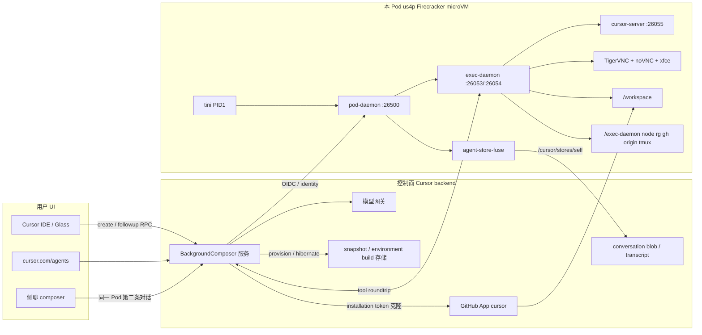
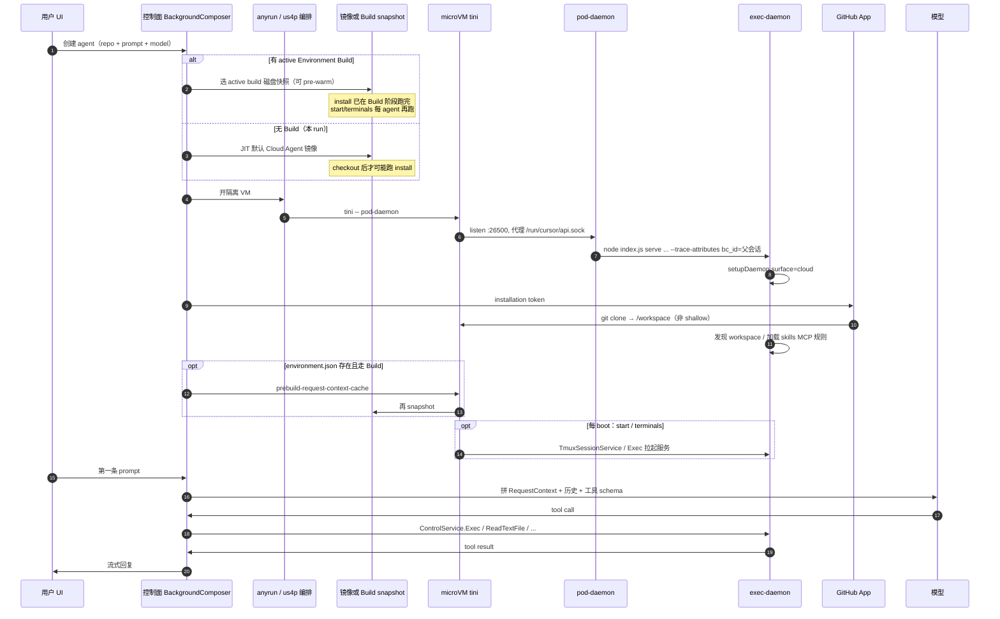

# Cursor Cloud Agent 完整架构（本机证据 + 控制面文档 + 客户端切片）

> 2026-09-17 复核：本页保留上一轮云端采集记录，文中“本对话/本 run”均指 2026-09-16 的采集会话，不是当前本机分析。最新跨本地/云端结论见[详细架构报告](cursor-local-cloud-architecture.zh-CN.md)。新报告补充本地 Host/loop/persistence，区分云子 agent 的 resume 与 continuation，明确 RequestContext 首轮缓存依赖调用方契约；本页推断不应视作完整后端实现证明。

探测时间：2026-09-16。本对话是侧聊，跑在父会话 env-setup 的同一台 VM 上。逆向产物在 `cursor-cloud-reversed/`。

## 1. 一句话结论

Cursor Cloud Agent 是「控制面（Background Composer / `api2.cursor.sh`）调度模型 + 隔离 microVM 里的 exec-daemon 执行工具」的远程 coding agent；本 Pod 属于 **JIT 默认镜像启动、无 linked environment、无 build/snapshot 引导**（`environment-info.build === null`）。侧聊 `bc-8d255668-…` 与父会话 `bc-49d992a3-…` **共用同一 Pod、同一 exec-daemon、同一 `/workspace`、同一 agent-store FUSE**；Dashboard 的 `list-cloud-agents` 只列出父会话和另一次 fresh-agent 验证，不列出本侧聊。

## 2. 总架构图

本地执行与本图的托管 Pod 是不同路径。`localAgentEnvironment.js` 是工作区能力装配，不能据此定位 harness；本地 Host/loop 见新增详细报告。`cloudSubagentRunner.js` 的新建路径调用 `StartBackgroundComposerFromSnapshot` 请求独立云环境，已有子会话则另有 resume 路径。

## 3. 启动时序图

本 Pod：15:30 由父会话 `source=setup` JIT 拉起；之后父会话才创建 draft environment 并跑成功的 draft build。**当前磁盘不是那次 build 引导的**（`environment-info.build` 为 null）。

## 4. Pod 内部组件表

| 组件路径 | 父进程 | 端口 / socket | 职责 | 本 run |
| --- | --- | --- | --- | --- |
| `/tini` | — | — | PID 1，转交 pod-daemon | 在跑 |
| `/pod-daemon` | tini | `:26500`，`/run/cursor/api.sock` | 进程监督、guest socket 代理、OIDC identity、SSH agent vsock | 在跑 |
| `/exec-daemon/node … serve` | pod-daemon | `:26053` HTTP，`:26054` PTY WS | 工具执行、request context、MCP、tmux、computer-use | 在跑 |
| `cursor-agent-store-fuse` | pod-daemon | FUSE `/cursor/stores` | Agent Store；`--self-store-id` = 父 bcId | 在跑 |
| `cursor-server` `out/server-main.js` | exec-daemon | `:26055` | 远程 workbench（`DownloadCursorServer` / `WarmRemoteAccessServer`） | 在跑 |
| TigerVNC `:1` + xfce + plank | desktop-init | `127.0.0.1:5901` | Computer-use 桌面 | 在跑 |
| noVNC websockify | desktop-init | `:26058` | 浏览器看桌面 | 在跑 |
| `/exec-daemon/tmux` | exec-daemon | tmux socket | 门户终端（`--tmux-service-enabled`） | 在跑 |
| Docker API | 未见 dockerd 进程 | `:2375` | `_ping=OK` | 端口在听 |
| `cursorsandbox` | — | — | 沙箱（需 `--sandbox-enabled`） | **未开** |

## 5. 请求上下文怎么拼出来

模型输入不是单一 prompt，而是控制面把多层拼成 `agent.v1.RequestContext`（exec-daemon `requestContextExecutor`）。

| 层 | 内容 | 本机证据 |
| --- | --- | --- |
| 系统 / 产品提示 | Cloud Agent 行为、工具名、侧聊边界 | 本对话可见的工具表与 `<cursor_commands>`；**全文不落在 guest 磁盘** |
| 产品 skills | 预装 `~/.cursor/skills-cursor/{canvas,env-setup,migrate-to-builds,subscribe,walkthrough-artifacts}` | 目录存在；`--strip-agent-skill-content` 只把非 plugin skill 的正文从 context 里拿掉，改由 skill 工具按需读 |
| Cloud rules | `--cloud-rules-enabled` | argv；`requestContext.cloudRule` |
| 仓库规则 | `AGENTS.md` / `CLAUDE.md` / `.cursorrules` | **本仓均不存在**；`--claude-md-enabled` 默认 true，无文件可加载 |
| `environment.json` | 仅 `{name, install}` | `/workspace/.cursor/environment.json`；不进入模型正文 |
| MCP | `--mcp-meta-tool-enabled` → 模型侧 `GetDynamicTools` / `CallDynamicTool`（daemon 内部名 `GetMcpTools`） | `--mcp-meta-tool-slim-descriptors`、`--mcp-input-schema-json` |
| 对话历史 | 控制面 blob，不是 guest 上的 markdown transcript | `AGENT_TRANSCRIPTS` 目录空；客户端 `cloudAgentStream.js` 用 `streamConversation` + blob store |
| 工具结果 | ControlService 流回控制面再进下一轮 | `Exec` 为 server-streaming |
| Build 缓存 | 冷启动第一轮 `useCached` | `/opt/cursor/.exec-daemon/request-context-cache.json`；本 JIT Pod **未走这条 bake** |

`ReloadAgentSkills` / `ReloadPlugins` / `InstallPluginArtifact` / `LoadMcpServers` 允许在 VM 起来之后热更新，不必重建 snapshot。

## 6. 权限与信任边界

### GitHub

- 身份：`gh auth status` 用户名 `cursor`；`GET /user` → `Resource not accessible by integration` → **GitHub App 安装令牌**，不是用户 PAT。
- App：`GET /apps/cursor` → id `1210556`，owner `cursor`。
- 范围：`GET /installation/repositories` 只有 `mikezhouhan/agent-fleet`。
- 对本仓：contents / git refs / pulls / issues 可读；`actions/secrets` 403。
- git remote 使用 `x-access-token`（值已脱敏）；`cursor.managedghconfig=true`；提交 `user.name=Cursor Agent`，SSH 签名 `gpg.format=ssh`。
- 公开文档：[Security overview](https://cursor.com/docs/cloud-agent/security) 写明「Cursor GitHub/GitLab App + 触发者可达集合，永不扩大」。

### 网络

- 父会话 env-info：`egress.restricted = false`。
- 本侧聊 env-info：agent state 加载失败，egress **未知**。
- 出站可达 `api2.cursor.sh`、`registry.npmjs.org`、`github.com`。
- `--ghost-mode true`：exec-daemon 不向 trace endpoint 打 OTel。

### 密钥

- `ControlService.SyncScopedSecrets`：值只在 daemon 内存，按 `secret_scope_id` 注入对应 Shell，不进 daemon 全局 env。
- commit-msg hook `~/.cursor/agent-hooks/.../commit-msg.cursor` 扫描提交说明里的 secret 字面值。
- 环境变量名可见：`CURSOR_AGENT`、`CURSOR_CONVERSATION_ID`、`CURSOR_AGENT_SOCKET=/run/cursor/api.sock`；**未见**用户 Secrets 注入。
- `pod-identity` socket 用于短期 OIDC，不把云厂商长期密钥放进镜像。

### 侧聊 / 子 agent 是否共享磁盘与凭证

| 形态 | 是否同 Pod | 磁盘 | 凭证 |
| --- | --- | --- | --- |
| 本侧聊 | **是**（exec-daemon `bc_id`、FUSE `self`、git 工作区均为父会话） | 共享 `/workspace`、`/cursor/stores/self` | 共享 `gh` App token、同一 git signing key |
| Task `environment:"cloud"` | **否**（`cloudSubagentRunner` → `StartBackgroundComposerFromSnapshot`，新 bcId） | 新 clone | 新 installation token 窗口 |
| 文档 “Per-agent VMs” | 指 **Dashboard 上的独立 Cloud Agent**，不覆盖同机侧聊 | — | — |

## 7. 本 run 的实测证据

| 探测 | 脱敏摘要 |
| --- | --- |
| `cursor-cloud-run-info` | `bcId=bc-8d255668-…`，source=internal，model=`cursor-grok-4.6-high-fast`，repo=`github.com/mikezhouhan/agent-fleet`，无 private worker |
| `environment-info` | `environment=null`，`build=null`，repos 同上，egress unresolved |
| `get-events` | 0 条 |
| `list-cloud-agents` | 只见 `bc-49d992a3-…`（setup）和 `bc-6278ca6e-…`（Verify env build）；**不见侧聊 bcId** |
| PID 1 | `/tini -- /pod-daemon --ssh-auth-sock-path … --pod-identity-sock-path /run/cursor/api.sock` |
| exec-daemon argv | 见 `cursor-cloud-reversed/exec-daemon/SERVE.md`；`bc_id=bc-49d992a3-…` |
| FUSE | `/cursor/stores/self → bc-49d992a3-…` |
| `CURSOR_CONVERSATION_ID` | `bc-8d255668-…` |
| git | 非 shallow；hooks 指到 `~/.cursor/agent-hooks/L3dvcmtzcGFjZQ`（`/workspace` 的 base64） |
| `gh` | App `cursor`，installation 仅本仓，rate 12500 |
| `exec-daemon serve --help` | 完整 capability 列表与本 argv 对齐 |
| 客户端切片 | `cloudSubagentRunner.js` / `cloudAgentEnvironment.js` / `cloudAgentHandle.js` |

完整 JSON：`cursor-cloud-reversed/live-probe/this-run.json`。

## 8. 未证实 / 需要补充的信息

- 控制面如何在 us4p 选机器、warm pool 命中率、模型是否与 VM 同区。
- Environment Save 之后 **下一台新 agent** 如何挂上刚测过的 `bld-20260916-4d6ad97c-…`（本 Pod 仍是 JIT）。
- `:50052` 监听者身份。
- Docker `:2375` 的真实进程（guest 内无 dockerd）。
- 控制面如何把 tool call 从模型字节变成 `ControlService.Exec`（guest 看不到该 RPC 客户端）。
- 侧聊 transcript 在后端如何挂到父 `bcId`；为何 `list-cloud-agents` 省略侧聊。
- `SyncScopedSecrets` 与 Grok Bot `secret_scope_id` 在普通 Cloud Agent 上是否使用。
- `read-only-bare-mode` 共享 Pod 的产品入口。

## 9. 以后继续深挖的问题清单

1. **侧聊在 blob store 里的 parent 指针** — 决定「对话」与「机器」的基数。查：dashboard transcript / `batch-fetch-details`（控制面）。
2. **`StartBackgroundComposerFromSnapshot` 请求字段全表** — 本地开云子 agent 的真实合同。查：`cloudSubagentRunner.js` 继续 beautify（客户端切片）。
3. **Build 冷启动是否真的 `useCached`** — 影响第一轮规则新鲜度。查：从 tested build 起的 fresh agent 日志（本机 + 文档）。
4. **`install` 在 JIT vs Build 的准确触发点** — schema 文案与 builds 文档冲突。查：[builds](https://cursor.com/docs/cloud-agent/builds) + 下一次 JIT 的 setup-logs。
5. **GitHub App 细粒度 permission 位** — 本仓 `permissions` JSON 全 false 但仍能 clone/push。查：GitHub installation API / 控制面 token 铸造。
6. **pod-daemon `PodDaemonService` proto** — guest 监督面。查：对 `/pod-daemon` 做 rust-src 符号级还原（本机）。
7. **cursor-server 与 exec-daemon 的鉴权关系** — 远程 IDE 是否等于 agent 工具通道。查：`WarmRemoteAccessServer` 实现（exec-daemon bundle）。
8. **egress allowlist 在 guest 的执行点** — 是 CNI 还是用户态代理。查：netfilter / 文档 Secrets & Network。
9. **agent-store-fuse `pod-grant` 格式** — 跨 agent 文件共享边界。查：`/run/agent-store-fuse/pod-grant` 结构（勿提交原文）。
10. **Computer-use DesktopLease 与人工 VNC 抢占** — 安全模型。查：ControlService.DesktopLease 注释 + 实测。
11. **Origin CLI 与 GitHub 双远程** — `origin` 何时代替 `gh`。查：PATH 与 `ManagePullRequest` 实现。
12. **模型名 `cursor-grok-4.6-high-fast` 与计费/路由** — 同区推理。查：dashboard / 文档（控制面）。
13. **hibernate 后 FUSE 与 git 工作区是否保留** — 安全文档 90 天 snapshot。查：idle 后再 attach（dashboard）。
14. **MCP `LoadMcpServers` 与 Cursor Cloud MCP 的关系** — 本对话的 cursor-cloud 是注入的 meta-tool 还是 LoadMcpServers。查：exec-daemon MCP 注册表（本机）。
15. **first-class Task cloud subagent 是否继承父 secrets** — 协同安全。查：新 cloud subagent 的 env 名列表（新 VM 本机）。
