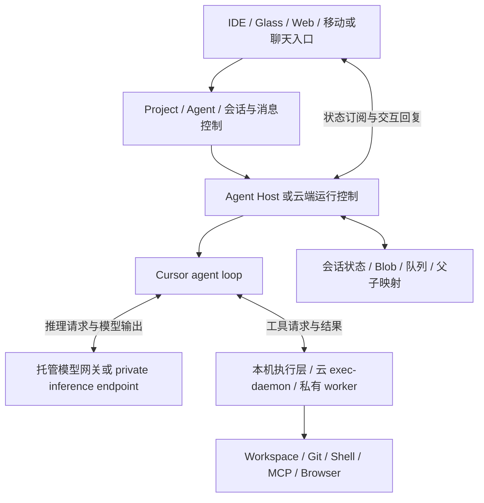
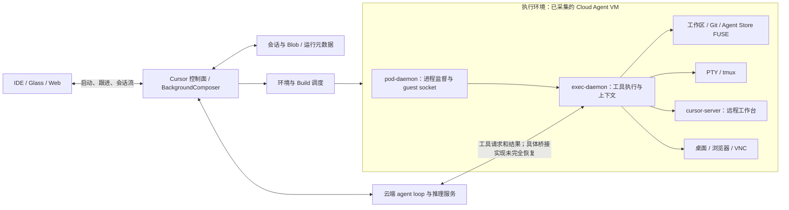

# Cursor 本地与云端架构：运行循环、执行宿主、会话与状态的完整拆解

分析日期：2026-09-17。基准为研究仓 `ce0611d` 中的 Cursor 3.20.17 客户端恢复集、2026-09-16 云端采集记录，以及本轮核对的同版本完整本地分发包。官方在线文档核查日期为 2026-09-17。

## 1. 先给结论

**Cursor 不是简单的“本地版 agent”和“云端版 agent”两套实现，而是一组可以分开部署的职责：产品界面、会话/运行控制、agent loop、模型推理、工具执行、工作区和持久存储。**“本地”有时描述 UI，有时描述代码目录，有时描述工具，有时才描述 loop。把这些维度合并，会误判部署与可替换性。

本地分发包已经包含独立 Agent Host、持久 Session、子会话索引和本地 loop 路径；云端则由 Cursor 控制面配合执行 VM 中的 daemon。My Machines 又把云端 loop 接到用户自己的执行机器。这三种情形不能用一个开关解释。[^local][^machines]

最值得借鉴的是 **让产品身份与执行实例分离，让宿主提供稳定的会话/工具/存储接口**。但 Cursor 当前可见架构围绕自家 runtime 和协议，不能直接认定它已经把任意第三方 coding agent 当作对等 runtime 插件。

## 2. 证据范围与可信度

| 材料 | 本轮可以核实什么 | 边界 |
|---|---|---|
| 客户端 1,047 个恢复单元 | 本轮逐一核对 SHA-256，全部匹配 inventory | named-module 切片可能跨越相邻函数，不能只看文件名 |
| 本地完整 payload | Agent Host、Private Inference 入口、daemon 持久化与 loop 选择 | 静态路径存在，不证明账号功能开关已启用 |
| 云端 extracted JS | 服务描述、启动装配、缓存算法 | 不是完整 exec-daemon 源码和调用链 |
| 重建 proto / TS | 服务和消息概念、阅读辅助 | proto 多数 message 为空；TS 缓存读写含占位实现，不能作为可运行代码 |
| `live-probe/this-run.json` | 上一轮某次侧聊的身份、环境和端口记录 | 本轮未重跑；不能推广到所有 VM 或账号 |
| 官方文档 | 当前公开产品契约 | 不是服务端实现证明，可能与旧客户端版本不同 |

客户端安装包身份、恢复方法见 [PROVENANCE](../cursor-projects-reversed/PROVENANCE.md)。本轮额外核对的三个完整分发文件均与已有 provenance 哈希一致，符号位置见 [local-runtime-evidence.json](../cursor-cloud-reversed/client-map/local-runtime-evidence.json)。没有运行 Cursor、创建云 VM、调用实际模型或验证断电恢复。[^inventory][^local]

## 3. 用六层理解整个系统



这是跨路径的职责图，不代表每个方框都一定是独立进程。尤其 Agent Host 可以在扩展宿主中装配，也存在独立 daemon；控制 UI 与执行宿主不是同一个生命周期概念。[^local]

| 概念 | 回答的问题 | 不应混淆的对象 |
|---|---|---|
| Project | 长期工作属于谁、有哪些成员和材料 | Git checkout、某一轮模型请求 |
| Session / Conversation | 一段可继续的工作历史 | 进程、VM |
| Turn / Followup | 本次输入何时被执行和完成 | 整个 Session |
| Agent loop | 怎样调用模型、解释结果、运行工具、继续迭代 | 模型服务本身 |
| Execution host | 工具在哪里执行、谁管理进程 | 推理 endpoint |
| Workspace / Worktree | 文件和分支在哪里、如何隔离改动 | 会话历史和审批记录 |
| Blob / Checkpoint | 大对象与可恢复状态如何保存 | 正在运行的 shell 内存 |

## 4. 本地架构：IDE 之外还有会话运行层

### 4.1 Workbench 与项目层

桌面/Glass 恢复材料包含项目注册、成员归属、会话句柄、上下文入口和消息行为解析。`localAgentEnvironment.js` 主要装配 workspace 下的 rules、skills、subagent 列表、MCP 状态、分支与 mention 查询；它不是仅凭文件名就能判定的 agent loop 实现。`localAgentRepository.js` 切片也混有邻接模块内容，不能把其所有函数归属于 repository。[^environment]

因此本地入口大致是：用户在产品会话里提交内容 → 解析项目/工作区与执行方式 → 进入对应会话控制路径 → 将交互更新投影到 UI。这是职责归纳，不是声称每种编辑器模式均经过同一条函数链。

### 4.2 三个扩展入口的不同职责

| 扩展 | 可见定位 | 需要保留的区别 |
|---|---|---|
| `cursor-agent-exec` | 命令、文件和工具执行；权限/审批相关能力 | 执行层，不等于整个 agent |
| `cursor-agent-host` | 在 AgentExec extension host 中托管 agent orchestration | 会话运行接口，不仅是聊天 UI |
| `cursor-local-agent-runtime` | 在 workspace extension hosts 外托管 Private Inference | 本地 runtime 路径，不证明模型在本机 |

manifest 只是入口证据；完整 `cursor-agent-host/dist/main.js` 则能看到注册 `registerAgentHostProvider`，提供 create/list/watch Session、sendMessage/sendAction、interruptTurn、cancelQueuedTurn、respondToInteraction、attachSession 和 getSessionBlobs 等操作。它还区分 turn lifecycle、交互和后台工作订阅，说明“一个会话是否存在”“当前轮是否在跑”“是否有等待回复”“后台工作是否继续”是不同状态。[^manifests][^local]

### 4.3 独立 daemon：会话与工具资源装配

完整 `agent-host-daemon/dist/bin/daemon.cjs` 中，`createStitchedAgentHost` 做了几件关键工作：

1. 创建或接收 BlobStore，并为默认 SQLite 存储接入持久 SessionCatalog。
2. 用 `SessionExecRegistry` 解析各 Session 的 workspace 路径与 projectDir，再创建执行资源。
3. 装配 Agent Host，把模型配置、存储、会话目录、执行资源分别注入。
4. 将 Task 子 agent 作为可 list、attach、交互的一级 Session。
5. 使用持久 `(parentSessionId, parentToolCallId)` 映射，重放父任务时优先找已有 child。

daemon 还暴露 Connect 风格 `AgentHostService`，服务代码使用 HTTP/2 server；这与模型 API 不是同一层协议。具体 listen 方式、启动模式和 feature gate 需按实际部署确认，不能因为 bundle 内有 daemon 就认定当前桌面实例一定启动了它。[^local]

### 4.4 本地状态不是“聊天文本保存到文件”

`createPersistentSessionStore` 维护 metadata、最新 ConversationState、BlobStore 和 followup queue。`createDaemonSessionPersistence` 提供 SessionCatalog、延迟加载，并合并同一会话的在途恢复请求。执行路径配置也可以从持久记录重新注册。[^local]

这带来三种不同的恢复能力：历史可读、任务队列可重建、父子关系可重连。它们都不能直接证明一个已经发出的 shell 命令不会重复执行，更不证明数据库提交与外部 Git/API 写入具有 exactly-once 语义。持久 child 索引解决重复创建子会话的一类问题，不解决所有副作用重放。

### 4.5 “本地 loop”仍可以调用远端模型

`resolveCreateAgentHost` 根据注入的 factory 与 `localLoop` 选择 Host 实现；本地 managed 路径通过 `createManagedLocalAgentClient` 创建 `LocalLoopAgentClient`，其推理依赖 `InferenceService.RunInference`。这说明 **迭代控制在本地与模型推理走托管服务可以同时成立**。不能把所有本地模式都称为离线 agent。[^local]

Private Inference 路径另有 provider catalog 和 endpoint 配置。`cursor-local-agent-runtime` 的 `runLocalAgent` 接收 baseUrl、模型、conversationState、action 和工具信息，创建 `LocalAgentClient`；通过回调执行工具、发送交互更新、读取/写入 blob 和保存 checkpoint。工具与 UI 并不被塞进模型 provider。[^local]

该入口中 Ask 模式还使用受限的工具 registry 路径。取消通过 action/abort 机制处理，未处理用户消息有独立管理。这里能看到本地 loop 所需的接口，但是否启用、默认走哪条推理路径，仍受产品模式与配置影响。

## 5. 云端架构：控制面配上执行机器



官方描述托管执行环境采用 Firecracker microVM。上一轮采集显示 guest 中存在 pod-daemon、exec-daemon、cursor-server、FUSE、tmux 和 VNC 栈；云端调度器、模型路由与工具请求的完整控制面实现不在这些材料中。图中连接是职责关系，不推断每条连接都为直接 RPC。[^security][^probe][^pod]

### 5.1 pod-daemon 与 exec-daemon 为什么分开

| 组件 | 职责 | 证据强度 |
|---|---|---|
| pod-daemon | 创建/连接/停止进程、监督、健康与 guest socket 桥 | 既有二进制 strings/路径推断及运行记录 |
| exec-daemon | 工具 RPC、文件/Git、上下文、MCP、插件、终端与桌面租约 | extracted JS 服务描述和启动代码 |
| cursor-server | 用户附加到远端工作区的 IDE 能力 | 运行记录与 WarmRemoteAccessServer 入口 |
| PTY/tmux | 长期 shell、输入输出和人工终端连接 | 服务表 |
| Agent Store FUSE | 以文件接口访问 agent store | 运行记录；后端一致性未恢复 |

可以把 pod-daemon 理解为 guest 内的进程管理层，exec-daemon 理解为 agent 的工具执行层，cursor-server 理解为人的远程编辑入口。三个职责独立，所以 agent 不必靠一个打开着的远程编辑器窗口来执行工具。至于具体进程由谁在何时拉起，需对照该次运行和完整启动器，不能只靠服务名称断言。[^pod][^control][^startup]

### 5.2 两种 Exec 接口与终端

恢复材料里同时有 `ControlService.Exec` 和 `ExecService.Exec`，还包括 PTY 和 tmux 服务。前者服务表覆盖管理与工具操作，后者承载 exec 消息流；单看同名 `Exec` 不能把它们视为相同 schema。重建 proto 的消息体为空，也不能据此生成兼容客户端。[^control][^exec][^pty]

PTY 的 Spawn/Attach/SendInput/Resize/Terminate 解决终端会话的问题；tmux 管理共享终端；执行请求完成、终端仍存活、工具结果已提交是不同事件。实现我们自己的宿主时，也应分开一次性命令、后台进程和可交互终端。

### 5.3 为什么云端需要 cursor-server

用户可能需要看文件、调试或亲自修改远端代码。`DownloadCursorServer` 与 `WarmRemoteAccessServer` 服务入口将 IDE 附加作为独立能力。它不是模型服务，也不能因为存在它，就把所有工具请求画成从 VS Code remote server 中转。[^control]

## 6. 云端一次任务的实际链路

从客户端可见链路归纳：

1. 创建请求携带仓库/分支、消息、模型选项、父会话或项目元数据。
2. 控制面决定执行环境并安排工作；启动策略可能使用 Build，也可能走尚无成功 Build 的标准环境启动。
3. guest 执行层准备 workspace、工具和 RequestContext。
4. 云端运行控制与模型迭代产生工具请求，执行层返回结果。
5. 客户端通过 `streamConversation` 获取状态、交互和 blob 引用，而不是直接读取 VM 内的所有 transcript 文件。
6. 跟进、插话和停止通过控制面消息操作处理；重新看见会话不意味着重新创建 VM。

第 1、5、6 步有客户端代码；第 2、4 步的后端事务和路由细节仍不可见。[^subagent][^stream]

### 6.1 UI 重连是一个独立子系统

`cloudAgentStream.js` 先加载本地状态和 blob 缓存以快速展示，再订阅远端权威流。它使用 offset 避免处理旧事件，并区分 conversationState 的版本；流包含 heartbeat。发生超时或长时间没有推进时，会按条件放弃旧 offset 重新取得状态，而不是永远增量重试。终态、永久错误和普通断线也有不同处理。[^stream]

这套逻辑解决“界面如何重新跟上运行”，不能证明“后端任务怎样从崩溃恢复”。UI abort stream 也不自动等于取消 agent：停止观察和停止执行必须通过不同操作实现。

## 7. 环境 Build 与 RequestContext 缓存是两种优化

**Build 缓存的是准备好的磁盘；RequestContext 缓存的是从工作区扫描出的上下文。**两者都不是模型内部 KV cache，也不是完整 agent 进程快照。

官方 Build 流程是准备镜像/仓库和 install，保存磁盘及版本，成功后激活；新任务启动时再运行 start/terminals。运行进程、shell exports 不随磁盘 Build 保留。旧采集的 `build=null` 只能表明那次环境没有记录 Build，不能把该次启动归纳成所有云任务。[^builds][^probe]

`request_context_disk_cache.extracted.js` 的实际逻辑是：写临时文件后 rename；读取时检查版本和 JSON；失败回退实时生成。`useCached=true` 时 clone 已烘焙上下文、叠加运行时 plugin 内容，并创建完整 executor 为后续调用准备。[^cache]

**需要纠正一个容易被注释掩盖的点：该 executor 并没有在内部计数、强制“仅第一轮”。**它每次看调用方的 `useCached`。注释要求后续轮不要继续设 true，说明新鲜度依赖调用方契约。缓存包含动态环境/Git/MCP 等字段，若错误复用可能过时；本轮没有复现这种问题，也没有拿到完整调用方证明此错误存在。

仓库里的 `request-context-disk-cache.ts` 是阅读辅助：写函数只有 `void`，读函数直接返回 undefined；分析运行行为必须看 extracted JS，不能运行该 TS 后声称验证了真实缓存。

## 8. 本地、云端、远程、自托管四种概念

| 情形 | UI 在哪 | loop 位置 | 工具在哪 | 核心判断 |
|---|---|---|---|---|
| 桌面本地 agent | 本机 | 取决于具体模式；可见本地 loop 路径 | 选定 workspace 的执行环境 | 不自动离线，也不自动固定本地 loop |
| Private Inference 路径 | 本机 | 可见本地 runtime | 回调连接执行层 | endpoint 可远端，不代表模型在笔记本 |
| Cursor 托管 Cloud Agent | 本机/Web 等 | 云端控制体系 | 托管 VM | UI 与任务运行寿命解耦 |
| My Machines / 私有 worker | 多种入口 | 云端 | 用户机器 | 本机执行不是本机 loop |
| Remote workspace | 本机显示 | 需要看使用的 agent 模式 | 远程 workspace 一侧或按工具路由 | 远程 IDE 不等于托管 Cloud Agent |

My Machines 官方明确使用出站连接，不需要给笔记本暴露入站端口；自托管只改变工具执行位置。文档还区分 stdio MCP 在机器侧、HTTP/SSE MCP 由后端连接，因此不能仅因工作区在内网就认为所有 MCP 都具有内网可达性。[^machines]

## 9. 子 agent、侧聊和迁移必须分开

### 9.1 本地 Task 派发云子 agent

`cloudSubagentRunner` 新建路径要求父工作区有且只有一个可识别 Git remote，确定 base branch，生成新 `bcId`；请求包含 `cloudSubagentParent`、父 tool call、模型信息、项目详情与可选 additional store IDs，并调用 `startBackgroundComposerFromSnapshot`。该路径不是把本地进程内存搬到云端。[^subagent]

代码用 repo/ref 构建起点，本轮未见该方法直接传输整个未提交 working tree；因此不能承诺本地未提交改动自动出现在新云任务里。需要另有显式文件/patch 同步路径才能成立。

旧映射应更准确地写为：

- 拒绝 `forkAgentId` / resume self。
- 拒绝 `continuationConfig`。
- **支持 `resumeAgentId`**：拉取云会话信息，校验 parent 类型和 ID，再提交 followup。
- 可以在 interrupt 路径进一步调用 `submitPendingFollowupNow`。

这里的 resume 是继续已有云子 agent，不是跨引擎恢复，也不是支持所有 continuation 类型。[^subagent]

### 9.2 侧聊不必拥有独立机器

旧 run 记录中的 conversation ID 与 exec-daemon/FUSE 的 owner ID 不同，记录将其识别为共用父 Pod 的侧聊。这至少证明该样本中“对话身份”与“执行机器身份”不是一一对应。不能将官方每个独立 agent 的 VM 描述套到产品内每一个聊天分支。[^probe]

由此也不能推导所有 side chat 都共享相同权限、所有云子 agent 都获得新令牌，或任意侧聊可以访问任何 store。机器隔离、会话归属和存储授权需分别验证。

### 9.3 真正迁移需要搬四类状态

若我们实现本地/云端迁移，需要明确处理：任务与消息历史、Git/未提交改动、原生 runtime 状态、正在运行的进程/权限等待。前两类迁移成功不意味着后两类自动延续。Cursor 的云子 agent 创建、远程 IDE attach、侧聊和 Build 都不能单独充当完整迁移证明。

## 10. 安全与身份的工程分层

本地产品文档描述工具审批与运行模式；云端执行环境还需要机器隔离、仓库授权和网络策略。二者解决不同问题，权限提示不是 VM 隔离的替代品。[^agentsecurity][^security]

云端服务描述存在 `SyncScopedSecrets`：按 scope 给 shell 提供秘密，不应从接口存在就推断每次云任务都采用该路径。`DesktopLease` 描述 daemon 内的桌面输入仲裁，人工抢占会中断 agent 输入；它也不是跨 VM 的全局任务锁。[^control]

旧运行记录显示 GitHub App 身份和限定仓库访问；这是那次运行的授权观察。我们不复用其中凭证，不将“某 API 返回 403”归纳成全面权限审计。同理，某次 guest 未启用内层 sandbox flag，不表示外层 Firecracker 隔离不存在。`ghost-mode` 关闭的可见路径是该 daemon 的 tracing 初始化，不意味着全产品没有日志、存储或遥测。[^probe][^startup]

## 11. ACP：方向决定它对我们的价值

官方当前 CLI 文档明确支持 `agent acp`，外部客户端通过 stdio JSON-RPC 驱动 Cursor，接收更新并响应权限请求。这表示 **我们的产品可以把 Cursor CLI 作为一个 ACP agent 候选**。它不表示 Cursor Projects 已经作为通用 ACP client，接管 Claude、Codex 等任意外部 agent。[^acp]

```text
我们的产品（ACP client） → Cursor CLI（ACP agent）       官方有此入口
Cursor Projects → 任意第三方 ACP coding agent          本轮材料未证明
Cursor 控制面 → exec-daemon 工具 RPC                   是工具执行协议，非 ACP 的同义词
```

对接后仍需验证 load/resume、权限、cancel、cwd、进程退出与会话重建，而不是看到 ACP 命令就认定能力齐全。本轮没有实际启动该命令。

## 12. 对我们要做的产品意味着什么

Cursor 最强的参考价值是把大量会话放进稳定的产品结构和执行体系，尤其是可独立观察的 Session、交互、后台工作与子成员。它不是只把多个终端进程摆在同一个页面。

但我们的目标还多一个关键要求：**换掉 coding agent 时，不换掉伙伴、任务、电脑和知识。**建议采用以下职责划分，而不是复制 Cursor 自有 loop：

| 我们自己的层 | 负责什么 | 从 Cursor 借鉴的机制 |
|---|---|---|
| Partner / Project | 身份、目标、成员、长期知识 | 项目与会话分离 |
| Task / Session control | 派发、消息意图、审批、验收、交接 | turn、interaction、background work 分开 |
| Runtime driver | ACP 优先，必要原生适配，能力逐项声明 | runtime 与工具回调解耦；避免绑定唯一 provider |
| Execution host | 启动/停止进程、workspace、终端、文件和资源配额 | Agent Host / exec-daemon 的职责边界 |
| Durable state | 事件、checkpoint 引用、子任务映射、产物和执行权 | 持久父子映射、队列、blob 与状态恢复 |
| Environment service | 镜像、依赖准备、机器生命周期 | Build 与运行阶段分离 |

有一个重要差异：多数原生 coding agent 自带文件/shell 工具。通过 ACP 接入它们时，不能假设所有工具都会经过我们的统一 exec RPC。必须按 agent 能力选择委托文件/终端、进程外沙箱或原生工具执行，并给用户一致但诚实的权限边界。

先验证单机两种 agent 的会话、介入、恢复和成果，再扩展云宿主；是否需要 Firecracker、FUSE、完整远程 IDE，取决于多租户与工作负载，不应作为首版默认复杂度。上述为我们的架构建议，不是 Cursor 已实现跨引擎产品的结论。

## 13. 尚不能下结论的部分

- 桌面各产品模式实际默认使用哪个 Host/loop，以及账号开关分布。
- 云端调度数据库、租约/fencing、工具结果提交与重试的完整事务边界。
- 所有 side chat、子 agent 与 store 授权的基数和继承规则。
- 机器故障后权限 waiter、运行中 shell 和网络副作用的恢复行为。
- RequestContext `useCached` 调用方是否在每个启动/恢复路径都遵守首轮限制。
- 任意跨本地/云端入口是否迁移未提交改动和原生会话状态。

本轮完成的是静态架构核对和官方契约对照。没有用文档声明、proto 方法名或恢复测试替代这些运行验证。

## 固定材料与官方文档

[^inventory]: [inventory](https://github.com/mikezhouhan/agent-fleet/blob/ce0611d/cursor-projects-reversed/inventory.json)
[^local]: [local](../cursor-cloud-reversed/client-map/local-runtime-evidence.json)
[^machines]: [machines](https://cursor.com/docs/cloud-agent/self-hosted/my-machines)
[^environment]: [environment](https://github.com/mikezhouhan/agent-fleet/blob/ce0611d/cursor-projects-reversed/recovered/cloud_local_agents/out__vs__workbench__workbench.desktop.main.js/localAgentEnvironment.js)
[^manifests]: [manifests](https://github.com/mikezhouhan/agent-fleet/blob/ce0611d/cursor-projects-reversed/recovered/cloud_local_agents/extensions__cursor-agent-host__package.json/package.json)
[^subagent]: [subagent](https://github.com/mikezhouhan/agent-fleet/blob/ce0611d/cursor-projects-reversed/recovered/cloud_local_agents/out__vs__workbench__workbench.desktop.main.js/cloudSubagentRunner.js)
[^stream]: [stream](https://github.com/mikezhouhan/agent-fleet/blob/ce0611d/cursor-projects-reversed/recovered/cloud_local_agents/out__vs__workbench__workbench.desktop.main.js/cloudAgentStream.js)
[^probe]: [probe](https://github.com/mikezhouhan/agent-fleet/blob/ce0611d/cursor-cloud-reversed/live-probe/this-run.json)
[^pod]: [pod](https://github.com/mikezhouhan/agent-fleet/blob/ce0611d/cursor-cloud-reversed/pod-daemon/SOURCE-LAYOUT.md)
[^control]: [control](https://github.com/mikezhouhan/agent-fleet/blob/ce0611d/cursor-cloud-reversed/exec-daemon/proto/agent.v1.control_service.proto)
[^exec]: [exec](https://github.com/mikezhouhan/agent-fleet/blob/ce0611d/cursor-cloud-reversed/exec-daemon/proto/agent.v1.exec_service.proto)
[^pty]: [pty](https://github.com/mikezhouhan/agent-fleet/blob/ce0611d/cursor-cloud-reversed/exec-daemon/proto/agent.v1.pty_host_service.proto)
[^startup]: [startup](https://github.com/mikezhouhan/agent-fleet/blob/ce0611d/cursor-cloud-reversed/exec-daemon/extracted/serve_startup.extracted.js)
[^cache]: [cache](https://github.com/mikezhouhan/agent-fleet/blob/ce0611d/cursor-cloud-reversed/exec-daemon/extracted/request_context_disk_cache.extracted.js)
[^security]: [security](https://cursor.com/docs/cloud-agent/security)
[^agentsecurity]: [agentsecurity](https://cursor.com/docs/agent/security)
[^builds]: [builds](https://cursor.com/docs/cloud-agent/builds)
[^acp]: [acp](https://cursor.com/docs/cli/acp)
