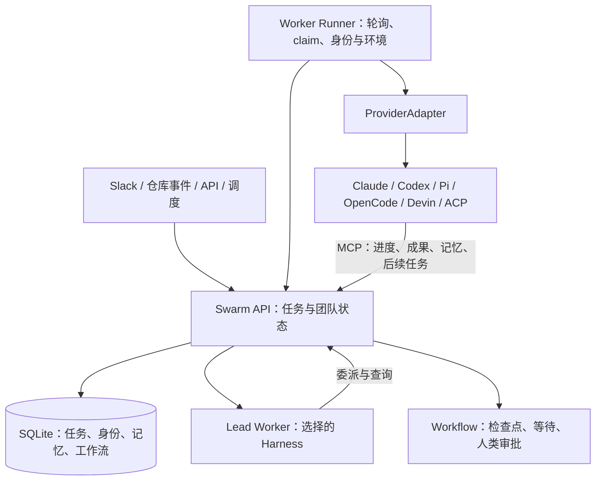

# Agent Swarm：任务型自治团队与多原生会话产品的分界

## 1. 结论

**Agent Swarm 值得作为“常驻团队、持久任务、工作流与共享记忆”的实施底座候选；如果目标首先是可审批、可恢复、可切换的原生 coding agent 会话，它还需要较大改造。**它确实接入了不同 harness，Lead 也不必固定在一套自有推理 loop 上；但系统主动选择用新任务、新 session 和上下文摘要维持连续性，而不是保留原生 session 并跨任务恢复。

这一选择使它与 Omnigent 有明显区别：Agent Swarm 以任务和团队运行过程为中心，Omnigent 更强调统一产品会话和多端控制。它与 Kandev 的 ACP 路径也不同：Agent Swarm 当前 ACP 是单次 prompt 的任务执行适配器，没有原生 load，也没有 live steering，权限请求直接自动选择允许项。不能把“支持 ACP”解释为“完整管理原生交互式会话”。[^1][^2][^3]

本报告使用 `desplega-ai/agent-swarm` 固定提交 `1821593fa588cea3a52f10ef5f6c4be72ce6761a`，包版本 `1.148.0`，分析日期 2026-09-15。源码与测试源码为主要证据，README 只用于定位。没有启动生产服务、连接 Slack、调用真实模型或运行该项目测试套件，因此不提供稳定性、成本或任务成功率排名。

## 2. 架构：逻辑 Agent、Worker 进程、Task 与 ProviderSession 分离

项目使用 Bun/TypeScript，API 层拥有 SQLite 数据，Worker 经 HTTP/MCP 访问。统一 ProviderAdapter 负责创建运行 session、接收事件、等待结果和取消；runner 处理身份、工作目录、任务前缀与 provider 装配。它存在调度与运行控制循环，但不同 provider 仍可以运行各自的原生 agent loop。[^2][^4]

Lead 是逻辑角色，不是固定某个模型。runner 既有 provider factory，也根据 Lead 身份进入对应工作流；Lead 和 Worker 的系统提示与工具权限不同。需要避免把“中央 Lead”误解为必须用框架自己的 LLM loop 担任主管。另一方面，角色与身份长期存在，不代表其原生上下文一直存活。[^4]

这比把多个临时 CLI 进程直接放在一个 Promise.all 中更完整。它有可持久追踪的工作单元、环境和回传途径；但新产品必须接受其“每次工作运行一个 session”的基本倾向，或者显式增加长期 Session 层。

## 3. Harness 接入：接得真实，连续性取舍也真实

provider factory 当前注册 Claude、Pi、Codex、Devin、Claude Managed、OpenCode 与 ACP。不同路径的运行地点、指令装配和 steering 能力不相同，不能以 provider 数量代替接入深度。[^2]

| 路径 | 已核实的关键实现 | 对新产品的意义 |
|---|---|---|
| Claude | Claude transport/CLI 等配置路径，新 session，queue steering | 原生工作能力可复用；跨任务不回到旧 session |
| Codex | app-server JSON-RPC；生产任务使用独立子进程；支持 steer/queue | 单任务内有深入控制；任务完成后回收堆和进程 |
| Pi | 单独 adapter，声明 steer/queue | 可以作为可选执行引擎，不是全系统唯一 loop |
| OpenCode / Devin | 独立 adapter，当前声明 queue | 与即时打断当前 turn 的 steer 不等价 |
| Claude Managed | 独立远端执行路径，声明 steer/queue | “所有 Worker 都只在本地 Docker 内执行”不是完整描述 |
| generic ACP | stdio ACP、MCP server 配置、事件转换、cancel | 当前为任务调用，不是持久多轮控制器 |

Codex 当前 `PROVIDER_STEER_CAPABILITIES` 和 adapter 都声明 `steer`、`queue`；`steer-task.ts` 的部分工具描述还写着 Codex queue-only。报告采用当前能力表和 adapter 的实际路径，不延用陈旧文字，也不把注册声明当作本轮实测。[^5]

## 4. 原生 resume 被主动移除：这是选型前提

`ProviderSessionConfig.resumeSessionId` 明确标记 deprecated。`resolveResumeSession` 会把候选原生 session 记入 skipped，并始终不返回可恢复 ID。Claude/Codex adapter 的 `canResume` 返回 false，runner 的任务续接路径使用 context preamble。这里不是某个 ACP agent 不支持 load 的偶然限制，而是全局的生命周期选择。[^3]

其理由在源码中体现为容器重启、上下文膨胀和长期进程资源问题。统一摘要降低了跨 harness 续接和更换容器的耦合，也让成本较容易按任务归集；代价是原生压缩状态、内部计划与挂起交互不能被完整保留。

普通 preamble 默认预算为约 2,000 token 对应的字符上限，最多追踪 5 层祖先，较近任务保留更多内容，远祖主要保留指针。恢复任务使用约 4,000 token 的字符预算，并读取最近 session logs 构造执行摘要；这是字符估算，不是精确 tokenizer 计量。[^3]

因此，适合它的用户承诺是“同一个团队记住目标和成果，接着处理工作”；不适合直接承诺“回到同一个原生 agent 的原状态”。如果想做 Grok 式长期伙伴，需要把伙伴时间线与这一串任务关联起来，而不是把每个新 session 伪装成无损 resume。

## 5. ACP 接入的四个关键边界

### 5.1 每个任务一次 prompt，完成后关闭进程

`ACPAdapter.createSession` 启动 agent，initialize 后 newSession，ACPSession 构造时开始 `runPrompt`。它只发送 `config.prompt`；获得结果或异常后在 finally 中终止进程组。abort 会先发 cancel，再终止进程组；`canResume` 返回 false。[^6]

外部 agent 在一次 prompt 内仍可以执行很多工具和推理步骤，因此它不是“单次模型 API 请求”。但外层没有继续向同一 session 多次交互的正常接口，也没有 session/load；`traits` 没有 steering 模式。与 Omnigent generic ACP 的进程存活期间多轮相比，这里更偏任务执行器。

### 5.2 原生权限默认自动选择允许

`SwarmAcpClient.requestPermission` 按顺序选择 `allow_always`、`allow_once`，否则选择第一个选项，无选项时取消。这里没有把 permission request 转成产品审批记录并等待人的路径。[^6]

这与自治 Worker 的定位一致，却不满足逐工具人类介入的要求。Codex 的具体新建线程配置也使用 `approvalPolicy: never` 与 `danger-full-access`；Claude 的配置中有绕过权限的选项。部署容器和工作流审批可以提供不同层面的控制，但不能替代每一次原生 shell/MCP/文件请求的权限判断。[^7]

这里的结论限定为选定路径的代码行为，不能泛化为“整个项目没有审批”或“容器不提供任何隔离”。真正的差别是审批所在的层级。

### 5.3 自定义 ACP 目标的身份指令不会自动变成系统指令

custom target 只有设置 `ACP_SYSTEM_PROMPT_PATH` 时才写入 system prompt 文件；OpenCode target 的对应函数为空。实际 prompt RPC 发送的是 task prompt。因此，不能仅凭 runner 组装了 systemPrompt 就确认任意 ACP target 都读到了伙伴人格和规则。必须验证目标是否会读取该文件、以何种优先级读取。[^6][^8]

自定义命令可以配置，环境变量按允许的名称传入；复杂命令应使用 JSON argv 配置，默认空白拆分不是完整 shell parser。模型/config option 还受目标声明影响。“可启动任意 ACP executable”与“指令、模型、工具、恢复对任意 executable 完整保真”有显著差距。

### 5.4 MCP 身份收敛做得更细，但不是原生工具隔离

adapter 为指定 agent/task 向 API 请求短期 bearer，把它交给 MCP server 配置，而不是直接把完整 operator key 放进去；mint 失败就失败，结束后 best-effort revoke，TTL 为 24 小时。这是一项实际的凭据边界改进。旧的实例字段注释提到 fallback，但当前 createSession 与 mint helper 没有 fallback 到 operator key 的路径。[^6][^9]

这约束的是访问 Swarm API 的身份与生命周期，不等同于限制 agent 在其环境里运行 shell。需要分别评估进程权限、MCP token 范围、网络连接与工作目录共享，不能把其中一项当作全部安全模型。

## 6. 任务分配与执行所有权

任务可以直接分配，也可以进入池。`claimTask` 用带 `status='unassigned'` 条件的 UPDATE RETURNING 竞争任务，使同一未分配状态的任务不会被两个 claim 同时拿走；poll 中还有容量、预算检查及 afterCommit 发布。[^10]

路由条件包含逻辑角色、capabilities 和 leadOnly。leadOnly 是明确授权条件；没有 affinity 的任务保留宽松行为；正常 affinity 匹配中原 sourceAgentId 有继续自己工作的例外，其他候选需角色与能力匹配。`harnessProvider` 在 affinity 中是信息字段，不作为强制 eligibility 条件。[^10]

这些机制是强项：团队角色与任务需求已经进入代码，而不是只在 prompt 中约定。但“原子领取一次”不等于“外部副作用 exactly once”。旧 Worker 失联但仍执行，新恢复任务被创建，或某写入成功后结果回传丢失，都需要独立的执行权 fencing、操作幂等和对账。

如果新产品要求某任务必须由某引擎完成，不能仅把这个要求写入 affinity.harnessProvider。需要新增可执行的约束，或明确指定具有该配置的 Worker 并验证运行时结果。

## 7. Steering：持久消息和明确降级是值得继承的设计

server 的统一 `requestSteering` 路径接收 HTTP/MCP/脚本/Slack 请求，保存 steering message。它区分请求模式、有效模式和降级结果；不支持时可以明确失败，或降为 queue / 后续任务。尚未启动的任务即使支持 steer，也要先排队。[^11]

当前能力表是：Pi、Codex、Claude Managed 支持 steer/queue；Claude、Devin、OpenCode 支持 queue；ACP 无 live steering。不能把这个表套到 Omnigent 或其他项目的同名引擎，因为接入方式不同。[^5]

对于无法投递或原任务已终止的消息，系统可以创建 follow-up task，并将消息标为 promoted。`markSteeringUndeliverable` 在事务中检查状态、创建任务和登记关联，重复调用不会重复创建；terminal sweep 也处理仍 pending 的消息。它清楚区分消息已保存、已交付和已变成后续工作，比只向进程 stdin 写一行强很多。[^11]

对新产品的启发是保留这种状态机，同时增加原生会话级交互。如果用户选择“立即停止并接受新约束”，而实际只能在下一个任务里处理，UI 必须说明降级，不能把成功入库显示为当前 agent 已执行。

## 8. 任务级恢复：实践丰富，仍然是启发式

heartbeat 对 stalled task 同时查看任务进度和 active session 心跳。默认情况下，没有 active session 且任务约 5 分钟无进展会进入恢复；session 心跳与任务都约 15 分钟陈旧也进入恢复；心跳新鲜但任务约 30 分钟无进展则升级给 Lead。近期 pending steering 提供有界宽限。这些阈值可配置。[^12]

恢复通常通过 supersede 原任务、创建 resume follow-up 完成。它尽可能把工作 pin 回逻辑原 Agent；pin 长时间没人领取时由 Lead 决定重路由，generation 限制避免无限恢复。workflow-step 任务把重试责任交回 workflow engine，避免两个恢复系统各创建一份工作。[^12]

文档还明确区分运行进程存活和当前任务是否死亡；多 runtime 模式下逻辑 Agent 可以有多个进程实例，runtime 的过期不直接意味着 session 可以删除。这个模式受开关控制，不能当作所有部署的默认行为。

应特别注意：active session 的心跳可能依赖工具活动，长时间模型调用或 shell 操作会安静。项目 runbook 承认误判可能性；generation cap 限制恢复次数，却不能阻止一个仍在工作的旧进程产生副作用。新产品如果要处理发布、合并、发邮件等工作，需要“执行未知”状态和效果对账，不能把超时当作已经死亡的证明。

## 9. 身份、记忆与工作流：比普通 coding 看板更接近常驻组织

Agent 身份包含 soulMd、identityMd、toolsMd、claudeMd 等内容。每次任务刷新身份时从 API 读取；失败保留最后有效版本，有界等待避免任务被身份服务卡死。提示模板负责把身份与工作规则装配进去，文件是可落地的镜像之一。[^13]

记忆检索具有向量/全文候选、graph expansion 和 rerank 路径，并区分 swarm 共享与 agent 私有 scope。它比单纯存聊天文本更适合积累可重用经验，但检索相关性和知识正确性没有因此得到保证；全团队共享记忆也不等同于按客户/项目隔离的知识权限。[^14]

workflow engine 有 agent-task、脚本、foreach、校验、wait 和 human-in-the-loop executor；恢复逻辑分别处理运行中、等待任务、等待审批与 wait-state。由此可建立“生成方案 → 等人确认 → 执行下一步”的工作流程。**这是工作流节点审批，与 ACP 原生工具 permission request 是两套机制。**[^15]

task outputSchema 和终态结果保护也值得关注：终态重复写默认保留第一次结果，force 修正文案不重放完成副作用。但 schema validator 只实现有限子集，忽略 oneOf、pattern、format、additionalProperties 等关键字。结构验证也不能证明代码通过测试或业务目标已完成，应把结果 schema 与实际验收分开。[^16]

定时任务恢复会对错过的 schedule 补跑一次，而不是把所有漏掉的次数逐次重放；这一点与 Omnigent 当前只安排未来触发不同。补跑是否适合业务仍要按任务定义，尤其不能把补跑等同于任意外部操作天然幂等。[^17]

## 10. 与其他八个对象的定位比较

| 对象 | Agent Swarm 相对突出的部分 | 对本目标仍应参考对方的部分 |
|---|---|---|
| Grok 重建版 | 可实施的团队任务、工作流、身份/记忆系统 | 自然的长期伙伴与消息体验 |
| Cindy | 常驻任务池、组织角色、恢复分流 | 原生上下文停泊与回切、桌面伙伴 |
| Rakazo | 多 harness 任务执行与团队分工 | Bot/Computer/Thread 的产品组织 |
| AO | 通用事务、共享记忆、工作流审批 | 原生 coding 会话监督与恢复 |
| Kandev | 常驻 Lead/Worker、工作流与记忆结合 | ACP session/load、回放协调与执行宿主 |
| DSH | 已装配的任务团队和运维流程 | 可组合框架能力与 runtime 契约 |
| Cursor Projects | 可运行服务端任务与工作流实现 | 项目主管、成员协调和成果组织体验 |
| Omnigent | 任务续接、身份/记忆与常驻组织更居中 | generic ACP 多轮、原生审批桥与会话切换 |

如果首版是“一个团队替公司持续处理工作”，Agent Swarm 应进入第一梯队验证。若首版是“像 Grok 一样与伙伴持续沟通，并随时选择/切换 coding agent”，Omnigent/Cindy 更直接，Agent Swarm 更像后台任务与协作机制参考。这个优先级来自产品语义匹配，尚未经过同任务实机比较。

## 11. 第七条实施路线：基于 Agent Swarm 演进

### 阶段 A：保留任务团队，验证可替换主管

选择一个 Lead、两个不同 harness 的 Worker 和一个小型代码仓库。沿用现有 task/claim/progress/workflow，不接入全部外部渠道。验证 Lead 换成另一条原生路径后仍能派发、查询、回收结果，避免某组 prompt/MCP 特性实际锁定主管。

通过标准是角色和成果可追踪、重复 poll 不重复领取、Worker 失败有单一恢复责任。若只需要后台团队，这一阶段应尽量使用原有的摘要续接策略，不为假想需求先引入长驻会话。

### 阶段 B：增加长期伙伴与交互式 Session

新增独立 Session/RuntimeBinding，将逻辑 Agent profile、产品消息时间线、Task 和原生 session ref 分离。一个伙伴可以对应多项任务，一个长期交互 session 也可以发起任务；Task 不再是唯一的交互容器。

需要保留现有 batch 模式，同时新增 interactive 模式。迁移先加可空引用、记录 provider/version/native ID 和模式，旧任务继续按 preamble 重放；不要把旧日志伪装成可以恢复的原生状态。

通过标准是用户看见连续伙伴时间线，内部任务切换不会丢失身份；并能够区分“恢复旧 session”和“根据摘要新开”。如果产品确定不需要原生会话连续性，可以跳过这一阶段，走更轻的任务型产品。

### 阶段 C：把 ACP 从任务调用升级成会话驱动

让 ACP 进程不在单次 prompt 结束时必然关闭，增加串行 prompt、多轮生命周期、session/load 能力协商、回放屏障、取消确认和进程回收。对于不支持 load 的目标，明确回退到摘要新建。

将 requestPermission 改为持久审批记录和响应通道，设定超时/断线拒绝或等待规则；不再自动优先 allow_always。验证身份指令进入原生引擎，而不只是写了一个无人读取的文件。

通过标准是两个 ACP 引擎在多轮、拒绝工具、断线和 UI 重连场景下表现诚实。不支持的操作必须降级可见。这个阶段的工作量意味着选择 Agent Swarm 不会自动比独立 ACP 控制层更省事。

### 阶段 D：补执行权和可验证交付

保留原子 claim 和 follow-up generation，增加 worker attempt/lease generation 与关键操作幂等键。超时恢复之前先判断旧进程和副作用是否可观测；旧 attempt 的结果不能推进新 attempt 的任务终态。

把 workflow HITL 接到用户授权，关键外部动作通过可控工具执行；结果 schema 升级为明确支持范围的验证器，再附上测试、PR、文件等验收证据。不能用 LLM 文案或 JSON 合法性代替完成判定。

通过标准是：在工具已经执行但结果尚未回传时 kill 进程，恢复不会重复关键动作；workflow retry 和 heartbeat 只产生一条有效后续工作链。

### 阶段 E：长期知识与多端产品化

在现有 memory scope 上增加项目/客户授权和来源版本，给错误知识提供修订与失效规则。统一消息、steering、审批、任务状态和成果的前端展示；随后增加外部渠道和部署方式。

需要长期经营的成本包括 Bun/SQLite 控制面、Worker 镜像、每种 provider、身份/技能装配、workflow 与 task 两种恢复机制，以及外部事件幂等。若核心需求主要落在阶段 B/C，且需要重做大部分 session 模型，应重新比较 Omnigent 或独立核心；若主要是 A/D/E，Agent Swarm 的现成资产更有优势。

## 12. 后续验证与当前限制

| 验证 | 最值得观察的结果 |
|---|---|
| Lead 采用不同 harness | 工具、指令与派发能力真实可用，主管可替换 |
| 两 Worker 同时 claim | 同一任务仅一个领取成功，容量约束保持 |
| quiet-but-live Worker | 长模型调用不被轻率当作死亡重跑 |
| ACP 拒绝工具 | 新审批桥能阻止执行，当前自动允许基线明确 |
| 无法投递 steering | 转为后续任务一次，用户能看到实际结果 |
| workflow 等待审批时重启 | 等待状态和已作出的选择不会丢失 |
| 任务完成回传重试 | 文案与副作用不重复推进，外部操作单独对账 |
| 自定义 ACP 的人格指令 | agent 实际读取并使用，而非仅文件写入成功 |
| schedule 停机恢复 | 一次补跑符合预期，不重复关键外部动作 |

本轮阅读了 ACP adapter、steering、resume、claim、workflow 恢复等相关测试源码，未执行这些测试，也没有安装依赖或启动容器。所有关键引用固定到上述提交；关于误判、跨层执行权和改造成本的部分是依据实现作出的分析与验证建议，不是已经复现的事故报告。

## 来源

[^1]: 项目定位与版本：[README](https://github.com/desplega-ai/agent-swarm/blob/1821593fa588cea3a52f10ef5f6c4be72ce6761a/README.md)、[package.json](https://github.com/desplega-ai/agent-swarm/blob/1821593fa588cea3a52f10ef5f6c4be72ce6761a/package.json)、[LICENSE](https://github.com/desplega-ai/agent-swarm/blob/1821593fa588cea3a52f10ef5f6c4be72ce6761a/LICENSE)。

[^2]: Provider 契约与注册：[types.ts](https://github.com/desplega-ai/agent-swarm/blob/1821593fa588cea3a52f10ef5f6c4be72ce6761a/src/providers/types.ts)、[index.ts](https://github.com/desplega-ai/agent-swarm/blob/1821593fa588cea3a52f10ef5f6c4be72ce6761a/src/providers/index.ts)。

[^3]: 原生 resume 弃用与上下文：[resume-session.ts](https://github.com/desplega-ai/agent-swarm/blob/1821593fa588cea3a52f10ef5f6c4be72ce6761a/src/commands/resume-session.ts)、[context-preamble.ts](https://github.com/desplega-ai/agent-swarm/blob/1821593fa588cea3a52f10ef5f6c4be72ce6761a/src/commands/context-preamble.ts)、[claude-adapter.ts](https://github.com/desplega-ai/agent-swarm/blob/1821593fa588cea3a52f10ef5f6c4be72ce6761a/src/providers/claude-adapter.ts)、[codex-adapter.ts](https://github.com/desplega-ai/agent-swarm/blob/1821593fa588cea3a52f10ef5f6c4be72ce6761a/src/providers/codex-adapter.ts)。

[^4]: 运行装配：[runner.ts](https://github.com/desplega-ai/agent-swarm/blob/1821593fa588cea3a52f10ef5f6c4be72ce6761a/src/commands/runner.ts) 的 provider factory、Lead 分支、context preamble 与 createSession；[数据库边界检查](https://github.com/desplega-ai/agent-swarm/blob/1821593fa588cea3a52f10ef5f6c4be72ce6761a/scripts/check-db-boundary.sh)。

[^5]: 当前 steering 能力与描述差异：[types.ts](https://github.com/desplega-ai/agent-swarm/blob/1821593fa588cea3a52f10ef5f6c4be72ce6761a/src/types.ts)、[codex-adapter.ts](https://github.com/desplega-ai/agent-swarm/blob/1821593fa588cea3a52f10ef5f6c4be72ce6761a/src/providers/codex-adapter.ts)、[steer-task.ts](https://github.com/desplega-ai/agent-swarm/blob/1821593fa588cea3a52f10ef5f6c4be72ce6761a/src/tools/steer-task.ts)、[能力一致性测试源码](https://github.com/desplega-ai/agent-swarm/blob/1821593fa588cea3a52f10ef5f6c4be72ce6761a/src/tests/provider-steering-capabilities.test.ts)。

[^6]: ACP 生命周期与权限：[acp-adapter.ts](https://github.com/desplega-ai/agent-swarm/blob/1821593fa588cea3a52f10ef5f6c4be72ce6761a/src/providers/acp-adapter.ts)，`SwarmAcpClient.requestPermission`、`ACPSession.runPrompt`、`ACPAdapter.createSession`、`canResume`。

[^7]: 原生配置：[codex-adapter.ts](https://github.com/desplega-ai/agent-swarm/blob/1821593fa588cea3a52f10ef5f6c4be72ce6761a/src/providers/codex-adapter.ts) 的 thread/start 与 sandbox/approvalPolicy；[claude-adapter.ts](https://github.com/desplega-ai/agent-swarm/blob/1821593fa588cea3a52f10ef5f6c4be72ce6761a/src/providers/claude-adapter.ts) 的权限参数。

[^8]: ACP 指令与环境：[acp-targets.ts](https://github.com/desplega-ai/agent-swarm/blob/1821593fa588cea3a52f10ef5f6c4be72ce6761a/src/providers/acp-targets.ts)、[acp-target-catalog.ts](https://github.com/desplega-ai/agent-swarm/blob/1821593fa588cea3a52f10ef5f6c4be72ce6761a/src/providers/acp-target-catalog.ts)。

[^9]: 会话 token：[acp-session-token.ts](https://github.com/desplega-ai/agent-swarm/blob/1821593fa588cea3a52f10ef5f6c4be72ce6761a/src/utils/acp-session-token.ts)。

[^10]: 任务分配：[db.ts](https://github.com/desplega-ai/agent-swarm/blob/1821593fa588cea3a52f10ef5f6c4be72ce6761a/src/be/db.ts) 的 `claimTask`、[agents.ts](https://github.com/desplega-ai/agent-swarm/blob/1821593fa588cea3a52f10ef5f6c4be72ce6761a/src/be/db/agents.ts) 的 `isAgentEligibleForTask`、[poll.ts](https://github.com/desplega-ai/agent-swarm/blob/1821593fa588cea3a52f10ef5f6c4be72ce6761a/src/http/poll.ts)。

[^11]: Steering 持久化与降级：[steering.ts](https://github.com/desplega-ai/agent-swarm/blob/1821593fa588cea3a52f10ef5f6c4be72ce6761a/src/be/steering.ts)、[steering promotion 测试源码](https://github.com/desplega-ai/agent-swarm/blob/1821593fa588cea3a52f10ef5f6c4be72ce6761a/src/tests/steering-promotion.test.ts)。

[^12]: 恢复实现与语义：[heartbeat.ts](https://github.com/desplega-ai/agent-swarm/blob/1821593fa588cea3a52f10ef5f6c4be72ce6761a/src/heartbeat/heartbeat.ts)、[worker-follow-up.ts](https://github.com/desplega-ai/agent-swarm/blob/1821593fa588cea3a52f10ef5f6c4be72ce6761a/src/tasks/worker-follow-up.ts)、[heartbeat-crash-recovery runbook](https://github.com/desplega-ai/agent-swarm/blob/1821593fa588cea3a52f10ef5f6c4be72ce6761a/runbooks/heartbeat-crash-recovery.md)。

[^13]: 身份刷新与提示：[identity-refresh.ts](https://github.com/desplega-ai/agent-swarm/blob/1821593fa588cea3a52f10ef5f6c4be72ce6761a/src/commands/identity-refresh.ts)、[base-prompt.ts](https://github.com/desplega-ai/agent-swarm/blob/1821593fa588cea3a52f10ef5f6c4be72ce6761a/src/prompts/base-prompt.ts)、[session-templates.ts](https://github.com/desplega-ai/agent-swarm/blob/1821593fa588cea3a52f10ef5f6c4be72ce6761a/src/prompts/session-templates.ts)。

[^14]: 记忆检索与范围：[memory-search.ts](https://github.com/desplega-ai/agent-swarm/blob/1821593fa588cea3a52f10ef5f6c4be72ce6761a/src/tools/memory-search.ts)、[access.ts](https://github.com/desplega-ai/agent-swarm/blob/1821593fa588cea3a52f10ef5f6c4be72ce6761a/src/be/memory/access.ts)、[graph-expansion.ts](https://github.com/desplega-ai/agent-swarm/blob/1821593fa588cea3a52f10ef5f6c4be72ce6761a/src/be/memory/graph-expansion.ts)。

[^15]: 工作流：[recovery.ts](https://github.com/desplega-ai/agent-swarm/blob/1821593fa588cea3a52f10ef5f6c4be72ce6761a/src/workflows/recovery.ts)、[human-in-the-loop.ts](https://github.com/desplega-ai/agent-swarm/blob/1821593fa588cea3a52f10ef5f6c4be72ce6761a/src/workflows/executors/human-in-the-loop.ts)、[foreach.ts](https://github.com/desplega-ai/agent-swarm/blob/1821593fa588cea3a52f10ef5f6c4be72ce6761a/src/workflows/executors/foreach.ts)。

[^16]: 结果保护与 schema 范围：[terminal-result-guard.ts](https://github.com/desplega-ai/agent-swarm/blob/1821593fa588cea3a52f10ef5f6c4be72ce6761a/src/tasks/terminal-result-guard.ts)、[json-schema-validator.ts](https://github.com/desplega-ai/agent-swarm/blob/1821593fa588cea3a52f10ef5f6c4be72ce6761a/src/workflows/json-schema-validator.ts)。

[^17]: 调度补跑：[scheduler.ts](https://github.com/desplega-ai/agent-swarm/blob/1821593fa588cea3a52f10ef5f6c4be72ce6761a/src/scheduler/scheduler.ts)，`recoverMissedSchedules`。
