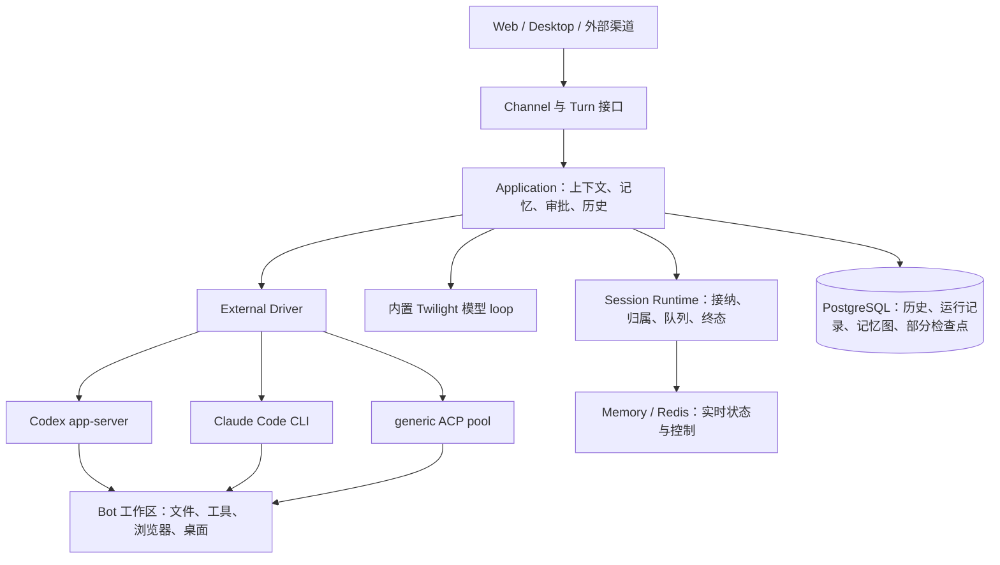

# Memoh：带长期记忆、独立电脑与多原生运行时的伙伴底座

## 1. 结论与研究范围

**Memoh 应进入 Grok 式长期伙伴产品的首轮底座验证名单，与 Omnigent、Cindy 并列考虑。**它把 Bot、工作区、渠道、长期记忆和原生执行放在同一产品中；当前主会话既可以用内置模型 loop，也可以用直连 Codex、直连 Claude Code 或 generic ACP。它并非只能在自己的 loop 里调用 coding agent 工具。[^1][^2]

它最突出的资产是“伙伴与电脑”的产品基础，以及会话控制中较明确的运行归属、审批、终态与历史一致性机制。不过，它还不是目标产品的现成答案：已有消息的会话不能直接换 agent，托管 `spawn_agent` 仍运行内置模型型子 agent，generic ACP 冷恢复没有使用 session/load，外部 agent 正在等待的审批也不能在所属服务进程死亡后原地恢复。[^3][^4][^5]

本报告固定于 `felinics/Memoh` 提交 `9e02a9446f325f083722bb7e23ac6cc00a1de740`，根包版本 `0.19.0`，分析日期 2026-09-15。UI submodule `felinics/ui` 固定于 `519a597e0e740906792f2bb6bb8e1c454e4ac727`。研究对象为公开仓库，不能由此推断未公开 Cloud 版本的功能和运行效果。本轮为源码与测试源码分析，未运行产品、测试套件或真实模型评测。[^1]

## 2. 产品模型：长期伙伴、对话与执行引擎已经分层

Memoh 的 Bot 有自己的配置、身份、记忆和工作区；用户通过 Web 或外部渠道与 Bot 交互。Thread 保存产品对话，Run 表示一次被接纳的执行，BotAgent 保存外部 agent 配置，runtime type 决定这次会话交给哪个引擎。这种分层比把一个聊天窗口直接等同于某个 CLI 进程更接近长期伙伴产品。[^2][^6]

这里的 Application orchestration 是产品层的上下文装配、执行派发与持久化，不等于它替外部引擎执行每一步推理。`external.Driver` 的主要接口是 `RuntimeType` 与 `Prompt`，结果包括原生输出、usage、停止原因和 checkpoint outcome；附加接口承载模式、命令、fork 等能力。增加外部引擎已有明确的入口，仍需同时补 runtime kind、能力、配置、凭据、UI 与测试。[^2]

部署也具有明确边界：Go Server、可拆分 Channel、Vue Web，工作区由容器后端承载；Desktop 是连接服务端的 Electron 客户端，并不是把服务器、数据库和向量服务打包进本地应用。对“合上笔记本继续工作”的目标，这种服务端所有权方向合适；对“完全离线、开箱即用的本机伙伴”，部署成本明显高于轻量桌面路线。[^1][^7]

## 3. README 与代码存在两处重要版本差异

README 仍概括为“通过 ACP 托管 Codex 和 Claude Code”，但当前 runtime capability table 已明确区分 `model`、`acp_agent`、`codex`、`claude-code`。ACP profile 注册的是 generic `acp`，Codex 与 Claude Code 走 direct external runtimes。不能按 README 把三条外部接入全部归为 ACP。[^1][^2][^3]

另一处是基础设施说明：根开发文档仍提到 Qdrant，但当前 builtin memory factory 以 PostgreSQL memory nodes/edges 为事实源，Markdown 为派生视图，语义种子检索可使用独立 pgvector 索引；没有 wiki store 时还存在 bootstrap 文件后备路径。新产品估算部署组件时，应以对应版本配置和装配代码为准，而不是延用旧架构说明。[^8]

这不是判定项目不可用的理由，而是维护成本的信号：接入和存储正在快速演进，选定底座后需要冻结一组 CLI、协议与迁移版本，并用行为验证更新文档。

## 4. 四种运行时：支持范围与连续性不同

| 运行时 | 实际接入 | 连续性 | 主要边界 |
|---|---|---|---|
| model | Go 内置 Twilight loop | 产品历史、压缩与内置决策恢复 | 保留自有 loop；但它只是可选主运行时 |
| codex | 直连 app-server v2 | 持久工作区 CODEX_HOME + thread ID；thread/resume | 依赖原生状态卷；resume 失败可回退新 thread |
| claude-code | CLI 双向协议、每轮进程与 `--resume` | 本地 transcript；缺失时可恢复数据库检查点 | 依赖 transcript 格式，捕获失败或分歧可发布 reset |
| acp_agent | 通用命令、stdio ACP、长驻池 | 活进程内多轮；冷启动新 session + Memoh context | 不提供 generic session/load；没有直接接上同轮 steering consumer |

前三个外部类型都支持 chat、discuss、schedule；`subagent` 模式当前只在 `model` 的能力表中。能力表是代码中的约束，并不是所有引擎已经实测等效。[^2][^3][^4][^9]

Codex 状态位于 BotAgent 对应的 `/data/.codex/agents/...`，Memoh 保存 `codex_thread_id`。`ensureThread` 尝试 `thread/resume`；普通恢复错误可新建 thread，取消和 compact 等路径有不同处理。因此不能承诺数据库备份本身足以恢复 Codex 全部上下文，也不能把成功继续输出当作旧 thread 已恢复。[^9]

Claude Code 路径有更明确的数据库 transcript 检查点。缺少工作区 transcript 时，代码尝试读取已发布检查点并还原，再传 `--resume`；损坏检查点返回错误，没有合适检查点才回退新会话。快照采用记录数、摘要与前缀一致性检查，避免失败轮次覆盖仍属于已提交历史的状态。它比只存一个原生 ID 更完整，但仍是轮次边界恢复，不是进程内所有挂起状态的快照。[^10]

## 5. Generic ACP：交互桥接较完整，冷恢复仍是重建

### 5.1 池化与原生会话

SessionPool 用 server 生成的 runtime ID 管理进程，并把它绑定到一个产品 session。绑定时检查 Bot、agent、项目和运行状态；每个 handle 的操作锁串行化 prompt、配置、绑定和关闭。默认绑定进程空闲 30 分钟回收，未绑定的预选模型进程空闲 5 分钟回收，每 Bot 未绑定实例上限为 4。[^3]

成功 prompt 后进程可以继续使用，所以它与 Agent Swarm 的单任务 prompt 后关闭进程有实质差别。取消则先做 ACP handshake，并等待 permission/form callbacks 收束；取消状态无法确认或回调未及时退出时才回收进程，避免旧审批落到下一轮。[^3]

但冷启动不会还原 generic ACP snapshot。当前 driver 明确返回 `CheckpointDeclined`，每个成功轮次发布 reset head；旧 checkpoint head 只产生提示并走 fresh session。`session_pool.go` 顶部关于“支持 profile 的 JSONL checkpoint”的注释仍有旧内容，实际分支和测试已采用 reset 语义。[^3]

### 5.2 Warm head 与持久历史对齐

进程本地记录它所对应的 publication head，每次 prompt 前与数据库 head 比较。如果其他服务器推进了历史、清空了会话，或上一轮进程已经推进但数据库没有提交，旧 warm handle 被关闭并重建。这解决的是“进程记得的历史与产品历史分叉”，而不是原生 load。[^3][^11]

对新产品很有价值的设计是：把“有检查点”和“明确没有检查点”都持久表达出来。不能在最新一轮无快照时偷偷加载更老的快照，再把它称作恢复了当前会话。

### 5.3 指令、资源与工具装配

外部 `PromptInput` 接收统一的 Memoh context document、用户输入、附件、模型/推理配置、工具入口与运行归属。ACP 使用资源块注入上下文；模型与 reasoning setter 有能力校验，配置传输失败会丢弃状态不确定的进程。成功写入上下文不等于目标模型一定按期望理解，仍需验证具体 ACP agent 对资源块、图片和工具的处理。[^3][^12]

generic ACP 的持久 HOME 为 `/data`，每进程临时目录是受检查的 UUID 路径，TMPDIR 与包缓存另行管理。路径组件检查和清理范围值得继承；这不意味着每个 ACP 配置天然获得独立操作系统用户或独立文件卷。多个会话共享 Bot 工作区时仍有并发文件写入问题。[^3][^7]

## 6. 审批、问答与实时介入

Memoh 的 ACP permission callback 不像 Agent Swarm 那样优先自动选 allow_always。它映射原生选项，验证作用域，将普通工具交给统一 policy/approval flow；未知操作和外部 MCP consent 可强制人类 review。Memoh 自己的 MCP 工具可预放行至网关，再由网关执行作用域与审批检查，避免双重弹窗。[^5]

批准后还有一次运行 guard 校验；客户端文件/终端回调可以消费一次性 grant，防止同一操作重复问人。没有 approval service、未知选项、被取消的旧 prompt 等情况有明确拒绝或取消路径。这里是原生权限桥接，不只是工作流里放一个人工节点。仍需区分 agent 主动请求的权限、Memoh 代理执行的工具，以及原生进程本身的 OS 权限。[^5]

Codex 与 Claude Code 实现同轮 steering：前者调用 `turn/steer` 并确认目标 turn，后者按协议能力接收输入并确认消费。队列只有在 driver 启用 consumer 后接受 steer；错误或不确定投递不会被自动当作成功，也不盲目重发。Generic ACP driver 没有传入对应 consumer，不能继承 direct runtime 的支持声明。[^13]

队列区分 accepted、claimed、applied、rejected、expired、canceled；accepted 代表排入控制面，不能显示成原生已执行。队列属于 memory/Redis 实时后端，带有限保留与容量，不应直接描述为 PostgreSQL 中永久的工作任务。对需要跨长时间停机的委派，还需要任务级事实源。[^13]

一个必须公开的限制是：**外部 agent 等待审批时，owner 进程死亡会丢失进程内 waiter。**`recoverWaitingDecision` 对这类运行时明确不接管，随后由 reaper 标记 lost；只有可从数据库重建 continuation 的内置模型停泊运行才进入该恢复分支。审批记录存在，不等于其对应的外部执行能继续等待原来的答案。[^5]

## 7. 运行归属、终态和恢复：值得优先验证的工程资产

Session Runtime 把提交、run/turn 身份、实时状态与持久 ledger 分开；同一个 session 的执行通过 admission 与 owner 控制。FenceActivator 将 run 的单调 fencing token 用于 PostgreSQL 持久化所有权；旧 owner 的写入应被拒绝，而不仅是从 UI 中移除旧进程。[^11]

外部轮次将消息和 checkpoint/reset publication 在同一历史提交过程中发布。原生检查点先暂存，再由成功轮次发布；明确 rollback 后部分 driver 丢弃已超前的 warm 状态。提交结果未知有数据库 reconciliation 路径，避免把“客户端没收到提交回应”直接视为一定没提交。[^11][^12]

reaper 结合 live backend 和 ledger 处理失联 owner、孤立 admission 与后端 generation 丢失。实时后端更换后，未提交流式文本无法恢复，代码选择持久 `lost`，不会自动重发同一工作来制造看似成功的恢复。单机 memory 与多实例 Redis 模式不能混为一种保证。[^11]

这些机制使 Memoh 成为执行所有权和失败语义的重要参考，但不等于端到端 exactly-once。持久化 fencing 能拦截迟到历史写入，不能撤回已发送的邮件、已经执行的 shell 或已合并的 PR。关键外部动作仍需要操作幂等、结果查询和人工处理“结果未知”的能力。

## 8. 长期记忆：有形成、修改、溯源与有界召回

当前 builtin memory 不只是向量查聊天记录。formation 实现 Extract → 候选检索 → Decide → ADD/UPDATE/DELETE/NOOP，将新信息与已有记忆融合；graph store 保存节点和边，Markdown 是可读视图，语义索引为可选辅助。记忆结果保留有界的 session/message source refs，便于回查。[^8]

默认 context packer 目标为 6 条、合计 1,800 字符，每条有上限，并按分数选择与重排。这是字符预算，不是 1,800 token。配置和模型上下文预算还会继续约束最终装配，不能由此推断所有知识都能进入每次请求。[^8]

外部 runtime 的 application 路径同样记录 memory recall，成功持久轮次后可触发记忆存储。因此更换主引擎并不必然失去 Memoh 的记忆层；它是目标产品中很有价值的引擎外资产。后台提取仍可能失败或落后，不是与聊天完成在同一个原子事务里保证成功。[^12]

内置形成路径主要按 Bot scope 组织，并携带用户身份元数据。跨渠道共享有利于伙伴连续性；但“知道这条记忆来自哪个用户”不自动等于“对每个共享会话都执行来源级权限过滤”。多成员产品需要单独验证私聊信息能否出现在群聊召回中，不能把身份标注当成已经证明的隔离策略。

Mem0、OpenViking 有独立 adapter，可比较更换记忆实现的成本。更换 provider 不会自动获得等价的更新、删除、来源与检索语义。把“记得更多”作为目标之前，应先设计错误记忆纠正、过期、用户删除和跨来源冲突测试。

## 9. 多 agent：多 Bot、讨论、子 agent 与异构任务是四层

多 Bot 和多个外部主会话已经成立；discuss 也能使用外部 runtime，并有选择 fresh context 的路径。但这不能直接推出一个主管能够通过统一工具创建任意 harness Worker、持续管理其任务和验收结果。[^2][^4]

托管 `spawn_agent` 接收的是 task、model_id、provider、fork、run_in_background；模型解析后构造 `SpawnRunConfig`，通过 `GenerateWithWatchdog` 执行。它有后台任务、串行消息队列、子会话与结果查询，但当前并没有 runtime_type / bot_agent_id 的异构 Worker 选择入口。`subagent` 能力表只允许 model，形成了第二层佐证。[^4]

因此“主管可替换”与“所有子 Worker 可替换”必须分别验证。主会话用 Codex，不代表 Memoh 管理的子任务自动变成 Codex；原生 agent 自己创建的子 agent，也不一定有统一产品状态和验收记录。对目标产品，最重要的新增工程是异构 delegation，而不是再增加一个模型下拉框。

相比 Agent Swarm，Memoh 更完整地提供长期交互、电脑和权限桥，Swarm 更强调持久任务团队、分配与 workflow。相比 Omnigent，Memoh 的记忆和工作区更居中；Omnigent 已有不同边界的会话切换能力，Memoh 则明确禁止有消息后更换 agent。两个项目不宜只按接入数量排序。

## 10. 自动化与部署边界

schedule 支持新建会话或在既有会话执行；新建可以选择内置模型、generic ACP 或 direct BotAgent，既有会话继承自己的 runtime 和工作目录。目标会话删除后会停用该 schedule，避免永久重复报错。[^14]

不过，定时器采用进程内 cron 注册，本轮检查的 schedule service 没有体现 Agent Swarm 式 missed-fire 补跑账本或独立的触发租约。调用次数和日志已持久化，不等于多个 scheduler 对同一计划时点只触发一次。多实例部署时应核对谁启动 scheduler、如何去重；runtime 的单会话互斥无法阻止每次新建不同会话的重复触发。这里是代码边界及验证建议，不是已复现的线上事故。

工作区是另一个真实约束：direct runtime 对 remote workspace backend 明确拒绝，因为其环境变量与凭据路径依赖容器布局。已有 remote bridge 不表示 direct Codex/Claude 可以透明运行在任意 SSH 主机。容器、浏览器、桌面、依赖安装、网络和凭据服务带来较完整能力，也带来更大的长期维护面。[^7]

根 LICENSE 与 README 标示 AGPLv3，但根 package.json 仍写 ISC。这里记录元数据冲突，不将 package 字段视为整个项目的许可结论；具体复用文件还应保留其对应来源和许可证。本轮不提供法律判断。[^1]

## 11. 第八条演进路线：基于 Memoh

### 阶段 A：冻结可运行基线，验证伙伴与外部主会话

先固定当前主仓、UI submodule、工作区镜像和两种 direct CLI 版本。选择一个 Bot、一个容器工作区、Web 渠道、内置记忆，以及 Codex/Claude 两条主会话路径；generic ACP 使用一个明确的目标做对照，不同时扩张所有渠道。

通过标准是：伙伴身份与记忆在不同会话中一致可用；原生工具可拒绝、停止；断开 UI 不停止工作；CLI 运行记录与产品 run/turn 对得上。若仅部署就持续依赖未公开 Cloud 代码，或目标环境无法支撑工作区，应暂停 fork，先确认可独立运行边界。

### 阶段 B：建立异构 Worker 委派

在现有 Thread/Run 上增加持久 WorkItem/Delegation：主管、目标、Worker runtime/BotAgent、工作目录、状态、成果与验收证据。保留 model subagent，另外通过 external.Driver 路径运行异构 Worker，而不是把 `model_id` 偷换成 executable 名称。

定义共享工作区与独立 worktree 两种明确策略，避免默认并发修改同一文件。主管可以是任意支持工具的主运行时；管理工具只负责派发与观察，不再引入一个必须由内置 loop 担任的固定主管。

通过标准是：Codex 主管派给 Claude Worker，换成 Claude 主管仍能派给 Codex Worker；中断一个 Worker 不停止另一个；委派和最终结果跨服务重启可查询。重复回传只能推进同一任务一次。

### 阶段 C：实现显式交接，保留现有禁止原地换引擎的保护

首版交接可创建新 Thread，并把旧 Thread、目标、约束、文件变更、成果和验证证据关联到同一个伙伴任务。产品时间线连续，内部原生 session 明确是新的。这比直接绕过 `ErrSessionHasMessages` 更容易验证，也不需要先承诺原生状态跨引擎转换。

如果之后确需同一产品会话中切换，再引入 RuntimeBinding 历史：每次绑定记录 runtime、原生 ID、publication head、交接版本和执行权。必须在停止旧执行、确认提交状态后切换；不能只修改 runtime_type。

通过标准是旧引擎不能在交接后推进新任务终态，用户可回查交接包含了什么、遗漏了什么。若业务接受新会话关联，暂不建设复杂原地切换。

### 阶段 D：按能力扩展 ACP 与故障恢复

保留 warm pool、permission bridge、head 比较和未知取消处理。只对确实声明并通过验证的 ACP target 增加 load/checkpoint adapter；其余继续 context rebuild，并在 UI 标明。

对外部 waiter 丢失，首版保留 lost 的诚实语义，提供“查看已执行动作 → 建立新 run 续接”；不要让旧审批按钮重新授权一个不确定的新执行。以后若要恢复挂起审批，需要原生协议、工具结果和恢复点共同支持。

通过标准是 kill owner、Redis generation 替换、数据库提交回应丢失、旧工具结果迟到都得到可解释状态；关键副作用不会被盲目重放。

### 阶段 E：知识权限、调度与交付产品化

将来源权限带入记忆检索和上下文装配，增加修订/删除/过期与冲突处理。为定时触发增加稳定 fire ID、单次接纳和补跑策略；为任务增加验收规则与产物引用，再扩大外部渠道和成员规模。

成本集中在 Go 控制面、Vue/Electron、PostgreSQL/可选实时后端、容器与 GUI 镜像、每种原生协议和记忆运维。若首版不需要电脑、长期知识和多渠道，采用 Memoh 可能背上大量无用组件；若这些恰是差异化，它比从会话工具补齐整个伙伴平台更值得验证。

## 12. 与其他九个对象的关系

| 对象 | Memoh 更接近目标的部分 | 仍应从对方学习的部分 |
|---|---|---|
| Grok 重建版 | 公开可实施的多 runtime 伙伴与电脑层 | 自然交互与长期伙伴体验 |
| Cindy | 服务端常驻、多渠道、独立电脑与记忆 | 桌面轻量、停泊回切、混合协作 |
| Rakazo | 已有外部主运行时和原生权限桥 | Bot/Computer/Routine 的产品组织 |
| AO | 通用伙伴、记忆、浏览器与桌面 | 编码任务监督、PR 与交付链 |
| Kandev | 长期伙伴与通用事务装配 | ACP load/replay 与执行宿主 |
| DSH | 已有完整产品和 direct/ACP 接入 | 可组合框架与能力契约 |
| Cursor Projects | 可运行的公开服务端与工作区 | 项目主管、成员和成果组织 |
| Omnigent | 图记忆、Bot 独立电脑与渠道体系 | 会话控制产品与切换路径 |
| Agent Swarm | 交互式外部主会话、原生审批 | 持久任务团队、workflow、角色路由 |

对“服务器常驻的 Grok 式伙伴 + 可替换 coding agent”这个具体目标，Memoh 的优先级应高于仅把它当作记忆库的判断。对于“马上能管理异构主管与 Worker 的任务团队”，Agent Swarm 的已有组织机制仍有优势；对于“同一交互产品内切换引擎”，Omnigent/Cindy 的相应机制仍更值得先验证。

## 13. 后续验证矩阵

| 场景 | 需要记录的事实 |
|---|---|
| 同 Bot 使用三种外部路径 | 各自原生 ID、工具、记忆与产物是否进入产品历史 |
| generic ACP warm / cold | warm 是否同 session；冷启动是否明确重建；head 分歧是否回收 |
| Claude transcript 丢失 | 已发布 DB checkpoint 是否恢复；损坏是否报错 |
| Codex 数据卷丢失 | 是否转新 thread，用户能否辨认上下文变化 |
| 等待权限时 kill owner | pending 是否终止且不可继续回答；run 是否收敛 lost |
| 立即介入 | accepted 与原生已消费分别可观察，不支持路径明确拒绝 |
| 两个不同 harness Worker | 委派、工作区归属、结果和验收能否统一追踪 |
| 同一计划多个 scheduler | 是否只接纳一个 fire，而非仅限制同一 session |
| 私聊记忆在群聊使用 | 是否按产品授权过滤来源，删除后索引/视图是否一致 |
| 操作成功但回传丢失 | 先对账再决定续接，不重复关键动作 |

现有仓库含 ACP pool/permission、Claude checkpoint、runtime fencing、queue 及单机/双实例 acceptance 测试源码；测试存在只说明可用的验证入口。[^15]本轮未执行这些测试，没有据此宣称真实 agent 兼容性、成功率或部署可靠性已通过。

## 来源

[^1]: 项目与版本：[README_CN.md](https://github.com/felinics/Memoh/blob/9e02a9446f325f083722bb7e23ac6cc00a1de740/README_CN.md)、[package.json](https://github.com/felinics/Memoh/blob/9e02a9446f325f083722bb7e23ac6cc00a1de740/package.json)、[LICENSE](https://github.com/felinics/Memoh/blob/9e02a9446f325f083722bb7e23ac6cc00a1de740/LICENSE)、[.gitmodules](https://github.com/felinics/Memoh/blob/9e02a9446f325f083722bb7e23ac6cc00a1de740/.gitmodules)、[根开发说明](https://github.com/felinics/Memoh/blob/9e02a9446f325f083722bb7e23ac6cc00a1de740/AGENTS.md)。版本冲突按实际代码分别描述。
[^2]: 运行时词汇与契约：[runtimekind](https://github.com/felinics/Memoh/blob/9e02a9446f325f083722bb7e23ac6cc00a1de740/internal/runtimekind/runtimekind.go)、[external.go](https://github.com/felinics/Memoh/blob/9e02a9446f325f083722bb7e23ac6cc00a1de740/internal/agent/runtime/external/external.go)、[application service](https://github.com/felinics/Memoh/blob/9e02a9446f325f083722bb7e23ac6cc00a1de740/internal/agent/application/service.go)。
[^3]: ACP：[profile.go](https://github.com/felinics/Memoh/blob/9e02a9446f325f083722bb7e23ac6cc00a1de740/internal/agent/runtime/acp/profile/profile.go)、[driver.go](https://github.com/felinics/Memoh/blob/9e02a9446f325f083722bb7e23ac6cc00a1de740/internal/agent/runtime/acp/driver.go)、[session_pool.go](https://github.com/felinics/Memoh/blob/9e02a9446f325f083722bb7e23ac6cc00a1de740/internal/agent/runtime/acp/session_pool.go)、[runtime_storage.go](https://github.com/felinics/Memoh/blob/9e02a9446f325f083722bb7e23ac6cc00a1de740/internal/agent/runtime/acp/profile/runtime_storage.go)、[pool 测试源码](https://github.com/felinics/Memoh/blob/9e02a9446f325f083722bb7e23ac6cc00a1de740/internal/agent/runtime/acp/sessionpool_test.go)。
[^4]: 托管子 agent：[subagent.go](https://github.com/felinics/Memoh/blob/9e02a9446f325f083722bb7e23ac6cc00a1de740/internal/agent/tool/subagent.go)，`execSpawnAgent`、`SpawnRunConfig` 与 `GenerateWithWatchdog`；运行模式约束见来源 2。
[^5]: 审批与恢复：[ACP callbacks](https://github.com/felinics/Memoh/blob/9e02a9446f325f083722bb7e23ac6cc00a1de740/internal/agent/runtime/acp/client/client.go)，`RequestPermission` 与 `requireToolApproval`；[recovery.go](https://github.com/felinics/Memoh/blob/9e02a9446f325f083722bb7e23ac6cc00a1de740/internal/agent/runtime/session/recovery.go)，`recoverWaitingDecision`。
[^6]: 产品会话与切换：[thread/service.go](https://github.com/felinics/Memoh/blob/9e02a9446f325f083722bb7e23ac6cc00a1de740/internal/chat/thread/service.go)，`UpdateEmptyDescriptorAndMetadataWithOwner`；[handlers/session.go](https://github.com/felinics/Memoh/blob/9e02a9446f325f083722bb7e23ac6cc00a1de740/internal/handlers/session.go)，`agentChanged` 与 HTTP 409。
[^7]: 工作区边界：[external/workspace.go](https://github.com/felinics/Memoh/blob/9e02a9446f325f083722bb7e23ac6cc00a1de740/internal/agent/runtime/external/workspace.go)、[ACP runtime_state.go](https://github.com/felinics/Memoh/blob/9e02a9446f325f083722bb7e23ac6cc00a1de740/internal/agent/runtime/acp/client/runtime_state.go)、[Desktop README](https://github.com/felinics/Memoh/blob/9e02a9446f325f083722bb7e23ac6cc00a1de740/apps/desktop/README.md)。
[^8]: 记忆：[factory.go](https://github.com/felinics/Memoh/blob/9e02a9446f325f083722bb7e23ac6cc00a1de740/internal/memory/adapters/builtin/factory.go)、[formation.go](https://github.com/felinics/Memoh/blob/9e02a9446f325f083722bb7e23ac6cc00a1de740/internal/memory/adapters/builtin/formation.go)、[context_packer.go](https://github.com/felinics/Memoh/blob/9e02a9446f325f083722bb7e23ac6cc00a1de740/internal/memory/adapters/builtin/context_packer.go)、[builtin.go](https://github.com/felinics/Memoh/blob/9e02a9446f325f083722bb7e23ac6cc00a1de740/internal/memory/adapters/builtin/builtin.go)、[providers.go](https://github.com/felinics/Memoh/blob/9e02a9446f325f083722bb7e23ac6cc00a1de740/cmd/internal/core/providers.go)、[app.docker.toml](https://github.com/felinics/Memoh/blob/9e02a9446f325f083722bb7e23ac6cc00a1de740/conf/app.docker.toml)。
[^9]: Codex：[config.go](https://github.com/felinics/Memoh/blob/9e02a9446f325f083722bb7e23ac6cc00a1de740/internal/agent/runtime/codex/config.go)、[driver.go](https://github.com/felinics/Memoh/blob/9e02a9446f325f083722bb7e23ac6cc00a1de740/internal/agent/runtime/codex/driver.go)，`ensureThread`；[steering.go](https://github.com/felinics/Memoh/blob/9e02a9446f325f083722bb7e23ac6cc00a1de740/internal/agent/runtime/codex/steering.go)。
[^10]: Claude Code：[driver.go](https://github.com/felinics/Memoh/blob/9e02a9446f325f083722bb7e23ac6cc00a1de740/internal/agent/runtime/claudecode/driver.go)、[checkpoint.go](https://github.com/felinics/Memoh/blob/9e02a9446f325f083722bb7e23ac6cc00a1de740/internal/agent/runtime/claudecode/checkpoint.go)、[checkpoint 测试源码](https://github.com/felinics/Memoh/blob/9e02a9446f325f083722bb7e23ac6cc00a1de740/internal/agent/runtime/claudecode/checkpoint_test.go)。
[^11]: 持久化与所有权：[agentstate/state.go](https://github.com/felinics/Memoh/blob/9e02a9446f325f083722bb7e23ac6cc00a1de740/internal/agent/runtime/agentstate/state.go)、[runtimefence/postgres.go](https://github.com/felinics/Memoh/blob/9e02a9446f325f083722bb7e23ac6cc00a1de740/internal/runtimefence/postgres.go)、[session/fence.go](https://github.com/felinics/Memoh/blob/9e02a9446f325f083722bb7e23ac6cc00a1de740/internal/agent/runtime/session/fence.go)、[reaper.go](https://github.com/felinics/Memoh/blob/9e02a9446f325f083722bb7e23ac6cc00a1de740/internal/agent/runtime/session/reaper.go)、[message/service.go](https://github.com/felinics/Memoh/blob/9e02a9446f325f083722bb7e23ac6cc00a1de740/internal/chat/message/service.go)。
[^12]: 外部执行与记忆：[service_runtime_turn.go](https://github.com/felinics/Memoh/blob/9e02a9446f325f083722bb7e23ac6cc00a1de740/internal/agent/application/service_runtime_turn.go)，外部 prompt 装配、publication 与 memory 存储；[resolver_runtime_contextview.go](https://github.com/felinics/Memoh/blob/9e02a9446f325f083722bb7e23ac6cc00a1de740/internal/agent/application/resolver_runtime_contextview.go)。
[^13]: 介入：[external/steering.go](https://github.com/felinics/Memoh/blob/9e02a9446f325f083722bb7e23ac6cc00a1de740/internal/agent/runtime/external/steering.go)、[Codex steering](https://github.com/felinics/Memoh/blob/9e02a9446f325f083722bb7e23ac6cc00a1de740/internal/agent/runtime/codex/steering.go)、[Claude steering](https://github.com/felinics/Memoh/blob/9e02a9446f325f083722bb7e23ac6cc00a1de740/internal/agent/runtime/claudecode/steering.go)、[live_queue.go](https://github.com/felinics/Memoh/blob/9e02a9446f325f083722bb7e23ac6cc00a1de740/internal/agent/runtime/session/live_queue.go)、[redis_live_queue.go](https://github.com/felinics/Memoh/blob/9e02a9446f325f083722bb7e23ac6cc00a1de740/internal/agent/runtime/session/redis_live_queue.go)。
[^14]: 自动化：[execution.go](https://github.com/felinics/Memoh/blob/9e02a9446f325f083722bb7e23ac6cc00a1de740/internal/schedule/execution.go)、[service.go](https://github.com/felinics/Memoh/blob/9e02a9446f325f083722bb7e23ac6cc00a1de740/internal/schedule/service.go)，`runSchedule`、`scheduleJob` 与 `resolveRunSession`。

[^15]: 验证入口：[Session Runtime acceptance 说明](https://github.com/felinics/Memoh/blob/9e02a9446f325f083722bb7e23ac6cc00a1de740/internal/agent/runtime/session/acceptance/README.md)、[queue 能力测试源码](https://github.com/felinics/Memoh/blob/9e02a9446f325f083722bb7e23ac6cc00a1de740/internal/agent/runtime/session/queue_capability_test.go)。
