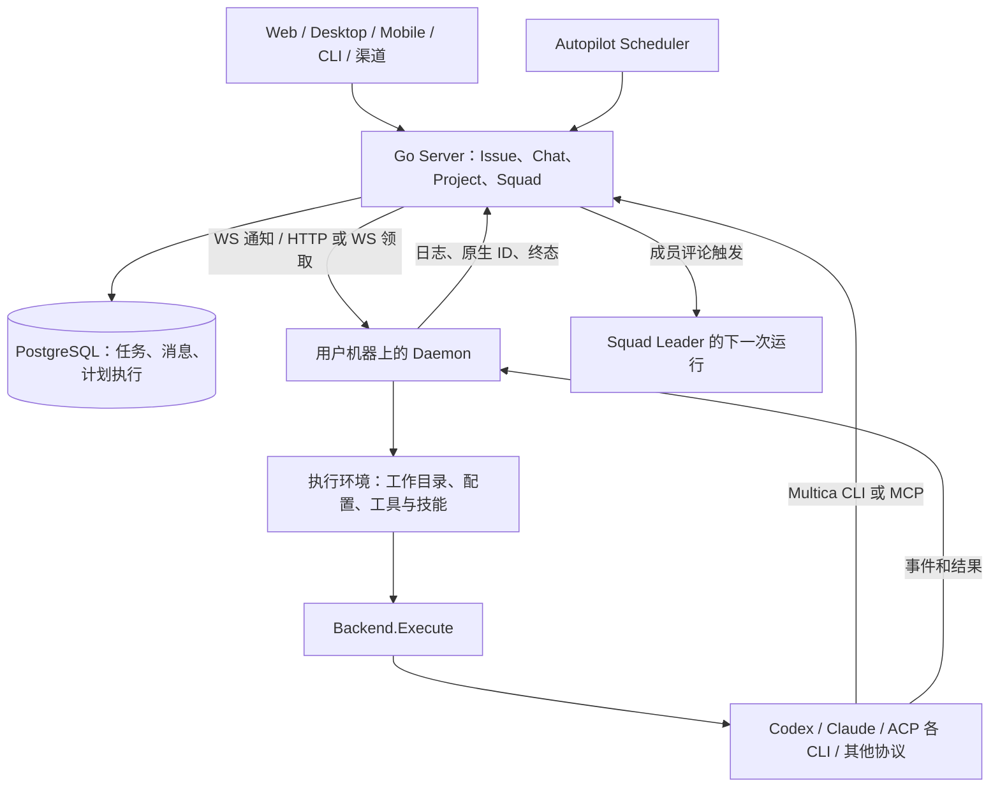

# Multica：以 Issue、小队和执行 Daemon 组织异构 Agent

## 1. 结论

**Multica 是异构 coding agent 团队与工程任务工作台的重要候选，但不是已经具备完整原生审批和长期伙伴记忆的 Grok 替代品。**它真正运行已安装的外部 agent CLI，没有强制让一个自有模型 loop 担任所有工作的主管；Squad leader 本身也是普通 agent，使用评论、结构化 mention 和任务队列协调成员。相比 Memoh，它已有更直接的小队委派模型；相比 Agent Swarm，它更强调人和 agent 共用的 Issue、项目、Review 与多端工作台。[^1][^2]

必须同时看到三个边界。第一，接入混合了 app-server、stream JSON、ACP 和专用协议，并非通用 ACP 客户端可以无差别管理所有引擎。第二，原生工具权限主要按自治执行自动处理，交付 Review 不是执行前审批。第三，当前 LICENSE 是带附加条件的 Multica License，不能把它归类为没有附加条件的 Apache-2.0 底座。[^2][^3][^4]

研究固定于 `multica-ai/multica` 提交 `cf52ba33ccf97f756de9e6b9d364fc0a57dc5260`，分析日期 2026-09-15。`git describe` 为 `v0.4.43-31-gcf52ba33c`，根 package.json 为 `0.2.0`；后者不宜作为统一产品发布版本。本轮只分析公开源码、仓内文档与测试源码，未运行服务器、客户端、测试套件或真实 agent。其他十个比较对象继续保持原研究快照。[^1]

## 2. 产品与控制面

Multica 将 Issue 和一次执行分开：Issue 是有负责人、状态、讨论与交付目标的工作对象，agent_task_queue 中的任务是一次排队、领取和执行。Chat 提供不依附 Issue 的私人对话；Project 提供仓库、文档等工作背景；Autopilot 提供周期或事件触发；Squad 提供协调者与成员。[^1][^5]

Server 管理协作事实，Daemon 管理机器、CLI、进程与执行资源。Desktop 会连接所在电脑作为 runtime；Web 或手机可以观察和操作其他机器上的执行。合上客户端是否仍继续，取决于实际执行机是否存活，不能把“服务端托管控制面”等同于“笔记本上的 agent 会在关机后迁往云端”。[^1][^6]

这一分层与 agentctl 思路有相似之处：执行地点和 UI 生命周期分离，协议适配落在执行侧。但 Multica Daemon 同时装配技能、仓库、任务身份和终态回传，不只是把终端通过网络暴露出来。

## 3. 原生接入：广，但不是同一种能力

`Backend` 的核心入口是 `Execute(ctx, prompt, ExecOptions)`，返回事件流与最终 Result。ExecOptions 包含工作目录、模型、原生 resume ID、超时、MCP 配置、额外参数和推理选项。它没有统一的交互式 `steer` 或 permission waiter 接口；可继续的产品对话主要通过下一次执行及原生 resume 组织。[^2]

当前 `SupportedTypes` 有 25 个协议家族键，加上复用 Pi 后端的 `omp` built-in identity，共 26 个注册身份；其中 Qoder 国际版/中国版也共享实现。这个数字衡量注册范围，不是 26 套独立协议，也不是本轮验证过 26 个 CLI。Custom runtime profile 仍必须基于允许的协议家族，不是任意 ACP executable 的开放协议槽。[^2]

| 路径 | 源码接入方式 | 应重点验证 |
|---|---|---|
| Codex | app-server，thread/start、resume 与原生终态 | thread 状态、取消握手、usage 与版本兼容 |
| Claude Code | 非交互 CLI、结构化流、resume | 权限模式、transcript、进程组清理 |
| Pi / Oh-My-Pi | JSON 模式与 session 文件 | session 文件路径、锁和 fork CLI 差异 |
| Hermes、Grok、Qoder、Dim 等 | ACP，但各有认证、load/resume、配置差异 | 声明能力与实际 RPC 是否一致 |
| DeepSeek Harness | Multica profile 的版本化 stdio 协议 | profile 安装、协议版本和产物回传 |
| 其他 CLI | 各自后端与命令/事件适配 | 不能从通用参数存在推断其被消费 |

例如，Multica 的 `grok` 是 Grok Build CLI ACP 路径，不是本研究中 `grok-bot-0.18-reconstructed` 的桌面产品。DSH 后端则说明框架可以通过专用适配成为可选执行者，但不能由此推断原 DSH 报告的固定快照已具备相同 profile。[^2][^7]

很多差异在源码中被明确处理：某些引擎从磁盘上下文文件读取系统说明，少数需要 inline SystemPrompt；ExtraArgs、ThinkingLevel 等只对读取它们的 backend 生效。统一表单需要能力门控，否则用户看到配置已保存，却不代表原生 agent 接受了配置。

## 4. ACP：恢复细节值得研究，权限仍偏自治

ACP 不是一个完全同构的后端。Grok、Dim 等使用 `session/load`，Qoder 使用 `session/resume`；有认证、模型设置、版本和锁释放的具体差异。Hermes 共享客户端还实现 terminal、permission 和事件转换。这里的价值是对真实 CLI 差异的处理，而不是只完成 initialize/new/prompt 三步。[^7][^8]

`classifyACPResumeFailure` 先区分取消和超时，再判断是否有“该 session 不可用”的正面证据。认证、MCP 不通、握手失败不能仅因发生在 resume 阶段就视为应该丢掉历史。这样的边界比遇到任意恢复错误就新建 session 更稳妥；分类仍依赖各实现的 RPC 错误形状和部分文本规则，需要持续兼容测试。[^8]

Daemon 的同次执行 fresh retry 还要求失败、有原 resume ID、尚未观察到工具调用。确认需新建后，它清除旧 ID、重新注入 cold context、加入连续性提示，并记录 retired session，防止以后从较老任务中再次捞到已废弃 ID。工具计数是已观测事件，不是操作系统级“绝无副作用”证明。[^9]

权限部分则是另一种取舍。共享 ACP selector 优先选择已知的 session-scoped grant，其次 allow_once，再尝试 reject_once；不会盲选永久 allow_always。未知选项或无合适选项有错误路径。这比无条件永久授权细，但依然是自动选择，没有面向人的统一等待审批流程。部分 backend 还有自己的策略，如 Hermes 设置 YOLO 环境变量、Grok 使用 always-approve 参数，不能把共享 selector 的限制推广成所有原生执行都受同一政策约束。[^3][^7]

因此，Multica 值得加入 ACP load/resume、错误分类和 daemon 生命周期的参考名单；若核心目标是工具级审批、即时插话和长期原生会话控制，仍应重点比较 Kandev、Memoh 和 Omnigent 的对应实现，而不能仅按接入数量定冠军。

## 5. Squad：真正的异构团队，协调协议主要由评论承载

Squad 包含一名 leader agent、agent 或人类成员、角色说明和自定义规则。派给 Squad 的工作先触发 leader，不会自动广播所有成员。leader 领取时得到系统操作规范、结构化成员 roster 与 squad instructions，再通过精确 mention markdown 派发；纯文本 `@name` 不是等价事件。[^10]

Server 的评论路由解析成员/小队，检查目标可用性与调用权限，防止 leader 自触发，并合并已有 pending 工作。成员后续评论可以触发 leader 再次评估；显式路由和完成结果有不同条件，不能把所有评论一律当作广播。角色说明影响模型选择，但不授予权限。[^10]

主管不是固定自有 loop。给 leader 换一个有相应工具和指令能力的注册 agent，协调仍可以走同一服务端路由。成员可位于不同 provider/runtime，这比 Memoh 当前 model-only 的托管 spawn_agent 更直接地支持异构团队。

不过，“leader 不亲自做实现、派完停下、每次写 evaluation、目标完成才提 Review”主要由注入协议约定。队列和评论路由由代码执行，leader 是否正确理解目标、选择成员、遵守协作规范仍取决于模型行为。它不是一个自动证明所有依赖、验收与成果归属的 DAG 引擎。

新产品应继承结构化派发与可审计评价，但考虑将关键 delegation 保存成独立对象：委派目标、约束、负责人、输入产物、结果和验收状态。评论是很好的交互入口，不应是唯一的机器可核验任务契约。

## 6. 任务领取、终态和重试

领取 SQL 使用 `FOR UPDATE SKIP LOCKED` 和状态更新，检查 runtime 在线、心跳新鲜、agent 当前绑定以及访问关系。它按 `(issue, agent)` 串行化，因此不同 agent 可以在同一个 Issue 并行；Chat 按 chat_session 串行化。还需结合 agent 并发上限与执行槽位，不能简单说整个 Issue 永远只允许一个运行。[^11]

领取后先处于 dispatched，有准备 lease，再进入 running。Finalization 为任务签发身份并登记交付信息；准备失败的回队按 task、runtime、dispatched_at 对准原领取，避免迟到错误撤回较新的领取。WS 是通知与通信途径之一，重连会触发 reconcile；数据库事实和回收逻辑使系统不完全依赖一次通知。[^6][^11]

Chat 完成状态与最新原生 session pointer 在同一事务更新，避免后续消息抢先领取旧 ID。终态 SQL 限制从 running 转 completed；retired session 与 rollout missing 同时记录。已完成输出、进程清理和 watchdog 的先后也有明确接口，避免原生结果已经到达后又被清理超时误判成模型失败。[^2][^9][^11]

自动重试只针对白名单中的基础设施失败，例如 runtime offline/recovery、timeout、provider network、技能包暂时不可用；编译错误和普通模型错误不会普遍自动重跑。provider network 有最多三次的特别节奏，明确关闭重试的配置仍应保留；离线重试等待运行时健康恢复。失败与 retry child 创建被放入同一事务流程，降低两者之间出现空档的风险。[^11]

这些是成熟度信号，但还不是外部效果 exactly-once。不能把 scheduler 的 lease token 当作 agent 每个 shell 操作的全局 fencing。旧 CLI 可能仍运行、外部操作可能成功但结果没回来，任务重试需要配合关键操作的幂等与对账。

## 7. Chat、切换和长期连续性

Chat 是独立于 Issue 的产品会话，可以附加 Project context。普通 UpdateChatSession API 只允许修改标题和项目，agent/creator/workspace 保持不变，原生 session/workdir/runtime pointer 归执行侧管理。因此不能将 README 的“切 provider 是下拉框”理解为任意已建立的 Chat 都能无损更换原生引擎。[^5]

Agent 配置本身允许修改 runtime，并验证目标与模型等选项；Builder 还有专门的 runtime switch API。这些是配置重绑或特殊产品流程，不能直接推广为普通 Chat 的原生状态迁移。Issue 换成员则由新执行读取可共享的任务上下文，属于交接，不是把 Claude 内部状态转换给 Codex。[^5][^12]

恢复通常依赖执行机上原生 transcript/session 文件与数据库中的 ID、workdir、branch 等引用。若本地原生状态已删除，只剩服务端日志，并不保证该引擎可继续 resume。Multica 对不可恢复 ID 的淘汰和 cold prompt 重建已有处理，仍需要让用户区分“恢复原上下文”与“根据任务记录继续”。

统一 Backend 当前没有 live steering 端口；评论或新 Chat 输入触发排队的下一次执行，取消有专门的运行路径。这与原生 agent 在当前 turn 接受约束不是同一能力。本轮未找到足以承诺跨全部后端同轮介入的证据，不能从某 CLI 自己支持 steer 推断 Multica 已接通它。

## 8. 长期知识与执行环境

Multica 的上下文中心是任务、评论、项目资源、技能和原生会话。Daemon 根据是否 resume 和是否有新增评论，注入全量阅读或增量阅读指引，避免模型误以为已经知道漏掉的工作。它更适合“围绕工作形成可回查的组织知识”，尚不能据此认定有 Memoh 那样的独立长期记忆形成、图检索与修订体系。[^9]

Codex 执行环境默认关闭原生 auto-memory 的生成和消费，理由是避免不透明的用户级知识跨任务/工作区混入；提供环境变量允许显式选择保留。这里体现了产品主动控制上下文来源，而不是“没有记忆意识”。但禁用某个引擎的隐式记忆，也不会自动补上面向长期伙伴的共享知识层。[^13]

执行环境装配仓库工作目录、provider 配置、MCP、任务 token 和技能。工作树、独立 clone、既有目录等策略需要按路径判断；per-task 配置隔离与任务 API token 不等于操作系统沙箱。仓内安全文档明确以 daemon OS 用户作为默认权限边界，原生 CLI 可以使用该账号可访问的文件与凭据。[^3][^6]

这对“把已经登录的 coding agent 带入团队”很方便；对新建多租户云产品，需要另行设计执行用户、容器/VM、网络、凭据及共享目录边界。这个差别直接影响从 Multica 演进的实际工作量。

## 9. Autopilot：持久计划与去重比普通 cron 更完整

Autopilot 调度使用数据库时间与持久执行记录。scheduler 对 `(job, scope, plan_time)` 领取，带 lease token、heartbeat、stale timeout 和 attempt；终态写入检查 lease token。Autopilot dispatch 再以 `(trigger_id, planned_at)` 唯一语义避免一个计划时点创建重复 run。[^14]

错过的 cron 时点按 latest-only 方式折叠，恢复时不是逐次补跑全部历史。任务触发范围与重试也有自己的预算和条件；计划恢复不依赖原进程里还留着 timer。相比 Memoh 当前检查到的进程内 schedule，这是一项更直接可复用的控制面资产。[^14]

也不能过度推导：计划执行记录、Autopilot run、agent task 和外部副作用属于不同层。已经存在但未成功完成派发的 run 有复用或重新处理分支，不代表任意 Webhook、脚本、邮件或代码发布都自动只执行一次。

## 10. 许可证与维护成本

固定版本的 LICENSE 明确由 Part I 附加条件和 Part II Apache 文本共同组成。Part I 对向第三方提供托管服务、嵌入对外商业产品、界面品牌和非界面归属说明提出条件；公开源码 fork 本身与运营托管服务被分开描述。这里记录上游条款内容，不推断条款效力或给出法律意见。对于“做全新产品”的底座比较，不能省略这一事实，也不能将本仓直接记作标准 Apache-2.0。[^4]

工程维护面包括 Go Server/Daemon、PostgreSQL、Next.js、Electron、独立 Expo Mobile，以及大量 provider 专用协议、CLI 行为和配置规则。接入数量是资产，也意味着持续跟随上游变化的成本。首版没有必要保留全部 26 个身份和所有客户端。

如果目标需要以自己品牌向外提供产品，技术验证和复用范围讨论应同时参考对应文件的许可条款；独立设计、只借鉴机制与直接 fork 是不同路线，报告不把它们混成同一成本。

## 11. 第九条演进路线：基于 Multica

### 阶段 A：验证一个真实异构小队

固定服务器、daemon 和两种 CLI 版本；使用一个 Squad、一个 leader、两个不同 provider Worker、一个代码仓库和 Web 界面。沿用 Issue/评论/mention/Review，不先建设新聊天外壳。

通过标准是主管换另一种 provider 后仍能派发；Worker 可以相互独立地交付；成员反馈只产生需要的协调任务；Review 有对应代码与验证证据。角色选得对、模型听从协议等能力必须真实验证，不能只检查 roster 已写入 prompt。

### 阶段 B：将协作契约从评论中提取出来

增加 WorkItem/Delegation/Artifact/Acceptance 关联，保留评论作为入口和人的讨论区。结构化 mention 创建的工作记录明确父任务、输入、目标、依赖、runtime 与结果，避免靠读完整评论线程猜测谁欠谁一个交付。

迁移采用新增可空关联和逐步补写：已有 Issue 和历史执行保留，旧评论不被自动宣布为已验证的任务契约。通过标准是重复 mention、乱序结果和 leader 重跑不会重复推进同一阶段。

### 阶段 C：补伙伴与显式引擎交接

把长期伙伴身份、对话时间线和每次原生执行绑定分开。伙伴可以管理多个 Issue，也能接受没有 Issue 的通用事务。引擎交接先采用新会话关联与明确交接摘要，不复用另一种引擎的原生 ID。

新增知识层应以用户可见的事实、偏好、来源与修订为中心，结合已有项目资源和技能；不要简单重新启用各个 CLI 的不透明全局记忆。通过标准是跨引擎仍保留目标与成果，同时能解释哪些内部上下文没有继承。

### 阶段 D：建设原生权限桥与能力分级

扩展 Backend 为可选的审批、问答、同轮介入和继续端口。先接两条能力明确的路径；ACP 保留目标原生选项，Codex/Claude 接到统一持久决策记录，取消时失效旧请求。默认自治与需人确认的策略应在任务与工具层明确区分。

通过标准是拒绝一个真实工具动作后 agent 能继续解释和规划；用户停止后迟到许可不会放行；不支持 steer 的后端明确提供排队或新任务，不伪装成当前执行已接受。

### 阶段 E：恢复、执行隔离与交付产品化

保留现有领取、retry lineage、session retirement、原子终态和 Autopilot plan 去重，补外部操作的幂等键、效果查询和未知状态处置。需要云端多租户时引入独立执行边界，避免沿用个人 daemon 用户权限作为租户隔离。

通过标准是 owner 死亡、领取响应丢失、原生结果到达后回传失败和 schedule stale-steal 都得到可核查结果。若主要需求集中在 C/D 且很少需要 Issue 工作台，重新比较 Memoh/Omnigent；若 A/B/E 是核心，Multica 的已有资产更匹配。

## 12. 与其他十个对象的比较

| 对象 | Multica 的相对优势 | 对方仍值得借鉴 |
|---|---|---|
| Grok 重建版 | 可运行的异构原生团队、任务控制面 | 长期伙伴与自然交互体验 |
| Cindy | 多端协作、Issue/Squad/Autopilot | 桌面伙伴与原生停泊交接 |
| Rakazo | 已有多 CLI 和小队委派 | Bot/Computer/Routine 的通用产品组织 |
| AO | 更完整的人与 agent 共用工作台 | 编码监督与交付生命周期 |
| Kandev | 小队、Issue、自动化产品层 | ACP 会话交互与执行宿主 |
| DSH | 完整任务产品；DSH 可作为一个后端 | 可组合能力与框架契约 |
| Cursor Projects | 公开服务端、daemon 与多 CLI | 项目主管和成员协作体验 |
| Omnigent | Issue/Squad 与持久自动化 | 会话控制、原生交互与切换 |
| Agent Swarm | 人与 agent 共用任务板、多端与项目交付 | 常驻身份、共享记忆与 workflow |
| Memoh | 已有异构小队与计划去重 | 伙伴电脑、图记忆、原生权限桥 |

对于“团队围绕代码交付协作”，Multica 应进入首轮验证；对于“长期伙伴使用电脑并接受人类随时介入”，Memoh、Omnigent、Cindy 仍更直接。Multica 不改变产品目标，反而帮助区分：目标究竟是带聊天的任务团队，还是能带团队工作的长期伙伴。

## 13. 验证范围与后续实验

| 场景 | 验证重点 |
|---|---|
| 两种 leader、两种 Worker | 委派不依赖固定主管 loop；成果可追踪 |
| 并发 claim | 同 `(issue, agent)` 串行，不阻止不同 agent 合理并行 |
| ACP resume 报错 | 取消、认证失败与明确 session 拒绝被区别处理 |
| 原生 session 损坏 | 淘汰旧 ID，cold context 不假装已经 resume |
| 原生权限拒绝 | 当前自动策略基线明确，新桥能真正阻止执行 |
| 结果已产生但进程清理慢 | 终态不被 watchdog 改写成超时 |
| 两个 scheduler / stale lease | 同计划时点不产生重复业务 run |
| 临时工作树清理 | 成果和持久路径仍可访问 |
| 私人 Chat 到团队 Issue | 分享范围与归属明确，不误将私人内容广播 |
| 外部动作成功、回传丢失 | 先查结果，再决定是否重试 |

仓内已有 claim race、完成竞态、session resume、provider adapter 和 scheduler 并发测试源码，可作为后续验证入口；这些测试没有在本轮执行。这里没有建立性能、成本或成功率排行榜。

## 来源

[^1]: 项目定位和版本：[README](https://github.com/multica-ai/multica/blob/cf52ba33ccf97f756de9e6b9d364fc0a57dc5260/README.md)、[package.json](https://github.com/multica-ai/multica/blob/cf52ba33ccf97f756de9e6b9d364fc0a57dc5260/package.json)、[AGENTS.md](https://github.com/multica-ai/multica/blob/cf52ba33ccf97f756de9e6b9d364fc0a57dc5260/AGENTS.md)。
[^2]: 接入契约：[agent.go](https://github.com/multica-ai/multica/blob/cf52ba33ccf97f756de9e6b9d364fc0a57dc5260/server/pkg/agent/agent.go)、[builtin_runtimes.go](https://github.com/multica-ai/multica/blob/cf52ba33ccf97f756de9e6b9d364fc0a57dc5260/server/pkg/agent/builtin_runtimes.go)、[claude.go](https://github.com/multica-ai/multica/blob/cf52ba33ccf97f756de9e6b9d364fc0a57dc5260/server/pkg/agent/claude.go)、[codex.go](https://github.com/multica-ai/multica/blob/cf52ba33ccf97f756de9e6b9d364fc0a57dc5260/server/pkg/agent/codex.go)、[pi.go](https://github.com/multica-ai/multica/blob/cf52ba33ccf97f756de9e6b9d364fc0a57dc5260/server/pkg/agent/pi.go)。
[^3]: 自治执行与权限：[hermes.go](https://github.com/multica-ai/multica/blob/cf52ba33ccf97f756de9e6b9d364fc0a57dc5260/server/pkg/agent/hermes.go)，`handleAgentRequest`、`selectACPPermissionOption`；[codex.go](https://github.com/multica-ai/multica/blob/cf52ba33ccf97f756de9e6b9d364fc0a57dc5260/server/pkg/agent/codex.go)，`handleServerRequest`；[安全模型](https://github.com/multica-ai/multica/blob/cf52ba33ccf97f756de9e6b9d364fc0a57dc5260/apps/docs/content/docs/security-model.zh.mdx)。
[^4]: [Multica LICENSE](https://github.com/multica-ai/multica/blob/cf52ba33ccf97f756de9e6b9d364fc0a57dc5260/LICENSE)，Part I 与 Part II。
[^5]: Chat：[chat 文档](https://github.com/multica-ai/multica/blob/cf52ba33ccf97f756de9e6b9d364fc0a57dc5260/apps/docs/content/docs/chat.mdx)、[chat handler](https://github.com/multica-ai/multica/blob/cf52ba33ccf97f756de9e6b9d364fc0a57dc5260/server/internal/handler/chat.go)，`UpdateChatSessionRequest` 与更新约束。
[^6]: 执行侧：[daemon.go](https://github.com/multica-ai/multica/blob/cf52ba33ccf97f756de9e6b9d364fc0a57dc5260/server/internal/daemon/daemon.go)、[reconcile.go](https://github.com/multica-ai/multica/blob/cf52ba33ccf97f756de9e6b9d364fc0a57dc5260/server/internal/daemon/reconcile.go)、[daemon handler](https://github.com/multica-ai/multica/blob/cf52ba33ccf97f756de9e6b9d364fc0a57dc5260/server/internal/handler/daemon.go)、[agent.sql](https://github.com/multica-ai/multica/blob/cf52ba33ccf97f756de9e6b9d364fc0a57dc5260/server/pkg/db/queries/agent.sql)。
[^7]: 专用接入：[grok.go](https://github.com/multica-ai/multica/blob/cf52ba33ccf97f756de9e6b9d364fc0a57dc5260/server/pkg/agent/grok.go)、[dim.go](https://github.com/multica-ai/multica/blob/cf52ba33ccf97f756de9e6b9d364fc0a57dc5260/server/pkg/agent/dim.go)、[qoder.go](https://github.com/multica-ai/multica/blob/cf52ba33ccf97f756de9e6b9d364fc0a57dc5260/server/pkg/agent/qoder.go)、[dsh.go](https://github.com/multica-ai/multica/blob/cf52ba33ccf97f756de9e6b9d364fc0a57dc5260/server/pkg/agent/dsh.go)。
[^8]: 恢复分类：[acp_session.go](https://github.com/multica-ai/multica/blob/cf52ba33ccf97f756de9e6b9d364fc0a57dc5260/server/pkg/agent/acp_session.go)、[acp_session 测试源码](https://github.com/multica-ai/multica/blob/cf52ba33ccf97f756de9e6b9d364fc0a57dc5260/server/pkg/agent/acp_session_test.go)。
[^9]: 恢复与上下文：[daemon.go](https://github.com/multica-ai/multica/blob/cf52ba33ccf97f756de9e6b9d364fc0a57dc5260/server/internal/daemon/daemon.go)，`shouldRetryWithFreshSession` 与 fresh retry；[prompt.go](https://github.com/multica-ai/multica/blob/cf52ba33ccf97f756de9e6b9d364fc0a57dc5260/server/internal/daemon/prompt.go)、[agent.sql](https://github.com/multica-ai/multica/blob/cf52ba33ccf97f756de9e6b9d364fc0a57dc5260/server/pkg/db/queries/agent.sql)。
[^10]: 小队：[squad_briefing.go](https://github.com/multica-ai/multica/blob/cf52ba33ccf97f756de9e6b9d364fc0a57dc5260/server/internal/handler/squad_briefing.go)、[comment.go](https://github.com/multica-ai/multica/blob/cf52ba33ccf97f756de9e6b9d364fc0a57dc5260/server/internal/handler/comment.go)、[task.go](https://github.com/multica-ai/multica/blob/cf52ba33ccf97f756de9e6b9d364fc0a57dc5260/server/internal/service/task.go)，`EnqueueTaskForSquadLeader`；[Squad 文档](https://github.com/multica-ai/multica/blob/cf52ba33ccf97f756de9e6b9d364fc0a57dc5260/apps/docs/content/docs/squads.zh.mdx)。
[^11]: 队列与终态：[task.go](https://github.com/multica-ai/multica/blob/cf52ba33ccf97f756de9e6b9d364fc0a57dc5260/server/internal/service/task.go)，`FinalizeTaskClaim`、`RequeueTaskAfterClaimFailure`、`CompleteTask`、`retryableReasons`；[agent.sql](https://github.com/multica-ai/multica/blob/cf52ba33ccf97f756de9e6b9d364fc0a57dc5260/server/pkg/db/queries/agent.sql)，`ClaimAgentTask`、`CompleteAgentTask`。
[^12]: 配置重绑与 Builder：[agent.go](https://github.com/multica-ai/multica/blob/cf52ba33ccf97f756de9e6b9d364fc0a57dc5260/server/internal/handler/agent.go)、[agent_builder.go](https://github.com/multica-ai/multica/blob/cf52ba33ccf97f756de9e6b9d364fc0a57dc5260/server/internal/handler/agent_builder.go)、[chat.sql](https://github.com/multica-ai/multica/blob/cf52ba33ccf97f756de9e6b9d364fc0a57dc5260/server/pkg/db/queries/chat.sql)。
[^13]: 上下文来源：[codex_memory.go](https://github.com/multica-ai/multica/blob/cf52ba33ccf97f756de9e6b9d364fc0a57dc5260/server/internal/daemon/execenv/codex_memory.go)、[prompt.go](https://github.com/multica-ai/multica/blob/cf52ba33ccf97f756de9e6b9d364fc0a57dc5260/server/internal/daemon/prompt.go)。
[^14]: 持久计划：[db_ops.go](https://github.com/multica-ai/multica/blob/cf52ba33ccf97f756de9e6b9d364fc0a57dc5260/server/internal/scheduler/db_ops.go)、[jobs_autopilot.go](https://github.com/multica-ai/multica/blob/cf52ba33ccf97f756de9e6b9d364fc0a57dc5260/server/internal/scheduler/jobs_autopilot.go)、[autopilot.go](https://github.com/multica-ai/multica/blob/cf52ba33ccf97f756de9e6b9d364fc0a57dc5260/server/internal/service/autopilot.go)、[autopilot.sql](https://github.com/multica-ai/multica/blob/cf52ba33ccf97f756de9e6b9d364fc0a57dc5260/server/pkg/db/queries/autopilot.sql)。
