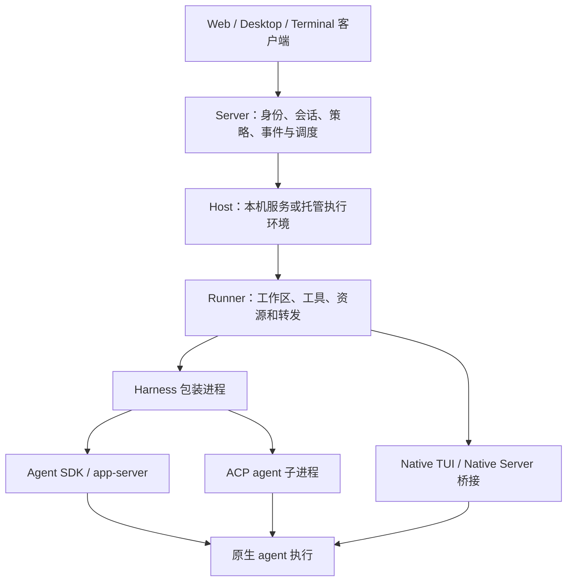

# Omnigent：多 Harness 编排底座的能力、边界与演进路线

## 1. 核心判断

**Omnigent 是本次新增对象中最值得实际验证的实施底座。**它已经把不同原生 agent 接入、服务器会话、执行宿主、用户审批、跨端事件和子会话放进同一个开源系统，和“支持不同 coding agent 的 Grok 式产品”有直接关系。它应进入 Cindy、AO 之外的首轮候选，而不是仅作为工具库参考。

但“支持多个 harness”不意味着每条路径具有相同的恢复、插话、指令和审批能力。它的通用 ACP 当前侧重运行中多轮、流式和权限交互；原地切换有明确适用范围；部分产品能力依赖原生 TUI 桥接，和通过稳定结构化协议管理 agent 的维护成本不同。[^1][^2]

本报告基于 `omnigent-ai/omnigent` 提交 `2a05baf4399dac074f5d29fb618bd0c7f09ec8f4`，分析日期 2026-09-15。代码、测试源码和注册表是主要证据；README 标记 alpha，本次不把能力声明或上游测试注释当作已完成的实机验证。没有安装其完整运行环境、登录模型账户或运行真实模型 benchmark。

## 2. 系统结构：需要维护控制循环，不必统一重写推理循环

可以将可见实现概括为以下职责关系；不同 native 与 SDK 路径不一定经过完全相同的每一跳：

`HarnessProcessManager` 负责按 conversation 懒启动进程、客户端连接、空闲回收和崩溃后的遗留进程清理。`HarnessApp` scaffold 处理事件入口、工具结果/审批等待、心跳、取消和关闭；`ExecutorAdapter` 将各 executor 的输出翻译成产品事件。[^3]

Codex executor 实际使用长驻 `codex app-server`，保留 thread，并通过 dynamicTools 暴露 Omnigent 工具；ClaudeSDKExecutor 使用 Claude Agent SDK，由 SDK 保留其内部工具循环与上下文管理。通用 ACP executor 同样让外部 agent 运行自己的 loop。[^4]

因此，不能因为仓库有 runtime/workflow 就断言它又锁死在一套自有推理 loop 中。新产品仍然需要调度、恢复、审批等控制逻辑，但这些逻辑可以管理多个原生执行器。Omnigent 的价值正是在这一层；同时它也提供直接模型/SDK 等其他路径，选型时必须明确采用哪条路径。

## 3. 能力矩阵：必须比较具体接入路径

注册表把 integration、elicitation、resume、fork history、instruction delivery、interrupt、streaming 等分开声明。这是优点，但依旧需要从执行路径和实机结果核对。[^2]

| 接入路径 | 主要机制 | 当前源码中最重要的边界 |
|---|---|---|
| `claude-sdk` | Claude Agent SDK + MCP 工具桥 | 注册为 cold-only；不能由 SDK 名称推定所有原生恢复/子 agent 控制能力 |
| `codex` | 长驻 app-server + 原生 thread + dynamicTools | 接入深度强，仍需核对实际二进制版本和恢复路径 |
| `claude-native` / `codex-native` | 原生终端包装，hook 或 JSON-RPC 审批接入 | 依赖 native bridge、终端和原生会话格式，维护面更大 |
| `cursor` | Cursor SDK executor | 与 Cursor Projects 云端 coordinator 不是同一能力，也不是 generic ACP |
| `cursor-native` | 常驻 TUI 与审批镜像 | 注册表声明不逐 token streaming、spec instructions 不投递；fork 可 preamble，原地 switch 不采用该分支 |
| `pi` / `pi-native` | 程序化路径 / 常驻 TUI 路径 | 同一家 agent 的两条路径能力不同，不能合并计分 |
| `acp` / `acp:<slug>` | 通用 stdio ACP | 进程存活时复用会话，重启时重新 new + 历史文本前缀 |
| Devin 等 ACP 内建项 | 通用 ACP 加可选 vendor extension | 子 agent 展示取决于具体 extension，不由 ACP 标签自动保证 |

有两个容易误读的字段。`resume: warm-reattach` 不等于主机重启后无损恢复；`subagents` 也不是“是否拥有任意多会话编排”的总开关，它关联到具体 native spawn/观察接入。Omnigent 自己的 `sys_session_send` 子会话机制需要另行核对。

`instruction_delivery` 尤其重要：部分 native 路径明确是 `NOT_DELIVERED`。这意味着界面保存了角色描述，不等于该描述进入真实 agent。若新产品承诺一个稳定伙伴的人格和工作规则，必须针对选定路径验证指令实际到达的时机和内容，不能只验证消息发送成功。

## 4. ACP 实现：值得复用，但恢复层还不够

### 4.1 已有能力

`AcpExecutor` 以 argv 启动配置的 agent 命令，经 initialize、session/new、session/prompt 完成调用。运行期间映射文本、思考、tool call 与 tool update；处理请求权限和可选文件读写；以 `session/cancel` 发出取消。[^5]

它处理了实际适配问题：客户端/服务端分配 session ID 的差别、可选非标准 model 字段、认证、图像能力、模型 config option、错误诊断，以及每个 agent 的环境变量白名单。`AcpExtension` 为 vendor 方言提供组合点，Devin 子 agent 活动可转成产品子会话；通用 extension 为空时不做这种推断。[^6]

ACP agent 可以通过 session/new 的 MCP server 配置访问 Omnigent 能力。对于忽略 session-scoped MCP 的 agent，必须采取另外的配置方式或明确缺失功能。内建 Jcode 条目就关闭该 MCP 广告。目录中的 `grok` 条目指 xAI Grok Build CLI，不能与此前研究的 Grok Bot 0.18 重建项目混为一谈。[^7]

### 4.2 原生恢复与上下文连续性的差别

当前 generic ACP executor 没有 `session/load` 调用。进程存活时复用 `_session_id`，进程重新启动后再创建会话，并将先前产品消息构造成历史前缀注入新 prompt。[^5]

这能维持任务语义上的连续，但不能恢复原 agent 的全部内部结构：原生压缩边界、工具状态、未完成审批、内部子 agent 和其他 agent 私有资源都不等同于聊天历史。首次 system instructions 也通过用户 prompt 前缀进入，而非原生系统指令接口；配置允许关闭该注入，表明 prompt 拼接本身存在兼容性取舍。

因此，在当前静态证据下，**Kandev 仍是 ACP 原生 session 加载和 replay 协调的优先参考；Omnigent 是 ACP 与产品控制面结合的优先候选。**Kandev 的 `LoadSession` 和 replay barrier 对比这里的新建+重放，是直接影响长期任务恢复的结构差别。[^8]

### 4.3 协议覆盖不是“通吃”

当前服务端发起请求处理分支覆盖权限和可选 fs 请求，其余返回 method-not-found；不能因此宣称完整实现所有 ACP 扩展，例如任意 terminal 委托。子 agent 方言也有专门扩展层。新接入一个 ACP CLI 应按它实际需要的能力做协议契约测试，而不是只检查 initialize 成功。

ACP 提供了统一的通信起点，并没有替产品提供统一的执行权、交付验收或共享记忆。Omnigent 已做了一部分上层工作，选用它可以减少工程量，但不会消除这些问题。

## 5. 工具与策略：执行责任已经分流，策略覆盖仍有条件

`ExecutorAdapter` 识别 `internally_executed`：原生 agent 内部执行的工具只转为观测事件，不进入宿主工具结果队列。这避免将“原生 shell 已经运行”的通知误当成宿主再运行一次的请求，是比简单日志转发更扎实的接入设计。[^9]

ACP permission 请求会先走 TOOL_CALL policy，再交给用户选择；显式 DENY 被拒绝，ASK 在缺少交互 handler 时拒绝。不同权限选项会映射回 agent。正常 adapter 路径安装了相关桥接，但 standalone executor 在没有策略/交互桥时允许执行，不能把底层类直接嵌入后仍假定完整策略生效。[^5]

还有两个应明确测试的边界：policy evaluator 异常后会转向交互回退；在 bypassPermissions 且没有得到明确策略意见时，可以放行。原生 agent 不请求权限的工具调用，也不能仅凭 ACP 的 permission 接口保证全部被策略层拦截。需要将工具 gate、进程 sandbox 和网络/文件权限一起验证。[^5][^10]

`acp_harness._resolve_os_env` 在缺少配置或 JSON 无法解析时回退 caller_process + sandbox none。这属于底层组合默认值，不意味着所有产品默认启动都无沙箱；但如果新产品要求“配置错误必须拒绝启动”，就不能不加约束地继承这个回退行为。[^10]

这类问题不是增加一张统一审批卡就能解决的。新产品应记录实际执行地点、执行方、适用策略、审批结果和原生返回结果，确保每条选定 harness 路径都满足相同的用户承诺。

## 6. 多 agent 编排有三种不同路径

### 6.1 Omnigent 拥有的独立子会话

`sys_session_send` 支持以 agent+title 创建或继续子会话，也支持向已有直接子会话发送消息。子会话有自己的 conversation 和历史，可并发派发；完成通知经异步工作/inbox 机制回传。已有运行任务的 follow-up 与刚启动任务的重试语义也有区分。[^11]

这最接近新产品需要的异构 Worker 模型：外层系统知道 Worker 身份、消息和结果，而非仅得到一个外部程序的最终字符串。它也限定树状写入范围，不能直接推导为任意多 Lead 共享同一个 Worker。

### 6.2 原生 agent 自己的子 agent

Claude、Codex 等原生 spawn 通过 hook/bridge 上报或路由。`runner/subagent_routing.py` 中跨 harness 对应关系主要是 Claude 与 Codex 两家及其 native/SDK 组合。该路由是 advisory：基础设施故障允许原生 spawn 按原模型继续。[^12]

因此，“混合多个 harness”不能推导为所有 agent 的内部 spawn 都能被改派到任意另一个引擎；路由失败也不等于任务被安全拒绝。成本优化可以接受这种回退，强制隔离或强制指定执行者则需要更严格的产品契约。

### 6.3 从 ACP 方言观察子 agent

ACP extension 把 vendor 子 agent 活动映射为产品树。这里首先解决可观察性，不自动获得对该子 agent 的完整独立控制。能显示一个子 agent 的工具卡，与能暂停、审批、切换和迁移它，是不同能力。[^6]

建议新产品以第一种方式作为可管理 Worker 的主模型，把第二、三种保留为原生内部活动。不要把它们都塞进一个无差别的“agent 列表”，否则用户会误以为每一项具有相同控制权限。

## 7. 原地换引擎：比模型切换更真实，但不是无损迁移

`POST /sessions/{id}/switch-agent` 的真实流程是：校验编辑权限和目标 bundle，检查顶层会话与空闲条件，克隆目标 agent，修改绑定与标签，清除 external session ID，通知客户端，再异步清理旧 runner 资源。产品会话 ID、历史、文件与 host/workspace 被保留。[^13]

明确限制包括：不能切换 `sub_agent`；当前 turn 运行时拒绝；目标必须是可绑定的模板 agent；跨 provider 不保留 model/reasoning 配置。支持历史重建的 native 目标从 Omnigent items 生成新原生会话，并不是返回旧引擎的原生停泊会话。

Cursor-native 和 OpenCode-native 的 preamble 历史能力用于 fork；当前 switch 路径不调用这个分支，切入会新开。`ForkHistory.PREAMBLE` 的注册声明不能直接外推为所有原地切换均携带历史。测试源码也对 Cursor/Pi 等目标做了 gating 验证。[^13][^14]

这与 Cindy 的停车再恢复有明显取舍：Omnigent 更强调保持一个产品 session、更换底层绑定；Cindy 的普通任务路径保留离场引擎会话，回切时尝试 resume 并补增量。前者统一转换更直接，后者更有机会保留原生上下文价值，但都需要处理失效和版本变化。

## 8. 恢复与一致性：下一轮应优先验证的地方

存储实现明确把 conversation/labels 与 agent/metadata 放在两次独立事务中：先提交新的 conversation binding，再删除旧 session agent、创建新 agent、清除原生 session ID。代码说明两个数据库不能共享 commit，分别重试。[^15]

**这是一个需要故障注入的中间状态窗口。**若第一阶段提交后进程终止，新的绑定与目标 agent 元数据可能暂时不一致。当前查看的切换路径没有展示一个持久 switch operation/outbox 来统一完成后续阶段；不能把“每次事务独立重试”解释成“跨数据库原子切换”。本报告没有复现故障，也不据此断言所有部署必然损坏。

旧资源清理是返回后的 best-effort background task。reset 失败会记日志且不发布误导的文件变更失效事件，这是正确的防护；但新绑定已成功返回与旧资源已清理完毕不是同一个事实。还应测试切换后立即发送消息、runner 离线、reset 延迟和两个客户端同时切换。[^14]

系统并非没有恢复设计。进程管理有孤儿清理；server→runner 的 session-init v2 snapshot 有 `suppress_recovery_turn`，避免恢复路径和正常转发重复消费同一条消息；存在真实 runner 重启后子 agent inbox 恢复的 E2E 测试源码。[^3][^16]

合理判断是：已经有值得继承的恢复机制，但不能只凭“有恢复”给整个状态机作可靠性担保。应该逐条验证切换、消息、审批、工具副作用和后台工作之间的边界。

## 9. 产品层：比纯调度库完整，距离长期伙伴仍有工作

Omnigent 已有 Project、会话权限、host、文件/终端、子会话、定时任务和多端事件通路。Project 是独立、owner-private 的数据库对象；其 config 是新建会话的默认建议，不是项目级强制策略，也不能把会话分享自动理解为完整项目协作权限。[^17]

它的现有身份组织仍侧重模板 agent 与 session-scoped clone。新产品如果要实现“伙伴长久存在、下面的引擎随时可换”，应独立定义 PartnerProfile，关联许多会话和任务，而不把伙伴身份等同于某一次 switch 时被删除/重建的 agent row。

定时任务使用持久任务配置和进程内 RRULE timer；服务重启只安排下次未来触发，不补跑停机期间的触发。正常完成靠事件写入；失去终态的 run 通过读取时的年龄检查兜底，超过 6 小时标为 incomplete/failed，不是主动恢复执行，也不会因此停止真实长任务。[^18]

这些选择对会话工作台可以合理，但对“全天候长期伙伴”要重新定义：错过提醒怎么办、事件是否合并、主机离线多久后换地方执行、长任务状态未知时是否允许重试。这些是产品策略，不应在 fork 后隐式沿用。

## 10. 优缺点与继承成本

| 维度 | 优点 | 需要承担的成本 |
|---|---|---|
| 多原生接入 | SDK、app-server、ACP、TUI 多路径真实实现 | 不同能力组合与 vendor 版本形成测试矩阵 |
| 控制面 | server/host/runner/包装进程已分层 | 配置、传输、状态投影和进程生命周期较复杂 |
| 人类介入 | 审批、工具观测、会话控制已有入口 | 每种 native/ACP 的拦截完整性不同 |
| 交接 | 产品会话保留、跨家族历史转换 | 原生状态不保留；子会话和部分目标受限 |
| 编排 | 独立子会话、inbox 与原生子 agent 桥接 | 三类子 agent 语义需要在产品中明确区分 |
| 运行环境 | 本机 host 服务与托管 host 结构 | 首版全开云 provider 会扩大运维和故障面 |
| 产品 | 多端、Project、分享、定时任务 | 长期伙伴、项目共享决策、验收仍需新增 |
| 可维护性 | 源码开放，Apache-2.0 文件明确 | alpha、文档有陈旧引用，大型适配文件增加理解成本 |

源码中存在指向当前仓库不存在的设计文档的注释，以及能力概述与实际 helper 分支不完全同步的情况。维护时应以运行入口和测试为准，不要把注释当作冻结的架构契约。[^3][^13][^14]

## 11. 第六条实施路线：基于 Omnigent 演进

### 阶段 A：限制范围，证明底座适配

选择一个本机 host、一个 server、两条结构化原生路径和一个通用 ACP 样本。优先验证 Claude SDK / Codex app-server，再补一条 ACP；若坚持纯 ACP，则直接以两个 ACP 引擎开始，并接受需要补恢复层的成本。

退出条件是同一产品工作故事成功：发任务、看原生工具、审批/拒绝、继续多轮、取消、关闭 UI 后继续、重连得到正确结果。必须通过实际 server+runner，而不只是直接调用 executor。先不要启用全部 native TUI、云 provider 和智能路由。

### 阶段 B：让能力成为可验证的产品承诺

把现有 registry 细化为 observed/declared/tested 三种证据；增加原生 load、cold replay、指令投递、steer、工具 gate、fork 与 switch 的独立能力。将不支持的操作在 UI 明确降级，而不是根据 harness 名猜测。

退出条件是两种引擎的能力差异能够在界面和错误结果中被准确表达；适配器升级会触发契约回归。现有 harness bench 是很有价值的起点，它区分 full-server、native-tui 和快速 wrap-direct，后者不能验证完整策略链。[^19]

### 阶段 C：补齐持久交接与执行权

建立 `SwitchOperation`，记录源/目标、generation、阶段和可重试状态；使数据库 binding、目标准备和旧资源回收可以在重启后对账。新 turn 应等待适当阶段或被 fence，不能把后台清理的时序当作正确性条件。

通用 ACP 先实现 agent 宣告支持时的 session/load，再实现失败后的明确 cold replay；给两者不同的恢复结果。若需要 Cindy 式回切，额外保存每个引擎的停泊 session ref 和交接摘要，保留失效处理。

退出条件是故障注入后不会重复写文件、旧引擎不会继续拥有同一工作区执行权、审批不会回给新会话。若这些保证需要改写整个 server/runner 所有权模型，应重新比较独立核心路线的成本。

### 阶段 D：建立伙伴与项目协作层

新增 PartnerProfile、ProjectGoal、Task、Artifact、Decision 和 SubscriptionEvent；沿用 Omnigent 的 session/host/权限基础，不把新对象压进大量自由 labels。迁移上先增加可空引用与版本字段，回填现有 session 的伙伴/项目归属，再逐步切换读路径，保留旧会话可读。

主管与 Worker 都选择原生 runtime。产品控制层负责路由、预算、事件和状态；验收规则决定是否完成目标，避免再造一个只能由自有 LLM loop 担任的固定主管。

退出条件是用户能围绕伙伴持续工作，主管可以分配两个异构 Worker，人类可以介入，成果有来源和验收记录。Cursor 的项目成员协调与队列策略可用于设计场景；Grok/Rakazo 的伙伴体验可用于产品组织。

### 阶段 E：常驻事件与远端

明确 missed-fire、积压合并、去重与恢复策略，再增加远端 host 和第二种 sandbox。对调度结果未知的任务，先观测与对账，再决定重发；操作型任务不能按纯聊天逻辑重试。

退出条件是停机与断线不引发重复外部副作用，任务归属、工作区与策略在跨端仍一致。团队能力需要独立项目 ACL 和身份审计，不能只扩大会话分享范围。

### 成本与停止条件

这条路线最大的节省是现成产品控制面和适配器，最大的成本是理解并稳定已有跨层契约。若两条主路径的验证效果良好，fork 有明显优势；若差异化需求要求重写历史、进程管理、权限和整个会话 API，则应把 Omnigent 降为参考，转向独立核心。

不建议在尚未证明主路径之前给出固定工期。可用阶段 A 的实际接入工作量、失败类型及阶段 C 的故障注入结果，估计后续维护成本。SDK/CLI 升级、native transcript 格式、跨数据库切换、事件对账会是长期成本中心。

## 12. 验证清单与研究限制

| 场景 | 当前证据 | 下一步通过标准 |
|---|---|---|
| ACP 多轮与重启 | new/prompt/replay 实现、fake-agent 测试源码 | 原生 load 与 cold replay 分别验证，历史不重复 |
| 原生工具只执行一次 | internally_executed 分流 | 真实写文件操作计数一次，重连不重发 |
| 审批 | policy + elicitation 实现 | ALLOW/ASK/DENY、断连、超时与 bypass 都测 |
| 换引擎 | route/store/helper 与测试源码 | 两次事务之间和 reset 前后 kill 均可恢复 |
| 子 agent | 独立子会话、native routing、ACP extension | 三种角色可区分，结果重复投递不重复验收 |
| 长期伙伴 | 项目、定时任务和会话基础 | profile 连续、missed-fire 策略明确、停机可对账 |

本轮没有运行 Omnigent 的单测、E2E 或 harness bench。测试源码表明作者覆盖了哪些意图，不等于本报告测得成功率。这里的“候选优先”是架构匹配判断，不是性能、稳定性或安全认证结论。

## 来源

[^1]: 项目定位与 alpha 状态：[README](https://github.com/omnigent-ai/omnigent/blob/2a05baf4399dac074f5d29fb618bd0c7f09ec8f4/README.md)、[LICENSE](https://github.com/omnigent-ai/omnigent/blob/2a05baf4399dac074f5d29fb618bd0c7f09ec8f4/LICENSE)。

[^2]: 能力定义与注册：[harness_capabilities.py](https://github.com/omnigent-ai/omnigent/blob/2a05baf4399dac074f5d29fb618bd0c7f09ec8f4/omnigent/harness_capabilities.py)、[harness_plugins.py](https://github.com/omnigent-ai/omnigent/blob/2a05baf4399dac074f5d29fb618bd0c7f09ec8f4/omnigent/harness_plugins.py)。

[^3]: 包装进程与事件 scaffold：[process_manager.py](https://github.com/omnigent-ai/omnigent/blob/2a05baf4399dac074f5d29fb618bd0c7f09ec8f4/omnigent/runtime/harnesses/process_manager.py)、[_scaffold.py](https://github.com/omnigent-ai/omnigent/blob/2a05baf4399dac074f5d29fb618bd0c7f09ec8f4/omnigent/runtime/harnesses/_scaffold.py)。

[^4]: 原生程序化接入：[codex_executor.py](https://github.com/omnigent-ai/omnigent/blob/2a05baf4399dac074f5d29fb618bd0c7f09ec8f4/omnigent/inner/codex_executor.py)、[claude_sdk_executor.py](https://github.com/omnigent-ai/omnigent/blob/2a05baf4399dac074f5d29fb618bd0c7f09ec8f4/omnigent/inner/claude_sdk_executor.py)。

[^5]: ACP 调用、权限、新建与历史重放：[acp_executor.py](https://github.com/omnigent-ai/omnigent/blob/2a05baf4399dac074f5d29fb618bd0c7f09ec8f4/omnigent/inner/acp_executor.py)，重点 `_ensure_session`、`run_turn`、`_decide_permission`、`_respond_to_agent_request`。

[^6]: ACP 方言：[acp_extension.py](https://github.com/omnigent-ai/omnigent/blob/2a05baf4399dac074f5d29fb618bd0c7f09ec8f4/omnigent/inner/acp_extension.py)、[acp_subagents.py](https://github.com/omnigent-ai/omnigent/blob/2a05baf4399dac074f5d29fb618bd0c7f09ec8f4/omnigent/inner/acp_subagents.py)。

[^7]: 内建 ACP 命令目录：[acp_cli_harnesses.py](https://github.com/omnigent-ai/omnigent/blob/2a05baf4399dac074f5d29fb618bd0c7f09ec8f4/omnigent/acp_cli_harnesses.py)。

[^8]: Kandev 对照：[adapter_session.go](https://github.com/kdlbs/kandev/blob/753e5549ee730245e4124654052b8b9e364d630c/apps/backend/internal/agentctl/server/adapter/transport/acp/adapter_session.go)，`LoadSession` 与 replay barrier。

[^9]: 工具执行责任分流：[_executor_adapter.py](https://github.com/omnigent-ai/omnigent/blob/2a05baf4399dac074f5d29fb618bd0c7f09ec8f4/omnigent/runtime/harnesses/_executor_adapter.py)。

[^10]: ACP 配置装配与回退：[acp_harness.py](https://github.com/omnigent-ai/omnigent/blob/2a05baf4399dac074f5d29fb618bd0c7f09ec8f4/omnigent/inner/acp_harness.py)。

[^11]: 独立子会话工具：[spawn.py](https://github.com/omnigent-ai/omnigent/blob/2a05baf4399dac074f5d29fb618bd0c7f09ec8f4/omnigent/tools/builtins/spawn.py)，`SysSessionSendTool` 与历史、关闭相关工具。

[^12]: Native 子 agent 路由：[subagent_routing.py](https://github.com/omnigent-ai/omnigent/blob/2a05baf4399dac074f5d29fb618bd0c7f09ec8f4/omnigent/runner/subagent_routing.py)。

[^13]: 原地切换入口：[routes_core.py](https://github.com/omnigent-ai/omnigent/blob/2a05baf4399dac074f5d29fb618bd0c7f09ec8f4/omnigent/server/routes/sessions/routes_core.py)，`switch_session_agent`。

[^14]: 原地切换历史与资源清理：[helpers.py](https://github.com/omnigent-ai/omnigent/blob/2a05baf4399dac074f5d29fb618bd0c7f09ec8f4/omnigent/server/routes/_sessions/helpers.py)，`_agent_carries_native_fork_history`、`_agent_carries_cursor_fork_history`、`_reset_runner_resources_after_switch_impl`；[test_sessions_switch_agent.py](https://github.com/omnigent-ai/omnigent/blob/2a05baf4399dac074f5d29fb618bd0c7f09ec8f4/tests/server/routes/test_sessions_switch_agent.py)。

[^15]: 两次事务的存储实现：[sqlalchemy_store.py](https://github.com/omnigent-ai/omnigent/blob/2a05baf4399dac074f5d29fb618bd0c7f09ec8f4/omnigent/stores/conversation_store/sqlalchemy_store.py)，`switch_conversation_agent`。

[^16]: 恢复相关证据：[session_init_protocol.py](https://github.com/omnigent-ai/omnigent/blob/2a05baf4399dac074f5d29fb618bd0c7f09ec8f4/omnigent/runner/session_init_protocol.py)、[test_subagent_restart_recovery_e2e.py](https://github.com/omnigent-ai/omnigent/blob/2a05baf4399dac074f5d29fb618bd0c7f09ec8f4/tests/e2e/test_subagent_restart_recovery_e2e.py)。

[^17]: Project 与本机 host：[project.py](https://github.com/omnigent-ai/omnigent/blob/2a05baf4399dac074f5d29fb618bd0c7f09ec8f4/omnigent/entities/project.py)、[service.py](https://github.com/omnigent-ai/omnigent/blob/2a05baf4399dac074f5d29fb618bd0c7f09ec8f4/omnigent/host/service.py)。

[^18]: 定时触发与终态兜底：[scheduler.py](https://github.com/omnigent-ai/omnigent/blob/2a05baf4399dac074f5d29fb618bd0c7f09ec8f4/omnigent/server/scheduled/scheduler.py)、[run_reconciler.py](https://github.com/omnigent-ai/omnigent/blob/2a05baf4399dac074f5d29fb618bd0c7f09ec8f4/omnigent/server/scheduled/run_reconciler.py)。

[^19]: 验证方法参考：[harness bench README](https://github.com/omnigent-ai/omnigent/blob/2a05baf4399dac074f5d29fb618bd0c7f09ec8f4/tests/harness_bench/README.md)、[ACP executor tests](https://github.com/omnigent-ai/omnigent/blob/2a05baf4399dac074f5d29fb618bd0c7f09ec8f4/tests/inner/test_acp_executor.py)。
