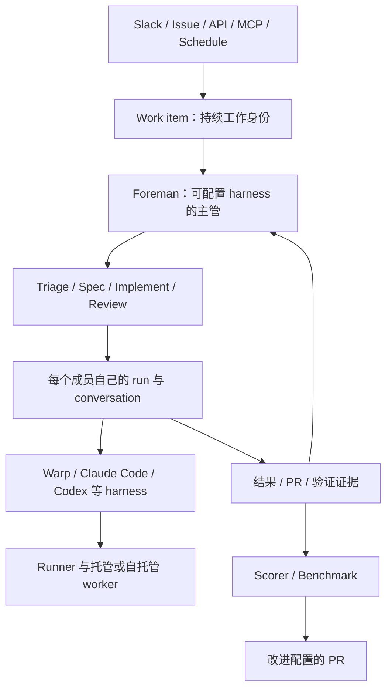

# Warp Factories：异构软件工厂、公开源码边界与第十条演进路线

研究日期：2026-09-16。目标仍是具有长期伙伴体验、可替换原生 coding agent、可介入协作和持久恢复的新产品。本报告将客户端源码事实、官方文档声明和拟议改造分开；未申请 Early Access、部署工厂或执行付费模型任务。

## 1. 核心判断

**Warp Factories 是重要的异构 agent 工厂产品参照，但不是已经公开完整控制面的 ACP 编排底座。**它最值得借鉴的是：主管与成员都能选 harness；工作项独立于一次运行；工厂定义可以版本化；评估结果能推动配置改进。对于用户提出的“不要把主管锁死在自己写的 loop”这一目标，官方支持范围是正向匹配的。[^agents]

但必须区分三件事：

1. **客户端已开源**：可以研究 CLI 驱动、会话恢复、终端和协作客户端。
2. **Factories 配置及示例公开**：可以定义团队、角色和自动化，并交给 Warp 服务执行。
3. **完整编排服务未公开**：官方 FAQ 明确 server、Drive backend、Oz orchestration 仍属专有部分。克隆客户端和配置不能得到一套脱离 Warp 服务的完整 Factories。[^faq]

ACP 也必须单独判断：FAQ 把 ACP 列为计划；本次看到的第三方 harness 实现是原生 CLI 驱动和专用恢复/消息桥，不能因支持多 agent 或 MCP 就称其为 ACP 平台。[^faq][^driver]

## 2. 实际克隆了什么

| 本地目录 | 固定提交 | 证据用途 |
|---|---|---|
| `warp/` | `7b7f4f7c2553ba68981f3f45db5157a823621839` | 客户端与专用 harness 驱动 |
| `warp-factory-examples/` | `84e7c952f1506c4bd2784d96fd40a6f4d6398cad` | 官方工厂定义、默认 prompts、验证客户端 |
| `warp-docs/` | `73e217b5fa0f4a1f57d8032022665471c719659c` | 可固定提交引用的官方文档 |

使用浅克隆，已完成 checkout。没有自动获取所有构建依赖，也没有运行 bootstrap。客户端 README 标示主体 AGPL v3、两个 WarpUI crate 为 MIT；示例仓标示 MIT。许可范围按各仓文件分别核对，不将示例许可扩展到闭源服务。[^readme][^examples]

## 3. 架构：把身份、工作、运行和机器分开

图描述官方产品模型，不表示这些服务端节点已经开源。Foreman 是统一对外沟通者；成员角色是职责模板，允许跳过阶段、退回修改和增加自定义成员。完成工作项表示把结果交给人，并不自动意味着合并或上线。[^agents]

对我们的启发是把长期伙伴、项目任务和运行实例分开：伙伴不应因一次进程退出而消失，任务也不应以某家原生 session ID 作为唯一标识。上述设计是本报告建议；Warp 的工厂身份本身仍以软件交付为中心，不代表已有通用私人伙伴模型。

## 4. 多 harness：主管也可以替换，但并非任意 ACP 插槽

官方文档明确，Foreman 可以运行 Claude Code 或 Codex 并派发成员，不必由 Warp Agent 担任。示例 `03-multi-harness` 则选择 Warp 主管、Claude 实现者、Codex 审阅者；不能只读示例就误判主管固定。[^agents][^example][^foreman]

`factory.yaml` 的 defaults 与各 agent 文件支持不同 harness、模型、runner 和认证。`model` 是 Warp harness 简写，与 `harness` 互斥；源码/定义中有 Gemini 路径，但文档对不同入口允许的标识并不完全一致：工厂定义接受更多值，不等于每个 API、套餐和部署都支持同一集合。[^definition][^harness][^gemini]

客户端 `ThirdPartyHarness` 抽象负责检查 CLI、配置、运行和恢复数据。`ResumePayload` 对 Claude/Codex 分型，增加新引擎需要实现代码和状态契约；不是提供一个 ACP executable 就自动获得全部产品能力。[^driver]

**Factory MCP 与 ACP 作用不同。**Factory MCP 让外部 agent 查询/提交工厂工作、取回上下文和回传分支；这不证明外部 agent 被平台托管，也不提供原生工具审批或 `session/load`。尤其 `get_task(start_working=true)` 不会领取锁、不暂停工厂；本地接手仍可能与云端并行修改。[^mcp]

## 5. 原生会话恢复与消息连续性

| 机制 | 可见证据 | 不能据此推断 |
|---|---|---|
| Claude/Codex 恢复 | 读取服务端 transcript envelope，重建原生会话数据后继续 CLI | 任意 harness 可跨引擎无损切换 |
| Codex | 重建 rollout 并调用 `codex resume`，保留 session ID | 仅保存聊天摘要就等价原生恢复 |
| Gemini | 当前驱动明确没有 conversation resume | 与 Claude/Codex 同等恢复能力 |
| 消息桥 | Claude 存在 bridge、事件游标和 wake 处理 | 服务端持久消息及外部副作用已获 exactly-once 保证 |

上述为静态源码事实，未执行断网、进程崩溃或版本迁移测试。恢复入口对服务端缺失 transcript 给出专门错误；不能把所有恢复失败都描述为自动新建成功。[^driver][^codex][^transcript][^claude][^gemini][^bridge]

官方编排文档描述持久 inbox、消息与状态统一序号、终态成员收到后续消息可唤醒；同时限制为一层 parent/children，child 不再生成孙级成员。它为异构协作提供了清晰的产品契约，但完整服务端日志、重投递和 fencing 实现不在本次公开源码中。客户端调用远端 `/ai/multi-agent` 的代码也不能替代对该服务的验证。[^orchestration][^client]

原生恢复、终态唤醒、任务延续、跨引擎交接应分别测试。我们需要的交接至少保留目标、约束、产物、待办、验证和未决权限；不承诺迁移另一引擎的隐含状态。

## 6. 审批和执行隔离：有工厂政策，不等于逐工具权限桥

工厂文档明确区分指令与权限：spec approval 默认属于 Foreman 的工作政策；能否合并取决于仓库权限和保护规则；运行时能访问哪些资源由平台配置和外部系统权限决定。不能把提示词中的“先询问人”当成不可绕过的审批状态机。[^agents]

更具体的源码边界：无人值守 Codex 驱动启动时使用 `--dangerously-bypass-approvals-and-sandbox`，Claude 使用 `--dangerously-skip-permissions`。这些路径依赖外层执行环境和凭证限制，不能与 Memoh/Omnigent 的产品权限请求桥混列。也不能将该结论扩展到 Warp 所有本地交互模式。[^codex][^claude]

对新产品，应分别定义任务派发许可、原生工具许可、成果验收和最终发布许可。采用 Warp 机制时，必须重新决定哪些工具需要同步等待人，审批超时和进程丢失怎样告知用户。

## 7. 自托管：移动执行面，控制面仍在 Warp

官网的开放基础设施表述应与详细部署文档一起读。Factories 文档明确：托管 self-hosted worker 将 checkout、命令和工作区放在用户机器；协调、身份配置、观测等仍经 Warp。进入结果、附件和 transcript 的代码内容也可能经过控制面。客户自有对象存储只移动支持的数据类型，不移动全部工厂状态。[^infra]

平台另有 unmanaged CLI 模式，由用户系统自行发起执行；但 Factories 文档明确 unmanaged agent 不能直接充当其工厂执行 host，可以通过 Factory MCP 交换工作。自托管计算不等于自托管完整 Factories，更不等于脱离服务离线运行。[^hosting][^infra][^mcp]

因此商业平台集成与开源 fork 是两个不同选择。客户端可以 fork，缺失的工厂服务端仍要另建；选择托管服务可以减少运行基础设施工程，但运行契约、套餐、导出和服务依赖需要实测。

## 8. 最值得借鉴：定义、评估和改进形成闭环

**工厂即代码。**角色、自动化、runner、技能、scorer 和 benchmark 都可以进入版本控制。文档声明无效定义不会部分应用；公开验证脚本却不是独立离线 parser，而是把文件发送到 Warp 的验证端点，无法连接就报告未验证。原子应用是官方服务行为声明，不能用这个脚本证明数据库事务实现。[^definition][^validator]

**运行后评估。**Scorer 是 LLM judge，给出分类及对应分数，可按采样率执行；重新评分会替换同 scorer 的旧结果。不是每次运行必然完成评估，也不是通过了 scorer 就等于程序正确。[^eval]

**可重复比较。**Benchmark 固定任务与正确性条件，对不同配置做重复试验，保留当次输入；支持从既有任务建立用例与固定仓库版本。界面成本估算和已完成评分的结果应与实际账单、失败/取消试验分开。我们不能把官网案例当成本仓十二个对象的统一测评。[^bench]

**改进需要审核。**当前文档描述每个 agent 累积 25 个未处理失败或最老失败达到 7 天时，定时检查生成改进任务；也支持手动触发。产物是应用或配置的 PR，最终仍由人审核。这是可追溯的改进机制，不是自主训练新模型。[^improve]

我们的演进应从保存真实验收证据和失败分类开始，再引入固定任务集、独立 judge 与配置回归。不要让评估器只检查 agent 自己声称完成的内容；保留测试日志、代码提交、截图出处及失败试验。

## 9. 与现有候选比较

| 对象 | 相比 Warp 更适合优先研究什么 | Warp 提供的新参考 |
|---|---|---|
| Memoh | 长期伙伴、独立电脑、知识形成、外部权限桥 | 角色配置、异构任务工厂、运行后评价 |
| Omnigent / Cindy | 多原生交互会话、权限、切换边界 | 让会话连接持久工作项与交付证据 |
| Kandev | ACP load/replay 和执行宿主的可见实现 | 将执行宿主连接企业工厂体验 |
| Agent Swarm | 可见的持久任务组织与 workflow | 定义、试验、改进 PR 的产品闭环 |
| Multica | 可见的 Issue/Squad、任务领取及调度实现 | 工厂配置版本化与评估体系 |
| AO | 编码交付与监督恢复源码 | 分阶段角色和统一对外负责人 |
| DSH / 独立核心 | 能自主控制框架与 runtime 契约 | 分离产品工作身份与具体执行引擎 |

旧对象继续使用原固定快照，证据见[十一项目报告](eleven-project-comparison.zh-CN.md)及各专题。以上是结构匹配判断，没有根据不同时间、不同证据层次的资料给可靠性打分。

## 10. 第十条路线：借鉴或集成 Warp Factories

这是平台集成/机制借鉴路线，不能称为完整 Factories 开源 fork 路线。

### A. 验证异构主管与工厂边界

先以一个仓库、一个小任务验证 Claude 或 Codex 主管委派另一引擎成员，回传成果后继续同一工作项。分别记录 factory、work item、agent identity、run、conversation 和 native session ID。退出条件是能够区分重复运行、原生恢复和任务接续；若账号/套餐不能支持目标部署，应在此停止集成路线。

### B. 选择控制面的归属

有两个子方向：采用 Warp 服务作为执行供应商，自己保留伙伴、知识、任务与审批记录；或借鉴其角色和定义模型，在现有开源候选上实现自主控制面。前者需要稳定 API、取消/查询、事件补拉、产物导出和成本核算验证；后者要承担消息、调度、身份、会话与恢复工程。两者都不要求 fork 整个终端 UI。

### C. 补齐 Grok 式伙伴

新增长期 Persona、用户偏好、项目知识、非编码事务和主动例行任务。伙伴发出带约束、产物类型与验收条件的任务，工厂回传证据；伙伴保留统一对话。模型循环仍可由不同原生 coding agent 担任，不能因为加入伙伴层又固定一个唯一主管 loop。

### D. 显式交接与介入

本地 pickup 先取得我们控制面的执行权，或明确标为协作副本；不能直接将 MCP pickup 当锁。跨引擎则建立新的执行会话并附交接包，保留旧会话引用。需要同步权限的 agent 使用专门能力接口；只有自动运行路径时，产品明确展示其权限模式。

### E. 评价驱动迭代

积累真实失败任务，固定代码与环境，再比较 harness、角色 prompt、模型和 runner。配置更新以 PR/版本发布，回归不通过则回滚配置；既有运行继续关联创建时版本。必须保留失败和取消结果，防止只比较幸存样本。

### 数据与迁移策略

自有任务 ID 作为主键，平台 run ID 为外部映射；保存任务输入、配置版本、执行版本、可导出产物和确认过的事件游标。切换供应商时迁移任务、知识与可审查交接包，只有验证过的同引擎会话格式才尝试原生恢复。禁止把整个服务端 transcript 当可移植 runtime 状态。

### 成本、风险与停止条件

成本同时包含推理、执行机器、平台编排、评估重复运行和自建产品工程。暂不提供未经实测的固定费用或工期。若要求完整离线、完全自主控制面、任意 ACP 接入或跨引擎原地恢复，当前证据不足以满足，应选择开源候选或独立核心；若首要目标是快速提供团队代码工厂，则 Warp 值得单独进行有界产品试验。

## 11. 验证清单与本轮实际完成

| 后续验证 | 必须观察的证据 |
|---|---|
| 非 Warp 主管 | 主管和成员真实 harness、工具调用与双向消息 |
| 崩溃恢复 | 恢复相同原生 session，或明确标为新会话接续 |
| 人工介入 | 工具等待、拒绝、取消及会话失联的真实结果 |
| 本地接手 | 避免重复编辑的执行权策略，而非仅发送通知 |
| 自托管 | 数据流向、凭证与隔离边界、控制面失联行为 |
| 配置和评估 | 错误配置不部分生效、固定版本试验、完整失败分母 |
| 供应商退出 | 无须 Warp 控制面仍能读回自有任务和交付证据 |

本轮已克隆三个官方仓库、固定提交、追踪关键 CLI 驱动/恢复入口、阅读示例和部署/编排/评估文档，并更新研究索引与下载说明。没有执行上表的运行试验，没有把现有测试文件当作测试通过，也没有调用远端验证服务上传工厂配置。

## 12. 固定证据

[^faq]: [faq](https://github.com/warpdotdev/warp/blob/7b7f4f7c2553ba68981f3f45db5157a823621839/FAQ.md)
[^readme]: [readme](https://github.com/warpdotdev/warp/blob/7b7f4f7c2553ba68981f3f45db5157a823621839/README.md)
[^driver]: [driver](https://github.com/warpdotdev/warp/blob/7b7f4f7c2553ba68981f3f45db5157a823621839/app/src/ai/agent_sdk/driver/harness/mod.rs)
[^codex]: [codex](https://github.com/warpdotdev/warp/blob/7b7f4f7c2553ba68981f3f45db5157a823621839/app/src/ai/agent_sdk/driver/harness/codex.rs)
[^claude]: [claude](https://github.com/warpdotdev/warp/blob/7b7f4f7c2553ba68981f3f45db5157a823621839/app/src/ai/agent_sdk/driver/harness/claude_code.rs)
[^gemini]: [gemini](https://github.com/warpdotdev/warp/blob/7b7f4f7c2553ba68981f3f45db5157a823621839/app/src/ai/agent_sdk/driver/harness/gemini.rs)
[^transcript]: [transcript](https://github.com/warpdotdev/warp/blob/7b7f4f7c2553ba68981f3f45db5157a823621839/app/src/ai/agent_sdk/driver/harness/codex_transcript.rs)
[^bridge]: [bridge](https://github.com/warpdotdev/warp/blob/7b7f4f7c2553ba68981f3f45db5157a823621839/app/src/ai/agent_sdk/driver/harness/claude_code/parent_bridge.rs)
[^client]: [client](https://github.com/warpdotdev/warp/blob/7b7f4f7c2553ba68981f3f45db5157a823621839/crates/warp_multi_agent_client/src/lib.rs)
[^example]: [example](https://github.com/warpdotdev/warp-factory-examples/blob/84e7c952f1506c4bd2784d96fd40a6f4d6398cad/examples/03-multi-harness/README.md)
[^foreman]: [foreman](https://github.com/warpdotdev/warp-factory-examples/blob/84e7c952f1506c4bd2784d96fd40a6f4d6398cad/examples/03-multi-harness/agents/foreman/agent.md)
[^validator]: [validator](https://github.com/warpdotdev/warp-factory-examples/blob/84e7c952f1506c4bd2784d96fd40a6f4d6398cad/scripts/validate_factory_files.py)
[^examples]: [examples](https://github.com/warpdotdev/warp-factory-examples/blob/84e7c952f1506c4bd2784d96fd40a6f4d6398cad/README.md)
[^agents]: [agents](https://github.com/warpdotdev/docs/blob/73e217b5fa0f4a1f57d8032022665471c719659c/src/content/docs/factories/factory-agents.mdx)
[^infra]: [infra](https://github.com/warpdotdev/docs/blob/73e217b5fa0f4a1f57d8032022665471c719659c/src/content/docs/factories/infrastructure-and-security.mdx)
[^definition]: [definition](https://github.com/warpdotdev/docs/blob/73e217b5fa0f4a1f57d8032022665471c719659c/src/content/docs/factories/factory-as-code.mdx)
[^mcp]: [mcp](https://github.com/warpdotdev/docs/blob/73e217b5fa0f4a1f57d8032022665471c719659c/src/content/docs/factories/factory-mcp.mdx)
[^eval]: [eval](https://github.com/warpdotdev/docs/blob/73e217b5fa0f4a1f57d8032022665471c719659c/src/content/docs/factories/measure-and-improve/scorers.mdx)
[^improve]: [improve](https://github.com/warpdotdev/docs/blob/73e217b5fa0f4a1f57d8032022665471c719659c/src/content/docs/factories/measure-and-improve/self-improvement.mdx)
[^bench]: [bench](https://github.com/warpdotdev/docs/blob/73e217b5fa0f4a1f57d8032022665471c719659c/src/content/docs/factories/benchmarks.mdx)
[^orchestration]: [orchestration](https://github.com/warpdotdev/docs/blob/73e217b5fa0f4a1f57d8032022665471c719659c/src/content/docs/platform/orchestration/index.mdx)
[^hosting]: [hosting](https://github.com/warpdotdev/docs/blob/73e217b5fa0f4a1f57d8032022665471c719659c/src/content/docs/platform/self-hosting/index.mdx)
[^harness]: [harness](https://github.com/warpdotdev/docs/blob/73e217b5fa0f4a1f57d8032022665471c719659c/src/content/docs/platform/harnesses/index.mdx)
