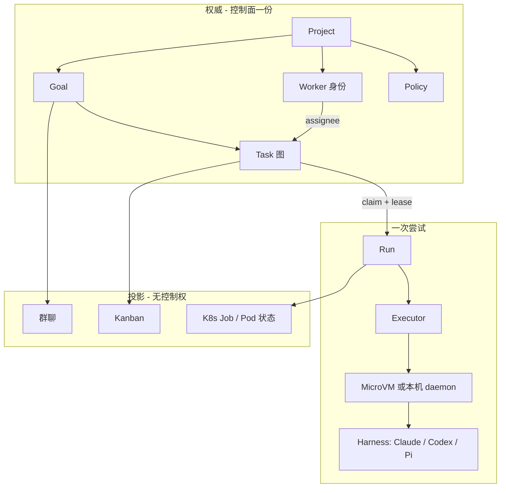

# 第一性原理：Coding-Agent-Neutral Cloud Agent 平台设计

设计日期：2026-09-21。本文是产品与架构规格，不是已实现代码，也不是 LoopX / Beads / Cursor 的 fork 说明书。

> **读法**：仓库与上游源码标「证据」；与参照项目的对齐标「对照」；尚未建造的产品决策标「规格」。规格以本文件为准；参照项目只提供证据，不提供默认依赖。

对照材料：[cloud-agent-architecture.zh-CN.md](cloud-agent-architecture.zh-CN.md)、[muse-vs-cursor-cloud-agents.zh-CN.md](muse-vs-cursor-cloud-agents.zh-CN.md)、[extensions/multica-analysis.zh-CN.md](extensions/multica-analysis.zh-CN.md)、[extensions/omnigent-analysis.zh-CN.md](extensions/omnigent-analysis.zh-CN.md)。上游快照见 [sources.json](../sources.json) 的 `design_references`。

---

## 1. 一页结论

**产品一句话**：一个挂在 Claude Code、Codex、Pi 等外接 coding CLI 之上的控制面。它治理 **Project / Goal / Task / Run**，在 K8s MicroVM（以及本机 daemon）上执行有界尝试；失败记在 Run 上，Goal 与 Task 保持可恢复。

**不是什么**：不是自研 generate↔tool 循环；不是 JSON stage 工作流引擎；不是「一个 master agent + 群聊」当真相；不是把 LoopX 和 Beads 两个内核同时嵌进产品。

**三层，只自建中间加计算：**

```text
控制面（自研，抄 LoopX 的 tick 合同，不 vendor LoopX）
  Goal · should-run · 人闸 · Turn 结算 · master 槽位 · 投影
        │
数据面（Beads 语义：ready / claim / lease / reclaim；不把编排写进 bd 核心）
  Task 图 · 依赖 · 评论 · gate
        │
计算面（自研）
  Executor · MicroVM / 本机 · Run · harness adapter
```

**对象主链：**

```text
Project（工作区、政策、master 槽位）
  └─ Goal（open | closed）
       ├─ Task / bead（open | in_progress | blocked | deferred | closed）
       │    └─ Run（一次 CLI 尝试，钉在一个 Executor）
       ├─ Worker（可认领身份，不是 VM）
       └─ 群聊 / Kanban / K8s Job  = 投影，不是源
```

**两条硬约束：**

1. **Coding-agent-neutral**：产品不实现任何一家的 agent loop。外接 Claude Code、Codex、Pi 等。适配器最小合同是 start / stream / terminal / cancel；resume、steer、原生权限、子 agent 都是可选，缺了就冷启动新 Run。
2. **没有不可恢复的 ERROR**：Goal 只有 open/closed（或等价的 active/stopped）。失败、取消、工人死亡、VM 销毁都落在 Run 上。Task 回到 open / blocked / deferred。MicroVM 死 = 丢那次 workspace，不等于丢票。

**本地与云协同的正确形状：** 同一张 Goal/Task 图，不同 Run 跑在不同 Executor 上。权威图只在控制面一份。工人（本机 Claude、云 Codex）只打控制面 HTTP，不直连 Dolt `3307`。

---

## 2. 要治的病

旧产品：用户用 JSON 定义 agent flow；每个 stage 是一个 agent，自带目录（PID → TD → coding → test → E2E）。底座是 K8s MicroVM。

病不在 MicroVM，在本体选错了：

| 旧形状 | 后果 |
| --- | --- |
| 编排语言当本体论 | stage 图比工作还先死；改计划等于改状态机 |
| 每个 stage 绑定一个 agent 目录 / 会话 | 换引擎等于换宇宙；Claude 的 session 交不给 Codex |
| 工作流节点可以进 ERROR | 票死了，人只能重开一条 flow |
| 自研或绑死一家 loop | 「支持多 agent」变成「多提示词同一循环」 |
| 群聊或 JSON 同时当调度器 | 两台状态机抢同一份工作 |

Cursor Cloud Agents、Multica、LoopX、Beads 从四个方向指向同一条缝：**durable 的是意图和工作项，不是 session，也不是 workflow 节点。**

对照：

- Cursor 主路径没有 agent-A 把 native session 交给 agent-B。Long-running 是短模型循环 + 控制面队列 / Goal / 订阅 + 可休眠 VM。2026-01-14 的 planner/worker/judge 是研究，不是已上线交接。
- Multica 的交接是 Issue + 评论 + 新排队 Run，不是把 CLI session 迁走。
- Omnigent 的 capability 矩阵证明「统一 ACP」是谎言：ACP 无 `session/load`，只能冷重放。
- LoopX Goal 只有 `active | stopped`；Turn 失败是类型化结果。
- Beads 章程禁止把编排写进核心；issue 没有 `error` 状态；死工人走 `reclaim`。

---

## 3. 两条硬约束（展开）

### 3.1 Coding-agent-neutral

产品拥有：工作图、准入、结算、VM 生命周期、政策、投影。

产品不拥有：模型选择循环、工具解析、各家权限 UI、各家 subagent 协议。

因此：

- 禁止自研「通用 agent loop」再把 Claude/Codex 当 tools。那是 DeepSeek Harness / 旧产品的路，中立会立刻假掉。
- 禁止要求所有引擎都走 ACP。Kandev 的 ACP 是**同一引擎续上**的插座；Multica Execute 是**异构派发**。两层都要，但 ACP 不能当跨引擎交接。
- Master 自己也必须是一个可替换的 coding CLI，通过产品工具（`create_task` / `assign` / `comment` / `close_goal`）工作，而不是一段藏在控制面里的私有 planner。

### 3.2 没有不可恢复 ERROR

可恢复的定义：任意时刻，操作者或另一个 worker 都能对同一 Goal 采取下一步——认领、重开 Run、等人、延期、关掉 Goal。不存在「必须 dump 状态机、新开一条 flow」的终态。

映射：

| 事件 | 记在哪 | Goal | Task |
| --- | --- | --- | --- |
| CLI 非零退出 / harness 崩溃 | Run `failed` + 类型 | 仍 open | `open` 或仍 `in_progress`（lease 未到期） |
| 人拒绝 / 要决策 | Run `cancelled` 或不等 Run | 仍 open | `blocked` + gate，或 `user_gate` |
| 依赖没完成 | 不启 Run | 仍 open | `blocked` / 图上 `blocks` |
| 故意搁置 | 无 | 仍 open | `deferred` |
| MicroVM OOM / 节点没了 | Run `failed`（`host_failure`） | 仍 open | lease 过期后 `reclaim` → `open` |
| 配额用尽 | 不启 Run / Run 拒绝准入 | 仍 open | 不变，`should-run` 给出 `wait` |
| 目标达成或人宣布放弃 | 最后一次结算 | `closed` | 相关 Task `closed` 或 `deferred` |

`UNRECOVERED_ERROR` 若出现，只允许作为**只读诊断投影**（LoopX reliability-diagnostics 的做法），禁止写入 Goal/Task 状态机，禁止授予任何控制权。

---

## 4. 三层平面：只集成一次工作项

LoopX 和 Beads 强相关，但**不能两个都当内核**。工作项（认领、闸、交接、死工人）完全重叠。同时跑 `loopx todo claim` 和 `bd update --claim` 会再养一台状态机。

| 层 | 向谁学 | 是否 vendor | 产品里是什么 |
| --- | --- | --- | --- |
| 数据面 | Beads | **语义必用**；库可选 | Task 图 + ready + claim CAS + lease/reclaim |
| 控制面 | LoopX | **不 vendor**；抄 tick 合同 | Goal、should-run、结算、政策、master 槽位 |
| 计算面 | Cursor guest / 自有 MicroVM | 自研 | Executor、Run、adapter、快照 |

**禁止**：把 Goal / quota / dashboard / 人闸写进 `bd` 核心。Beads 干净，是因为章程把编排赶出去了；他们已经删过 `convoy / agent / role / rig`。公开 API `package beads` 的第一句就是给**仓外编排**用的。

**禁止**：把 LoopX 整仓（Python + TS、20+ capability、Personal Workspace、Lark）当依赖。LoopX Todo 是弱版 Beads；要的是它的 **should-run / 结算 / Goal 无 ERROR / 投影≠真相**。

**允许**：控制面把 Beads 当存储引擎（server 形态），或复刻 issueops 语义到 Postgres。工人永远不直连存储。

证据：Beads ~22 万行 Go；LoopX ~39 万行 Python + 12 万行 TS。中间层一厚，干净就会按 LoopX 的体量长回去。

---

## 5. 对象模型

### 5.1 总图



### 5.2 Project

工作区与政策的容器。不是聊天房间，不是 master 的身体。

| 字段 | 含义 |
| --- | --- |
| `project_id` | 稳定 ID |
| `repos[]` | git 绑定（可多仓，但首版建议单仓） |
| `policy` | 自主度、网络、秘密范围、人闸默认、隔离档 |
| `master_slot` | 当前 coordinator worker ID，**可替换** |
| `executor_pools[]` | 本机 / 云区域 / self-hosted 池 |
| `knowledge_root` | 可选：给 `prime` 用的项目记忆指针 |

生命周期：存在或归档。归档不等于把 Goal 打成 ERROR；未关闭 Goal 禁止静默消失。

对照：LoopX `ProjectRecord` + repo；Beads 只有 `.beads/` 工作区，没有 Project 行。本产品的 Project 还要带 MicroVM 政策，两家都弱，必须自建。

### 5.3 Goal

寿命意图。可跨很多 Task、很多 Run、很多 harness、很多天。

| 字段 | 含义 |
| --- | --- |
| `goal_id` | 稳定 ID |
| `project_id` | 所属项目 |
| `objective` | 人可读意图，有界文本 |
| `status` | `open` \| `closed` |
| `closed_reason` | 达成 / 放弃 / 被取代，仅 closed 时 |
| `quota` | 自动 compute 预算 |
| `policy_override` | 覆盖 Project 政策，只能更严 |
| `master_slot_override` | 可选；默认用 Project 的 master |

规格：Goal **不是** chat thread。线程可以执行 Goal，Goal 必须在线程重载、网络中断、换 worker 之后还在。对照 LoopX `docs/state-interaction-model.md`：「A goal is not a chat thread」。

Beads 没有 Goal。不要用 epic 冒充 Goal：epic 是图上的聚合节点，Goal 是配额、政策、开/关的寿命对象。

### 5.4 Task（bead）

跨引擎交接的**唯一**单位。一张有依赖的工作图，不是 JSON stage。

核心字段（对照 Beads `types.Issue`，产品层可减字段，语义对齐）：

| 组 | 字段 |
| --- | --- |
| 身份 | `task_id`（哈希 ID，避免多写者撞号） |
| 内容 | `title` `description` `design` `acceptance` `notes` |
| 状态 | `open` `in_progress` `blocked` `deferred` `closed` |
| 图 | `blocks` `parent-child` `conditional-blocks` `waits-for` `supersedes` |
| 认领 | `assignee`（Worker ID）`lease_expires_at` `heartbeat_at` `revision`（CAS） |
| 放置暗示 | `worker_class` / `engine_hint` / `executor_class`（元数据，**不是 hostname**） |
| 闸 | `gate_kind`：`human` `timer` `ci` `task` |
| 审计 | comments；provenance：`claim` `suspend` `resume` `handoff` `commit` `land` |

`assignee` 是 Worker 身份字符串，不是 VM、不是 session。Gas Town 各层拼写靠归一；本产品 Worker ID 从一开始就要稳定。

**不要**把 Agent / Rig / Convoy / Slot 做成一等类型。需要时放 metadata，避免 Beads 已经回滚过的 schema 爆炸。

### 5.5 Run

一次被准入的 effect：某个 Worker 在某个 Executor 上，用某个 harness 版本，尝试推进某张 Task。

| 字段 | 含义 |
| --- | --- |
| `run_id` | 稳定 ID |
| `goal_id` `task_id` | 所属 |
| `worker_id` | 认领者 |
| `executor_id` | 本机 daemon / 某区域 MicroVM 池中的一次放置 |
| `harness` | `claude-code` `codex` `pi` … + 版本 |
| `workspace_ref` | git SHA、snapshot ID、volume 声明 |
| `status` | `admitted` `starting` `running` `succeeded` `failed` `cancelled` |
| `result_kind` | 见 §7.2 |
| `lease_id` | 持有的 Task lease |
| `events_uri` | 流式事件（可 replica-local，不联邦） |
| `artifacts_uri` | 日志、测试输出、patch 指针 |

**Task 不绑 VM。Run 才绑。** 同一 Task 第一次 Run 在云上崩了，reclaim 后可以在本地开第二次 Run。

对照：LoopX 把 Turn journal 和 Run history 糊在一起；云上必须拆开。Beads 没有 Run（只有 `gh:run` gate）。这是必须自建的对象。

### 5.6 Worker

可认领身份。可替换、可同时存在多个。

例子：`master-codex`、`claude-local`、`codex-cloud-e2e`、`pi-reviewer`。

| 字段 | 含义 |
| --- | --- |
| `worker_id` | 稳定、可归一 |
| `harness` | 默认引擎 |
| `home_executor_class` | 偏好放置（local / cloud / self-hosted），不是一次绑定 |
| `capabilities_observed` | 观察所得：docker、浏览器、GPU… **不授权** |
| `policy_ceiling` | 该工人允许的最松政策，仍不得松于 Goal |

Master 是 Project/Goal 上一个 **slot**，值为某个 `worker_id`。换 master = 换槽位里的工人，Goal 不变。

对照：LoopX「no durable leader identity required」；Beads 无 Agent 表。本产品保留 slot 是为了人有一个对话入口，不是把 leader 做成真相。

### 5.7 Executor

能跑 Run 的地方。

| 类 | 例子 | 信任 |
| --- | --- | --- |
| `local_daemon` | 笔记本上的 Claude Code / Codex | 用户本机；密钥可能更宽 |
| `cloud_microvm` | K8s 拉起的 MicroVM | 产品默认隔离 |
| `self_hosted` | 用户机房 worker | 按标签与政策 |

Executor 提供：镜像或已装 CLI、网络策略、秘密挂载、空闲释放、快照。不提供「下一步做什么」——那是 should-run + Task 图。

### 5.8 投影对象（非权威）

| 投影 | 源 | 禁止 |
| --- | --- | --- |
| 群聊 / 频道消息 | Goal 事件 + Task 评论 + Run 摘要 | 用 @mention 当 claim；用聊天顺序当状态机 |
| Kanban | Task 状态 | 在板上改一列却不走 CAS |
| K8s Job/Pod | Run | Pod Failed 写进 Goal |
| Dashboard | should-run 包 + 注意力队列 | UI 建议被当成白名单 |

对照：LoopX「board is a projection」；Beads `.beads/issues.jsonl` 是 export 不是 SoT；Lark *message visibility ≠ Turn authority*。

---

## 6. 状态机（必须小）

不要恢复旧 JSON 的组合状态。三台小机器，失败在最下面那台。

### 6.1 Goal

```text
open ──close──► closed
closed ──reopen──► open
```

没有 `error`、`failed`、`stuck`。卡住只出现在投影：「有 Task blocked / 配额耗尽 / 等人」。

### 6.2 Task

```text
open ──claim──► in_progress ──close──► closed
in_progress ──unclaim / reclaim──► open
open | in_progress ──block──► blocked ──unblock──► open
* ──defer──► deferred ──undefer──► open
closed ──reopen──► open
```

`blocked` 来自图（未完成的 `blocks`）或显式 gate，不是 ERROR。`conditional-blocks` 表示失败分支，仍是图上的边。

### 6.3 Run

```text
admitted → starting → running → succeeded
                              → failed
                              → cancelled
```

终态 Run 不可变。重试 = **新 Run**，新 `run_id`，可换 Executor / harness。旧 Run 保留证据。

### 6.4 控制面 tick 路由（抄 LoopX 词表，不抄实现）

执行前 `TurnRoute`：

`ready_for_host | repair_required | replan_required | user_action_required | wait | blocked | contract_error`

执行后 `ResultKind`：

`validated_progress | validated_completion | repair_required | replan_required | user_action_required | wait | iteration_failed | host_failure | validation_failed | writeback_failed | quota_spend_failed | terminal_closeout_failed`

`terminal_closeout_failed`：**写回和花配额已提交**，只重试收尾，禁止当「没花过」再跑一遍。这是无 ERROR 约束在结算层的具体化。

循环 disposition：`run_now | wait | stop | user_action_required | repair | replan | terminal`。

---

## 7. 控制循环

每拍只问五件事（LoopX 的产品问题，改成本产品对象）：

1. 当前 Goal 是什么？
2. 图上下一步是哪张可认领 Task？
3. 要不要人？
4. 证据相对上次有没有变？
5. 这一拍准不准跑、在哪跑？

### 7.1 `should-run` 包（唯一 tick 权威）

控制面在唤醒时发出**一份** JSON 包给即将启动的 Run，禁止 prompt 里另藏一套政策。

包内至少：

- Goal 摘要（有界）
- 被准入的 `task_id` 与 acceptance
- 边界：`write_scope`、网络、秘密名（不是秘密值）、人闸是否仍开
- 观察能力 ≠ 授权（LoopX `--available-capability` 的教训）
- `next_effect`：claim、执行、写回命令
- `disposition`：run_now / wait / …

工人和 harness 可以在边界内自由规划；越界必须走新的预检。列表里的「建议下一步」是 steering，不是白名单。对照 LoopX *Guided Autonomy, Not Recommendation Lock-In*。

### 7.2 结算顺序（必须幂等）

```text
validate observation
  → durable writeback（Task/Goal 图）
    → quota spend
      → terminal closeout（投影、通知、关 Run）
```

任一步失败都有类型，且：

- writeback 已提交则 spend 必须按已提交处理；
- spend 已提交则 closeout 失败只重试 closeout；
- 禁止「失败了所以整个 Goal ERROR」。

Turn / Run journal 足够让 MicroVM 在 `starting`/`running` 中途消失后，由控制面 reaper 结案并 reclaim。

### 7.3 谁驱动 tick

不是 master 模型死循环，也不是 K8s Cron 盲打。驱动者：

- 用户消息 / followup 队列（对照 Cursor `AddAsyncFollowupBackgroundComposer`）
- Task 进入 ready
- lease 心跳超时
- gate 解除（人、CI、timer）
- 配额窗口恢复
- 可选：订阅（CI、issue 评论）→ 入队，不直接开 VM

Master 只是这些唤醒里的一个来源：它也可以 `create_task`，然后下一拍由 should-run 决定谁 claim。

---

## 8. 数据面：Beads 语义 + 控制面部署

### 8.1 必须具备的操作

工人与控制面只认这一组（对照 `issueops`）：

| 操作 | 作用 |
| --- | --- |
| `ready` | DAG + 状态 + gate → 可认领前沿 |
| `claim` / `claim_next` | CAS：assignee + `in_progress` + lease |
| `heartbeat` | 续租 |
| `unclaim` | 主动放回 |
| `reclaim` | 租约过期，清 assignee，回到 `open` |
| `close` | 完成；可带 successor / 图边 |
| `comment` | 交接说明 |
| `gate create/resolve` | 人 / CI / timer |
| `dep add` | 依赖 |

`bd ready` 是纯函数，比「master 记得下一步」稳。控制面可以建议放置，但不能绕过 ready+claim 把工作塞进 VM。

### 8.2 租约与死亡

- 认领必须带 TTL lease。无 lease 的 ephemeral claim，工人一死就会 stranded（Beads 已文档化，禁止当默认）。
- 心跳来自 Run。VM 活着但 harness 卡死：心跳策略要能区分「进程在」和「工作在推进」；首版可以先「Executor liveness」，再加 harness 层。
- **reaper 只在控制面跑。** Beads 的 lease 只在发放 replica 上有意义；别的副本 `reclaim` 会跳过，除非确认那台机器没了（`--any-replica`）。因此每台 MicroVM 绝不能当 Dolt replica 发放租约。

### 8.3 存储与「service 模式」

Beads 有两层服务，不要混：

| 名称 | 是什么 | 本产品怎么用 |
| --- | --- | --- |
| `bd init --server` | 多写 `dolt sql-server`，默认 `127.0.0.1:3307` | **控制面内部**一份图。Gas Town 的 `gt dolt start` 是同机编排，不是公网库 |
| `bd serve` | HTTP `/v0`，默认 loopback，无 TLS，HTTP claim 不跑 hooks | 形态对：工人走 HTTP。出环回必须 token + 终止 TLS（mesh / 网关）。产品应自建网关，而不是把裸 `bd serve` 暴露给用户 |

**禁止：**

- 每台笔记本 / MicroVM 一份嵌入式 `.beads`，靠 `bd dolt push/pull` 当实时协同（lease 会看错，认领会打架）。
- 每台 VM `bd init --server` 连公网 3307。
- 把 Dolt 当多租户 SaaS。Beads 的 Postgres/MySQL adapter 做过又撤回；支持路径仍是 embedded Dolt、Dolt server、SQLite。约 20 个 agent 打同一个 sql-server 已有 hang 事故。

**规格：**

```text
本地 Claude / 云 MicroVM
    → HTTPS 产品网关（auth、租户、Goal、should-run、开 VM）
        → 每 Project（或每租户分库）一份多写 Task 图
           首版：控制面 VPC 内 Dolt server
           以后：同一 issueops 语义换 Postgres 合法
```

`.beads/issues.jsonl` 若导出，只给 diff/viewer，不是备份策略。备份走存储引擎快照。

### 8.4 持久化三档

对照 Beads：

| 档 | Beads | 本产品 |
| --- | --- | --- |
| 版本化真相 | issues / deps / comments | Goal、Task 图、Policy、Run 终态元数据 |
| 节点瞬时 | leases / wisps | 心跳、探针、stream offset |
| 不联邦日志 | `bd_events_journal` | 每 Run 的 event stream，按需归档 |

聊天全文默认不进真相。需要跨 session 的 insight 走显式 `remember` / 项目记忆，对照 `bd prime`：冷启动灌工作流+记忆，不是迁 transcript。

---

## 9. 计算面：MicroVM 与 Run

### 9.1 放置

调度绑三条边，禁止绑第四条：

| 边 | 含义 |
| --- | --- |
| Task → Worker class | 谁可以 claim（引擎、能力、权限档） |
| Run → Executor | 这次在哪跑 |
| Executor → Workspace | 哪个 git SHA / snapshot、哪些 secret、网络 |

**禁止 Task → VM。** 否则云机器没了就不能改本地接着干。

同一 Goal 上两张 Task 可以同时跑在两个 Executor：

```text
Goal
 ├─ Task「写 PID」  claim by claude-local   Run → 笔记本
 └─ Task「跑 E2E」  claim by codex-cloud    Run → 云 MicroVM
```

代码用 git；工作用图；结算用 Run 结果。不共享磁盘，不迁移 session。

### 9.2 VM 生命周期与「票还在」

- 创建：仅 `should-run = run_now` 且 claim 成功之后。禁止先开 VM 再找事做。
- 运行：工具/CLI 在箱内；循环与权威在箱外（对照 Cursor：guest 只有 exec-daemon；对照 Muse：loop 在 cell 内——本产品选 Cursor 这侧，因为要换 CLI，不能把 loop 焊在镜像里）。
- 空闲：可挂起 / 释放；self-hosted 对照 `--idle-release-timeout`。
- 死亡：控制面把 Run 标 `failed/host_failure`，reclaim Task。workspace 可丢。Goal 仍 open。
- 快照：可选，用于同 Executor 上 resume；**不能**当作跨引擎交接手段。

### 9.3 子 agent 与后台命令

规格：**只活在一次 Run 里。**

Claude 的 Task 工具、Codex 的子进程、后台 bash，随这次 MicroVM 结束而结束。跨 VM 的并行 = 多张 Task + 多个 Run，不是「把 subagent 漂到另一台」。

LoopX 的 `subagent_control_plane_handoff_v0` 若借鉴，只描述拓扑，不把子 agent 提升成可跨机器认领的 Worker。

### 9.4 工作区

每次 Run 声明：

- `source`：clone SHA 或起始 snapshot
- `writable_paths`
- `network`：按政策投影后的实际值（只能更严）
- `secrets`：按名注入，日志红线

本地 Run 允许更宽（用户自己的 SSH）；云 Run 默认无外网、无用户本机 cookie。同一 Goal 不自动继承本机信任。

---

## 10. 交接

### 10.1 跨引擎 = 冷交接

唯一路径：

1. Worker A 在 Run 里改代码、写证据、`comment`、`close` 或创建 successor Task。
2. 图更新；`ready` 出现下一张票。
3. Worker B（可能不同 harness、不同 Executor）`claim`，新 Run 冷读 Goal 摘要 + Task + git。

禁止：

- 把 Claude session 文件拷到 Codex；
- 用 ACP `session/load` 当跨引擎协议（Omnigent：ACP 没有 load，只有冷重放）；
- 用群聊 @某工人当作 claim（没有 CAS、没有 lease）；
- 让 master 「记得」下一步而不写图。

对照：LoopX successor todo + `context_handoff` 收据；Beads `assign` + comment + `ProvHandoff`；Multica Issue 新排队执行。

### 10.2 同引擎续上 = 可选热路径

若 adapter 报告 `resume=true`（Kandev ACP `session/load`、Codex 本机续、Claude `--resume`），控制面可以在**同一 Worker class、同一 Executor 类、同一 Task lease**下把后续 followup 送进仍活的 Run。

任一条件变了（换引擎、换机器类、lease 易主）→ 强制冷启动。能力表写明，禁止假装统一。

### 10.3 Master 在交接里的位置

Master 可以：拆 Goal、`create_task`、指定 `worker_class`、写 acceptance、在评论里解释。

Master 不可以：成为 Goal 的身份；不写图就口头派工；失败时把 Goal 打成 ERROR。

LoopX 原话（对照 `docs/guides/custom-agent-runner-integration.md`）：Agent A 写 successor，B 下次 wake 来 claim；*No central model needs to remember or manually route the handoff.*

人仍然需要一个对话入口——那是 slot，不是本体。Master 挂了 = 少一个拆单工人，图还在；换一个 Claude/Codex/Pi 填进 slot。

---

## 11. 群聊

群聊是 Goal 的**评论投影 + inbox**，有三种合法消息：

1. 人给 Goal / 某 Task 的指令（入 followup 队列，下一拍 should-run）。
2. 系统把 Run 事件折叠进去（开始、需要人、失败类型、PR 链接）。
3. Worker 通过产品工具写的 comment（会落库）。

非法：

- 把「群」当成 Squad 运行时，@ 谁谁就获得写权限；
- 未 claim 就在频道里并行改同一 repo；
- 用频道已读当权威（LoopX：可见性与 Turn authority 分离；投递要收据，接收方 `adopt|defer|reject|no_change`）。

首版可以没有独立 IM。Web 里的 Goal 时间线就足够。IM 只是另一个投影适配器。

---

## 12. 权限、人闸、隔离

### 12.1 单向投影

人在 Project/Goal 选**产品政策**，不直接选「Claude YOLO vs Codex sandbox vs Pi 审批」。

政策轴：

| 轴 | 例 |
| --- | --- |
| 自主度 | 每次确认 / 按 gate / 边界内自动 |
| 网络 | 无 / 允许列表 / 全开 |
| 秘密 | 无 / 只读 registry / 部署密钥 |
| 人闸 | 发布、生产写、外发、删数据 |
| 隔离 | 本机 / 云 MicroVM / 更强硬件隔离 |

Adapter **只能更严，不能更松**。某 CLI 没有细粒度权限，就在更粗的档停住，或拒绝 `run_now` 改走 `user_action_required`。

对照：LoopX 不做平台级 YOLO，`--available-capability` 不授权；Beads `agent.profile` 只有 conservative / minimal / team-maintainer，**没有 yolo**；Multica 是 YOLO + 事后 Review + OS 用户隔离——本产品不把 YOLO 当默认，隔离以 MicroVM 为准。

### 12.2 人闸是 Task，不是 workflow ERROR

`gate_kind=human` 的 Task（或 Beads 式 `type=gate`）挡住下游 `blocks` 边。超时：timer gate 可自动；**human gate 永不因超时而当作批准**（Beads 已如此）。

决策范围要结构化：`approve | reject | cancel`，并记录 actor。聊天里的「好的」不算，除非变成一次 recorded decision。

### 12.3 隔离是真边界

Claude `--harden` / PreToolUse 不是强隔离（LoopX 自己承认）。本产品：

- 云默认：MicroVM，网络与秘密按 Run 注入；
- 本机：明确标「信任本机」，政策天花板仍在；
- 控制面 API 与 Dolt 不进 VM 网络，VM 只出网到网关。

### 12.4 写权与 claim

关闭 / 改 acceptance：默认只有 assignee，或人 `--force`。对照 Beads `AssigneeMatches`。没有 claim 的工人可以向图建议（comment / 创建新 Task），不能改别人持有的票，除非政策允许 open competition（Beads `WorkTypeOpenCompetition`）——首版不做，默认 mutex claim。

---

## 13. Harness 适配器

### 13.1 最小合同（必须）

| 方法 | 含义 |
| --- | --- |
| `start(run)` | 在 Executor 上拉起 CLI，注入 should-run 包 / skill |
| `stream(run)` | 事件：文本、工具名、退出前状态（可丢失，以终态为准） |
| `wait_terminal(run)` | `succeeded/failed/cancelled` + `result_kind` |
| `cancel(run)` | 尽量停 CLI 与 VM |

### 13.2 可选能力（缺则降级）

| 能力 | 有则 | 无则 |
| --- | --- | --- |
| `resume` | followup 进同一 Run | 新 Run 冷读图 |
| `steer` | 下一 tool 边界插入 | 排队为下一次 Run 的用户消息 |
| `native_permissions` | 把产品政策投影进去 | 产品层先闸死，或拒绝自动跑 |
| `subagents` | Run 内并行 | 拆成更多 Task，或串行 |
| `acp` | 同引擎热插座 | 当普通 CLI |

能力表必须在注册 Worker 时写死并在 UI 暴露。禁止「我们支持 ACP 所以都一样」。Omnigent 的 `instruction_delivery NOT_DELIVERED` 和 ACP 无 load，是已经裂过的证据。

### 13.3 集成面优先级

对照 Beads 生产验证过的顺序：

1. CLI 子进程（最简单，hook / AGENTS.md）
2. 产品 HTTP（工人只认这个）
3. ACP（同引擎）
4. MCP（schema 贵；Beads 官方不推荐当主面）

LoopX 的 FastMCP / 各家 `*_goal_mode` 是碎适配器，不要整仓搬。每接一家 CLI，只填能力表 + 一个 adapter 包。

### 13.4 注入给 CLI 的不是第二套编排器

给 Claude/Codex/Pi 的 skill 只许：

- 读 should-run 包；
- 遵守边界；
- 用产品 CLI/HTTP 做 claim/update/close/comment；
- 结束前写回证据。

不许在 skill 里再实现一遍 JSON workflow。

---

## 14. 模板，不是工作流引擎

旧 JSON flow 的合法来世：Beads **formula → proto → molecule**——浇成 Task 图之后，只认图。

允许：

- 「PID → TD → coding → test → E2E」作为可修订模板；
- 浇出来的节点带 `worker_class` 暗示和 human gate；
- 浇完人/master 仍可改边、拆点、延期。

禁止：

- 模板实例自己的 ERROR 状态；
- 运行时解释器按 stage 推进，而图只是旁路日志；
- 把 formula 写进数据面核心 schema。

对照：Beads 允许 formula 文件在仓里；章程禁止编排政策进核心。

---

## 15. 本地与云协同（端到端）

### 15.1 场景

人在笔记本和 Claude 拆 PID；云上 Codex 跑测试；另一个 self-hosted 工人只在有 GPU 时 claim 训练相关 Task。三方看同一 Goal 时间线。

### 15.2 数据路径

- 权威：控制面 Goal + Task 图 + Run 元数据。
- 代码：git remote。冲突用 git / merge-slot 序列化（Beads `<prefix>-merge-slot` 可借鉴为「同时改同一热文件的互斥票」），不靠共享盘。
- 事件流：按 Run 存在对象存储，控制面只存指针与终态。

### 15.3 控制路径

1. 本机或云 worker 认证到网关。
2. `should-run`：若 `run_now` 且该 worker 可 claim 的 ready 非空。
3. `claim` 成功 → 若 executor_class=cloud 则拉 MicroVM；若 local 则本机 daemon 接 Run。
4. 注入包，start harness。
5. heartbeat。
6. 终态结算；失败 reclaim 或留闸。

### 15.4 失败

| 失败 | 结果 |
| --- | --- |
| 笔记本合盖 | local lease 过期，云工人可 reclaim 同一 Task（若 worker_class 允许） |
| 云 VM 被杀 | Run failed，图仍在 |
| 控制面短中断 | claim CAS 保护；进行中 Run 以 lease 为准 |
| 两工人同时 claim | 一个成功，一个 `ErrAlreadyClaimed` |

### 15.5 政策不随 Goal 跨执行器放宽

云 Run 即使 Goal 允许「本机全权限」，仍按云天花板。should-run 按**这次 Run 所在 Executor** 发包，不按 Goal 发万能包。

---

## 16. 明确不做

1. 自研通用 generate↔tool loop 当默认执行器。
2. Goal/Task 上的 `error` 终态。
3. Master agent 或群聊当 durable object。
4. 同时 vendor LoopX Todo 内核和 Beads 图。
5. 把 LoopX 能力市场、Lark、Markdown `ACTIVE_GOAL_STATE.md` 当 SoT 搬进产品。
6. 把编排类型写回 Beads core。
7. Native subagent 跨 MicroVM。
8. 暴露 Dolt 3307 / 无 TLS 的 `bd serve` 给公网。
9. 用 MCP 当主控制协议。
10. 用 ACP 冒充跨引擎交接。
11. 平台默认 YOLO。
12. JSON/TOML flow 运行时状态机。
13. 先开 VM 再找 Task。
14. 聊天「好的」当作 production 批准。

---

## 17. 最小可造船

按垂直切片，不按「先做完整个控制面」。

### 切片 0 — 图 + 单 Executor

- 一个 Project、一个 Goal、Task 图、本机或单池 MicroVM。
- 一个 harness（建议 Codex 或 Claude，先一家）。
- claim / heartbeat / reclaim / close。
- Goal 无 ERROR；失败出新 Run。

### 切片 1 — should-run 与结算

- 准入包、配额、人闸 Task。
- writeback → spend → closeout 幂等。
- 投影：一条 Goal 时间线（不是真群聊）。

### 切片 2 — 第二家 harness + master slot

- 第二 adapter；跨引擎冷交接必须可演示：A close + successor，B claim。
- Master 是可替换 CLI，工具只有图操作。
- 能力表出现在 UI。

### 切片 3 — 本地 + 云

- 控制面一份图；本机 daemon + 云 MicroVM。
- 工人只 HTTPS 网关。
- 政策按 Executor 收紧。

### 切片 4 — 模板浇图、订阅、空闲释放

- 旧 PID→E2E 变成 formula。
- CI 订阅入队。
- VM idle 释放与可选快照。

每一刀都必须能演示「杀 VM / 杀 CLI / 换引擎 / 人拒绝」后 Goal 仍可推进。

---

## 18. 对照总表

| 概念 | 旧 JSON 产品 | Cursor Cloud | Multica | LoopX | Beads | 本设计 |
| --- | --- | --- | --- | --- | --- | --- |
| 寿命对象 | flow 实例 | Cloud Agent / bcId | Issue | Goal | 无（只有 issue） | Goal |
| 工作项 | stage | 无跨 agent 票 | Issue | Todo | Issue/bead | Task 图 |
| 一次尝试 | stage 执行 | 箱外 loop 的一段 | 排队执行 | Turn + history | 无 | Run |
| 协调者 | JSON 解释器 | 用户 + followup | Squad leader @ | CLI should-run，无 leader | 仓外编排 | 可替换 master slot + should-run |
| 群聊 | 无/旁路 | 侧聊同 pod | 频道投影 | Lark 投影 | message issue | 投影 |
| 执行器 | K8s MicroVM | anyrun VM | daemon×CLI | 本机 harness | 无 | MicroVM + 本机 |
| 跨引擎交接 | 绑死目录 | 无主路径 | 新 Run | successor todo | assign+claim | 冷交接 Task |
| ERROR | stage 终态 | 无（agent 仍开） | 执行失败可重试 | 无 Goal ERROR | 无 issue error | 失败在 Run |
| 存储 | 自建状态机 | 控制面 blob | 自建 | 本地文件 | Dolt | 控制面一份图 |

---

## 19. 术语

| 词 | 含义 |
| --- | --- |
| Harness / CLI | Claude Code、Codex、Pi 等外接循环 |
| Adapter | 把 harness 接到最小合同的薄层 |
| Worker | 可认领身份 |
| Executor | 跑 Run 的地方 |
| Slot | Project/Goal 上指向 Worker 的可替换孔 |
| Cold start | 新进程、新 workspace、读图与 git |
| Projection | 只读视图，无 CAS |
| should-run | 这一拍的唯一准入包 |
| Reclaim | 租约死后把 Task 放回 ready |

---

## 20. 实现时的合法选择（不阻塞规格）

这些不影响对象模型和两条硬约束，实现阶段再锁：

1. 数据面首版是 **Beads server 藏在网关后**，还是 **自研 Postgres issueops**（语义必须对齐 §8.1）。
2. 箱外「唤醒」用自研队列还是 Temporal：只编排 Run 生命周期与 followup，**不**把 Temporal 当 agent loop（本产品没有自研 loop）。对照 [temporal-cloud-agent-loop-scheme.zh-CN.md](temporal-cloud-agent-loop-scheme.zh-CN.md) 的第二截（沙箱）可用；第一截（ReAct workflow）与 coding-agent-neutral **冲突**，默认不用。
3. 多仓 Project 是否首版就做。建议先单仓。
4. 是否做 IM 适配器。建议先 Goal 时间线。

---

## 21. 规格收束

本产品的完整形状是：

**一份控制面里的 Goal，一张 Beads 语义的 Task 图，一串可死可换的 Run，跑在不同 MicroVM 或本机上的外接 coding CLI。** Master 和群聊都是这张核上的适配器。LoopX 提供 tick 与无 ERROR 的说明书。Beads 提供图与认领。Cursor 提供「循环在箱外、箱子可死」的计算面参照。谁都不该被整仓嵌进来。
