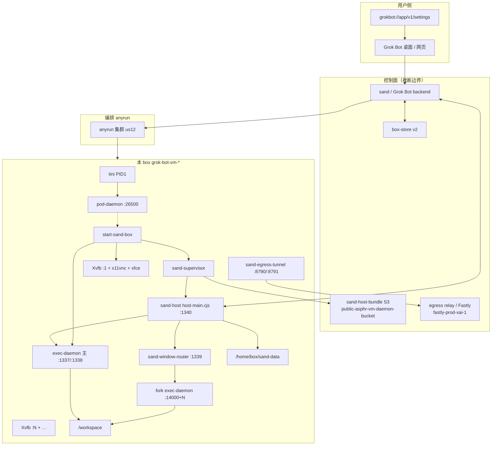
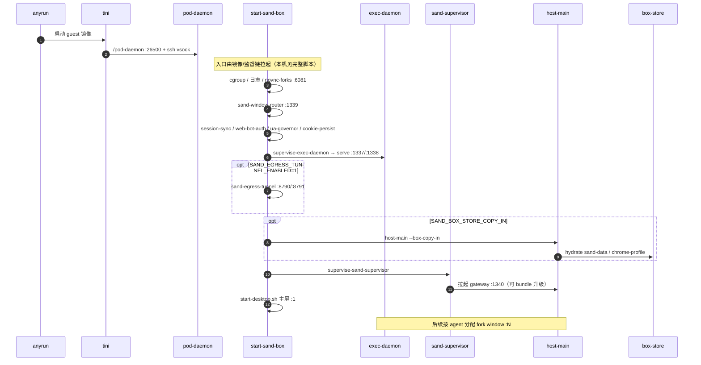

# Grok Bot Sandbox / Cloud Agents 架构（本机证据 + sand 线索 + 与 Cursor Cloud 对照）

探测时间：2026-09-19（Asia/Shanghai）。本对话是共享 box 上的 `sand-subagent-*`；产物在 `grok-bot-sandbox-reversed/`。

> 原则：凡写「证据」均来自本机文件/进程/端口/字符串；「推断」单独标注。不收录密钥原文。

## 1. 一句话结论

Grok Bot 的「Computer」是跑在 **anyrun microVM** 里的 **sand box**：PID1 仍是 Anysphere/anyrun 的 `tini → pod-daemon`，工具面仍是 `@anysphere/exec-daemon-runtime`；之上叠了 **多窗桌面 + sand-host gateway + box-store 持久化 + egress tunnel**。同一物理 box 上可挂多个 agent（各占一个 X display / fork exec-daemon），由 `sand-window-router` 与 owner token 隔离。产品 UI deep link 为 `grokbot://…`，HTTP 出口代理名含 `xai`，但 host bundle 默认仍从 **Anysphere S3** 拉取。

## 2. 总架构图

**证据**：进程树、端口、`start-sand-box`、`box-contract`、S3 URL、hostname/env。  
**推断**：控制面具体服务名与 RPC 未在 guest 落盘；图中 `CTRL` 为逻辑块。

## 3. 启动时序（证据）

`start-sand-box` 在 copy-in **失败**时会：`SAND_SUPERVISOR_ENABLED=0`、关闭 store sync、**不**拉起 host——避免空身份对外服务（脚本内明文注释）。

## 4. Pod / Box 内部组件表

| 组件 | 父/监督 | 端口 / 路径 | 职责 | 本 run |
| --- | --- | --- | --- | --- |
| `/tini` | — | — | PID1 | 在跑 |
| `/pod-daemon` | tini | `:26500` | anyrun guest gRPC、SSH agent vsock | 在跑 |
| `/opt/orbit/current/orbitd` | — | — | 镜像发布位 `bcf29f8` | **未跑** |
| `start-sand-box` | 镜像入口 | — | 编排 sand 用户态 | 已执行 |
| `sand-exit-watch` / `sand-memory-watch` | root/box | telemetry log | 退出与内存监视 | 在跑 |
| `supervise-exec-daemon` | box | — | 重启主 exec-daemon | 在跑 |
| `exec-daemon serve` | 上者 | `:1337/:1338` | 工具 / PTY / computer-use / MCP meta | 在跑 |
| `sand-window-router` | box | `:1339` | 按 `x-sand-display` + owner token 反代到 fork daemon | 在跑 |
| `start-window` + fork exec-daemon | supervisor/host | `:14000+N` | 每 agent 独立桌面工具面 | `:6/:7` 在跑 |
| `sand-supervisor` | supervise-sand-supervisor | status.json | host 生命周期、bundle 升级、桌面健康 | 在跑 |
| `host-main.cjs` | supervisor | `:1340` | agent host / gateway | 在跑 `18cd065` |
| `sand-egress-tunnel` | supervise-egress-tunnel | `:8790/:8791` | WS 隧道 + CONNECT 代理 | 在跑 |
| Xvfb + x11vnc + xfwm4 + plank | start-desktop | `5900+N` / noVNC | 计算机桌面 | 主+fork |
| `/home/box/sand-data` | — | 持久化 | agents / settings / store / transcripts | 在用 |
| `box-doctor` | 按需 | `/tmp/box-doctor.log` | 健康检查 | 可运行 |

## 5. 端口契约（证据）

生成自 `sand/src/shared/box/box-contract.ts` → `box-contract.generated.mjs`：

| 名 | 端口 |
| --- | --- |
| primaryExecDaemon | 1337 |
| primaryPty | 1338 |
| windowRouter | 1339 |
| hostGateway | 1340 |
| primaryNovncWebsockify | 6080 |
| forkNovncWebsockify | 6081 |
| egressTunnelWebSocket | 8790 |
| egressConnectProxy | 8791 |
| fork execDaemon base | 14000 |
| fork pty base | 13600 |
| fork vnc base | 5900 |
| CDP base | 9222 |

HTTP 头：`x-sand-display`、`x-sand-window-owner`。

## 6. 多 Agent / 多窗模型（证据）

- `SAND_BOX_MAX_WINDOWS=100`。
- `/home/box/.sand-window-assignments.json`：`assignments: { <agentId>: <displayNumber> }` + `tokens`（脱敏）。
- 本 run 至少观察到 display `1`（主）、`6`、`7`；fork 目录 `/tmp/sand-window-{6,7}/`。
- `start-window`：display≤1 直接返回；已有 X + daemon 且 token 一致则 adopt；token 冲突 exit 75。
- 子对话 env：`CURSOR_CONVERSATION_ID=sand-subagent-…`，与 Cursor Cloud 的 `bc-…` **命名不同**，但同机共享 `/workspace` 与 sand-data。

**与 Cursor Cloud 对照**：Cursor 侧聊是「同 Pod 第二条 bc 对话、同一 exec-daemon」；Grok Bot 是「同 box 多 agent，常映射到不同 display / fork exec-daemon」。两者都共享磁盘，但隔离粒度不同。

## 7. 请求与工具路径（证据 + 推断）

| 层 | 证据 | 推断 |
| --- | --- | --- |
| 模型 / 会话循环 | `host-main.cjs` 含 `CloudAgent` / `BackgroundComposer` / `sand-subagent` / AgentStore 字符串 | 会话编排在 sand-host + 控制面，不在 exec-daemon |
| 工具执行 | 主/fork `exec-daemon serve`，flags 含 computer-use、mcp-meta-tool、origin-cli | 与 Cursor Cloud ControlService 同族 |
| 身份 | `CURSOR_AGENT_SOCKET=/tmp/sand-identity.sock`；`SAND_BOX_AUTH_ID` 形如 `auth0\|user_…` | Auth0 用户绑定到 box 租户 |
| MCP | 本对话可见 Github / X 等 MCP；host settings 含 `mcpBoxServers` | 箱内与客户端均可挂 MCP |
| Auto-review | host-main 大量 `SAND_AUTO_REVIEW_*` | 与产品「自动审查」一致，分类器在 host |

系统提示与完整工具 schema **不**以明文落在 guest（与 Cursor Cloud 相同）。

## 8. 持久化与升级

### 8.1 sand-data（证据）

- 根：`/home/box/sand-data`；`/home/box/agent-data` 为符号链接。
- `agents/<uuid>/`：`profile.json`、`settings.json`、`group.json`、`store.db*`、`automations/`。
- 其它：`settings.json`、`gateway.json`、`source-map.json`、`sand-statsig-bootstrap.json`、`agent-transcripts/`、`plugins/`、`workflows/`、`user-memory/`。
- `SAND_BOX_STORE_BACKEND=v2`，`SAND_BOX_STORE_SYNC=1`，boot 时可选 `--box-copy-in` 水合。

### 8.2 host bundle（证据）

- 本地版本文件短 sha；supervisor 可从 Anysphere 公共桶拉 tgz 热替换（`hostDir.stage` / `.prev`，避开 overlayfs `EXDEV`）。
- image-owned 脚本（`start-sand-box`、`sand-supervisor*.mjs` 等）**禁止**被 box-scripts 覆盖。

### 8.3 Update vs Reset Computer（证据，reference）

- Update：迁到新实例，保留文件与登录，**不**保留 apt/npm 等已装软件。
- Reset：回上次 snapshot，可能丢未同步工作；文档要求优先引导 Update。

## 9. 网络与密钥边界

| 项 | 证据 |
| --- | --- |
| 出口代理名 | `SAND_HTTP_PROXY_NAME=fastly-prod-xai-1` |
| egress tunnel | 启用；WS `:8790`，CONNECT `127.0.0.1:8791`；env `SAND_EGRESS_TUNNEL_BEARER` **不**传入 exec-daemon |
| Docker API | `:2375` 在听，guest 无 dockerd 进程（与 Cursor Cloud 相同现象） |
| GitHub | 本 run `gh auth status`：**未登录**（不同于 Cursor Cloud 的 GitHub App installation token） |
| 密钥文件 | 仅记录路径：`box-secrets.json`、`host-secrets.json`、`gateway.json.token`、`chrome-cookie-seed.json` |

## 10. 与 Cursor Cloud Agent 对照表

| 维度 | Cursor Cloud（仓库既有逆向） | Grok Bot sand box（本 run） |
| --- | --- | --- |
| 主机名 / 集群 | `cursor` / us4p | `grok-bot-vm-*` / **us12** |
| OS | Ubuntu 24.04 样本 | **Debian 13 trixie** |
| PID1 | tini → pod-daemon | **相同模式** |
| 对话 ID | `bc-…` | `sand-subagent-…` / agent UUID |
| exec-daemon 端口 | 26053/26054 | **1337/1338** + fork 基址 |
| 多桌面 | 单桌面为主 | **一 agent 一窗**（router+token） |
| Agent 宿主 | 控制面 BackgroundComposer + 可选 cursor-server | **箱内 host-main :1340** |
| 持久化 | agent-store FUSE + workspace | **sand-data / box-store v2** + workspace |
| 身份 socket | `/run/cursor/api.sock` | `/tmp/sand-identity.sock` |
| 出口品牌 | cursor.sh 控制面 | **Fastly xai** 代理名 |
| host 升级桶 | （Cloud 以镜像/build 为主） | **Anysphere S3 sand-host-bundle** |
| 产品 deep link | cursor.com / IDE | **`grokbot://app/v1/…`** |
| 包名血迹 | `@anysphere/exec-daemon-runtime` | **相同** + monorepo `sand` |

## 11. 本 run 实测摘要

| 探测 | 脱敏结果 |
| --- | --- |
| hostname | `grok-bot-vm-157438920` |
| `/.dockerenv` | 不存在 → anyrun |
| image sha / orbit | `bcf29f8` |
| host version | `18cd065` |
| cluster | `us12` |
| 主 exec-daemon | pid 在跑，argv 见上 |
| gateway | port 1340，token 已脱敏 |
| 活动 agent | `agents/active-agent.json` → uuid 前缀 `761022e5…` |
| 窗分配 | 多个 agentId → display 2…7 |
| reference | `app-ui.md` / `debugging-the-box.md` 存在 |

完整 JSON：`grok-bot-sandbox-reversed/live-probe/this-run.json`。

## 12. 未证实 / 待挖

1. 控制面如何把桌面客户端会话路由到 us12 某 box（broker API 未在 guest）。
2. `:50052` 监听者身份（Cursor Cloud 同样未知）。
3. `orbitd` 在何种升级路径被 exec。
4. Auth0 tenant 与 xAI 计费的精确边界。
5. `sand-eval-runner` 与 computerUse 子 agent 的完整协议。
6. 非官方 `grok-bot-0.18-reconstructed` 与现行 sand-host 的版本差。
7. GitHub 在「已连接」账户下的 token 形态（本 run 未登录）。
8. Temporal 等工作流引擎是否在控制面（guest 未见 temporal worker 进程）。

## 13. 后续问题清单

1. **host-main 的对外 HTTP/WS 路由表** — 是否等价于精简版 BackgroundComposer。查：对 gateway 的只读探测（勿提交 token）。
2. **box-store v2 对象键设计** — Update Computer 保文件的真实粒度。查：copy-in 日志形状（已有 `/tmp/sand-copy-in-status.json`）。
3. **fork 窗与 MCP 是否共享** — 安全边界。查：per-display exec-daemon env。
4. **与 Cursor Cloud `bc_id` 的兼容层** — host 字符串仍有 `bc_id` 日志。查：`sand.cloud_agent.exchange_record_failed` 上下文。
5. **本地 Docker sand-box 与 anyrun 的差异矩阵** — reference 已区分；查：`SAND_DEV_LOCAL_BACKEND_PROXY_PORTS`。
