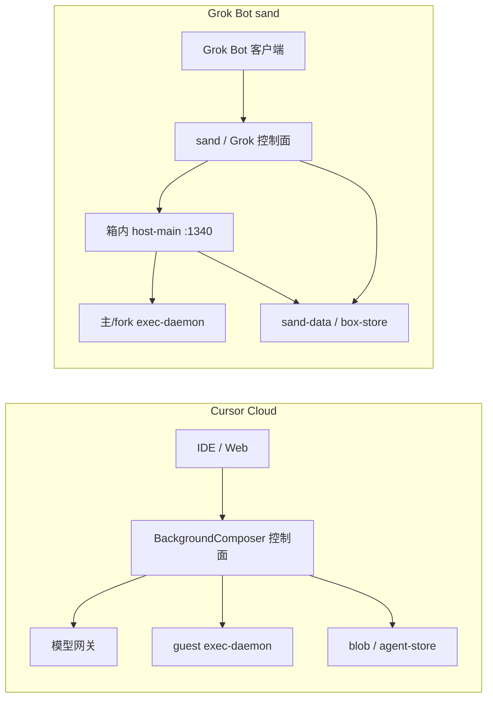

# Grok Bot vs Cursor Cloud Agents：产品设计与架构设计对照

分析日期：2026-09-19（Asia/Shanghai）。材料来自本仓既有架构报告与两套本机逆向目录，不是 xAI / Anysphere 官方白皮书，也不是端到端产品评测。

> **原则**：凡写「证据」均指向本仓路径或官方文档链接；「推断」单独标注。不收录密钥原文。Grok Bot 产品层结论同时参考非官方重建仓与现行 sand box 本机证据，二者版本不同，不能互相外推为完整官方实现。

## 1. 结论先行

**产品定位一句话**：Cursor Cloud Agent 是面向软件交付的「远程 coding agent / Background Composer 会话」——以仓库、跟进、PR 与 Dashboard 列表为中心；Grok Bot 是面向长期伙伴的「Bot + Computer」——以持久身份、共享电脑、多 agent 桌面与例行自动化为中心，编码只是工具面能力之一。

**架构一句话**：二者共享 Anysphere/anyrun 的 microVM 底座（`tini → pod-daemon` + `@anysphere/exec-daemon-runtime`），但 Cursor Cloud 把会话编排放在箱外控制面（BackgroundComposer），guest 以单桌面 + agent-store FUSE 为主；Grok Bot 在 guest 上叠整层 `sand-*`（多窗路由、箱内 `host-main` gateway、box-store、egress tunnel），把「一台 Computer 上挂多个 agent」做成一级产品。

## 2. 产品设计对比

### 2.1 用户对象与主对象

| 维度 | Cursor Cloud Agents | Grok Bot（产品体验 + sand 证据） |
| --- | --- | --- |
| 典型用户 | 已在 Cursor IDE / Glass / Web Agents 里写代码的开发者 | 需要长期 AI 伙伴、后台工作与「一台电脑」的用户（开发者与知识工作者均可） |
| 主对象 | Cloud Agent / Background Composer 会话（`bc-…`） | Bot / agent 身份（UUID）+ Computer（box） |
| 次对象 | Project、侧聊、云子 agent、Environment Build | 群组、线程/对话、automations、workflows、user-memory |
| UI 入口 | IDE、cursor.com/agents、侧聊 composer | 桌面/网页；deep link `grokbot://app/v1/…` |

**证据**：Cloud 主对象与 `bcId` 见 `analysis/cloud-agent-architecture.zh-CN.md` §1、§7 与 `cursor-cloud-reversed/live-probe/this-run.json`；Grok Bot deep link 与账号文案残留见 `grok-bot-sandbox-reversed/client-map/README.md`；sand-data 下 `agents/<uuid>/`、`automations/`、`workflows/`、`user-memory/` 见 `analysis/grok-bot-sandbox-cloud-architecture.zh-CN.md` §8.1。伙伴产品组织另见 `analysis/multi-agent-grok-product-analysis.zh-CN.md` §4（重建版）与十二项目比较中对 Grok / Rakazo / Memoh 的定位。

**推断**：Grok Bot 的「成功默认叙事」是伙伴持续在线并回报；Cursor Cloud 的默认叙事是这次 agent run 是否把代码改对、能否跟进与交付。二者都能写代码，但首页心智不同。

### 2.2 持久性

| 维度 | Cursor Cloud | Grok Bot sand box |
| --- | --- | --- |
| 机器寿命 | 按 agent / Pod 调度；文档描述 hibernate 与 snapshot；侧聊可挂在父 Pod 上 | Computer 是可 Update / Reset 的长期箱体；Update 迁实例保文件与登录，不保 apt/npm |
| 会话状态 | 控制面 conversation blob / Agent Store；guest 上 `AGENT_TRANSCRIPTS` 常空 | `/home/box/sand-data` + box-store v2；boot 时可 `--box-copy-in` 水合 |
| 工作区 | `/workspace` 常为 GitHub App 克隆；Build 缓存磁盘与 RequestContext 是两套优化 | 同机共享 `/workspace`；多 agent 共享磁盘，隔离主要在桌面与 fork daemon |
| 身份绑定 | 触发者 + GitHub/GitLab App 可达集合 | `SAND_BOX_AUTH_ID` 形如 Auth0 `auth0\|user_…`；租户/store/boot id 进 env |

**证据**：Cloud 持久化与侧聊共用 Pod 见 `analysis/cloud-agent-architecture.zh-CN.md` §5–§6；Build vs RequestContext 见 `analysis/cursor-local-cloud-architecture.zh-CN.md` §7。Grok Update/Reset、sand-data、Auth0 形状见 `analysis/grok-bot-sandbox-cloud-architecture.zh-CN.md` §8–§9 与 `grok-bot-sandbox-reversed/live-probe/this-run.json`。

**推断**：Cloud 的「对话」与「机器」基数故意解耦（侧聊证明）；Grok 的「Bot」与「Computer」也解耦，但同一 Computer 上并行多 Bot/agent 是常态产品路径，而不是例外侧聊。

### 2.3 多 agent、Routines、电脑/桌面

**多 agent**

- **Cursor Cloud（证据）**：Dashboard 上的独立 Cloud Agent 文档语义是 per-agent VM；同机侧聊是第二条对话、**同一** exec-daemon / `/workspace` / FUSE `self`；Task `environment:"cloud"` 走 `StartBackgroundComposerFromSnapshot` 开**新** `bcId`。见 `analysis/cloud-agent-architecture.zh-CN.md` §6 表与 `analysis/cursor-local-cloud-architecture.zh-CN.md` §9。
- **Grok Bot（证据）**：`SAND_BOX_MAX_WINDOWS=100`；`/home/box/.sand-window-assignments.json` 将 `agentId → displayNumber`；每窗可 fork 独立 exec-daemon（`:14000+N`）与 Xvfb/x11vnc；`sand-window-router :1339` 用 `x-sand-display` + owner token 反代。见 `analysis/grok-bot-sandbox-cloud-architecture.zh-CN.md` §6、`grok-bot-sandbox-reversed/exec-daemon/README.md`。

**Routines / 自动化**

- **Grok（证据）**：sand-data 存在 `agents/<uuid>/automations/`、`workflows/`；重建版与横向报告强调后台工作、调度 lane 与例行任务是伙伴产品的一部分（`analysis/multi-agent-grok-product-analysis.zh-CN.md` §4；Rakazo 的 Routine 对照见同文 §6）。
- **Cursor Cloud（证据）**：公开材料强调 Environment Build、start/terminals、跟进与子 agent；本仓 Cloud 逆向**未**把「用户级 Routine 日历」建模为与 Bot 同级的一级对象。定时/订阅更多出现在 Projects / MCP 讨论中（`analysis/extensions/cursor-projects-analysis.zh-CN.md`），与 Cloud Agent VM 生命周期不是同一产品层。

**电脑 / 桌面**

- **二者均有 computer-use（证据）**：Cloud 样本为 TigerVNC + xfce + noVNC `:26058`；Grok 为每 display 一套 Xvfb + x11vnc + noVNC（主 `:6080`，fork token `:6081`）。
- **差异（证据）**：Cloud 以单桌面为主；Grok 把「一 agent 一窗」做成端口契约（`box-contract`）。Cloud 另有 `cursor-server :26055` 供人附加远程 workbench；Grok 本 run **未见**独立 cursor-server，产品宿主在 `host-main.cjs :1340`。

### 2.4 协作与何时用人介入

| 场景 | Cursor Cloud | Grok Bot |
| --- | --- | --- |
| 人看代码 | 远程 cursor-server / IDE attach；DesktopLease 仲裁人机抢占桌面 | 人可看各窗 noVNC；reference 强调 Update Computer 优先于 Reset |
| 人审批工具 | 本地 Agent 审批模式与云端 Secrets/Network 策略分层 | Auto-review：`host-main` 含大量 `SAND_AUTO_REVIEW_*`（箱内分类器），工具子进程故意不继承 gateway/egress bearer |
| 协作单元 | Project 成员、主管/Worker、侧聊、云子 agent | 群组编排（重建版有成员/轮次/PASS）；多 agent 同 Computer；MCP 箱内可挂 Github/X 等 |
| 仓库协作 | GitHub App `cursor` installation token，范围不扩大触发者可达集 | 本采样 run `gh` **未登录**；账号连接形态待「已连接」场景再证 |

**证据**：Cloud GitHub/DesktopLease/`SyncScopedSecrets` 见 `analysis/cloud-agent-architecture.zh-CN.md` §6；Grok Auto-review 与凭证剥离见 `analysis/grok-bot-sandbox-cloud-architecture.zh-CN.md` §7、§9 与 `grok-bot-sandbox-reversed/exec-daemon/README.md`。

**推断**：Cloud 的「人介入」更常发生在 diff/PR/远程 IDE；Grok 的「人介入」更常发生在桌面接管、设置/账号与自动审查拒绝之后。二者都需要把「停止观察」和「停止执行」分开——Cloud 客户端流 abort ≠ cancel agent（`analysis/cursor-local-cloud-architecture.zh-CN.md` §6.1）。

### 2.5 度量成功的方式

| | Cursor Cloud | Grok Bot |
| --- | --- | --- |
| 产品成功信号（推断，对照公开叙事） | 任务完成、可跟进会话、可审查的 diff/PR、Environment Build 可复用 | 伙伴仍在、Computer 可恢复、后台/例行任务有回报、多窗工作不互相踩桌面 |
| 工程可观测（证据） | `list-cloud-agents`、streamConversation、bcId / env-info、ghost-mode 关闭 OTel | sand-statsig、box-doctor、sand-exit/memory-watch、gateway status、copy-in status |
| 不应用来冒充成功的信号 | agent 说「完成了」；UI 重连成功；Pod 仍在跑 | host gateway 在听；某窗 VNC 亮着；transcript 目录非空 |

横向产品报告反复强调：完成、验收、进程存活是不同事实（`analysis/multi-agent-grok-product-analysis.zh-CN.md` §11.6）。做 Agent 产品时应显式选一套成功定义，而不是混用「会话还活着」与「交付已验收」。

## 3. 架构设计对比

### 3.1 控制面 vs 数据面

| | Cursor Cloud | Grok Bot |
| --- | --- | --- |
| 会话循环主要在哪 | **箱外** BackgroundComposer + 模型网关 | **箱内** `host-main.cjs` + 箱外控制面协同（guest 看不到完整 RPC） |
| 工具执行 | guest `ControlService` / Pty / tmux | 同族 exec-daemon；端口与多实例监督不同 |
| 编排集群 | anyrun（样本 us4p） | anyrun（样本 us12）；hostname `grok-bot-vm-*` |

**证据**：Cloud 总图与时序见 `analysis/cloud-agent-architecture.zh-CN.md` §2–§3；Grok 总图与「CTRL 为逻辑块」边界见 `analysis/grok-bot-sandbox-cloud-architecture.zh-CN.md` §2；host 字符串含 `CloudAgent` / `BackgroundComposer` / `sand-subagent` 见 `grok-bot-sandbox-reversed/sand-host/README.md`。

**推断**：Grok 并未扔掉 Cloud Agent 血缘，而是把一部分「曾经只在控制面的宿主职责」下沉到 sand-host，以便多窗与本地 Docker/anyrun 同构调试。

### 3.2 沙箱 / VM 组件

| 组件 | Cursor Cloud（us4p 样本） | Grok Bot sand（us12 样本） | 同源？ |
| --- | --- | --- | --- |
| 外层隔离 | Firecracker microVM（公开文档 + `/.dockerenv` 不存在） | 同（anyrun pod） | 是 |
| PID1 | `tini → pod-daemon :26500` | 相同模式 | 是 |
| pod-daemon | SSH vsock、可选 pod-identity、进程监督 | 同族 `PodDaemonService`；身份 socket 改由 sand 提供 | 是（配置分化） |
| exec-daemon | `:26053/:26054`，`surface=cloud`，`bc_id` 进 trace | 主 `:1337/:1338`；fork `:14000+N`；剥离隧道/网关凭证 | 是（契约分化） |
| 产品叠层 | cursor-server、agent-store-fuse、desktop-init | `start-sand-box`、`sand-supervisor`、`sand-window-router`、`sand-egress-tunnel`、`host-main` | **否**（Grok/sand 自有） |
| 内层 cursorsandbox | 样本未开 `--sandbox-enabled` | 同样未开 | 同行为样本 |
| OS 样本 | Ubuntu 24.04 | Debian 13 trixie | 镜像分化 |

**证据**：对照表见 `analysis/grok-bot-sandbox-cloud-architecture.zh-CN.md` §10；包名 `@anysphere/exec-daemon-runtime` 见两侧 `exec-daemon` README；pod-daemon 符号见 `grok-bot-sandbox-reversed/pod-daemon/README.md` 与 `cursor-cloud-reversed/pod-daemon/SOURCE-LAYOUT.md`。

### 3.3 会话与状态存放

| 状态种类 | Cursor Cloud | Grok Bot |
| --- | --- | --- |
| 对话权威源 | 控制面 blob + 客户端 `streamConversation` | sand-host / 控制面；guest 有 `agent-transcripts/` 目录但完整系统提示不落盘 |
| 跨重启文件 | Agent Store FUSE（`self` 绑父 bcId）；workspace git | box-store v2 sync；`/home/box/sand-data`；`agent-data` 符号链接 |
| 上下文烘焙 | `prebuild-request-context-cache`；`useCached` 靠调用方契约 | 本报告未在 Grok 样本中复现同等 bake 路径；host bundle 可热升级 |
| 子会话 ID | 侧聊 `bc-…` ≠ daemon `bc_id`（父） | `CURSOR_CONVERSATION_ID=sand-subagent-…`；agent UUID 另册 |

**证据**：Cloud §5、`cursor-cloud-reversed/exec-daemon/SERVE.md`；Grok §8、`live-probe/this-run.json`。RequestContext 缓存契约见 `analysis/cursor-local-cloud-architecture.zh-CN.md` §7。

### 3.4 工具平面

二者工具平面同属 Connect-ES / `agent.v1.*` 家族（ControlService、Exec、Pty、computer-use、MCP meta-tool）。差异主要在装配：

- Cloud 样本开启 tmux portal、cloud-rules、strip-agent-skill-content、origin-cli、trace 到 `api2.cursor.sh`（可 ghost-mode 关掉）。
- Grok 样本强调 computer-use、mcp-meta-tool、origin-cli；**故意 unset** `SAND_GATEWAY_TOKEN` / `SAND_EGRESS_TUNNEL_BEARER` / `SAND_INFERENCE_RENEWAL_CREDENTIAL` 再进 exec-daemon。

**证据**：`cursor-cloud-reversed/exec-daemon/SERVE.md`；`grok-bot-sandbox-reversed/exec-daemon/README.md`。

### 3.5 多窗口 / 多 agent 隔离

| 隔离轴 | Cursor 侧聊 | Cursor 云子 agent | Grok 多窗 |
| --- | --- | --- | --- |
| 机器 | 同 Pod | 新 VM / 新 bcId | 同 box |
| 工具 daemon | 同一 exec-daemon | 新 daemon | 常为 fork daemon |
| 桌面 | 共享 | 新环境 | 每 agent 一 display |
| 磁盘 | 共享 | 新 clone | 共享 `/workspace` + sand-data |
| 凭证 | 共享 gh App 窗口 | 新 installation 窗口（样本路径） | 按连接账户；本 run 无 gh |

**证据**：Cloud §6 表；Grok §6。**推断**：Grok 用「桌面 + owner token」换取同机多租户体验；磁盘隔离弱于独立 Cloud Agent VM，强于「纯同进程多对话」。

### 3.6 与 IDE 的关系

- **Cursor**：Cloud Agent 是 IDE/Glass/Web 的一等公民；本地还有 Agent Host / local loop / Private Inference 等可分开部署的职责（`analysis/cursor-local-cloud-architecture.zh-CN.md` §1、§4）。远程 `cursor-server` 让人进同一 workspace。
- **Grok Bot**：产品不以 Cursor workbench 为中心；箱内无本 run 的 cursor-server。客户端 deep link 与设置页品牌为 Grok Bot，reference 仍残留 “Sign In with Cursor”（`grok-bot-sandbox-reversed/client-map/README.md`）。

**推断**：Grok Bot Computer 更接近「远程常驻伙伴主机」，Cursor Cloud 更接近「IDE 可派发的远程执行会话」。

### 3.7 Egress / 安全

| 项 | Cursor Cloud | Grok Bot |
| --- | --- | --- |
| 出站品牌 | `api2.cursor.sh` 等；egress 可 restricted | `SAND_HTTP_PROXY_NAME=fastly-prod-xai-1`；`sand-egress-tunnel :8790/:8791` |
| 仓库身份 | GitHub App installation（样本） | 本 run 未登录；Auth0 用户绑 box |
| 密钥注入 | `SyncScopedSecrets` 按 scope 进 shell | box/host secrets 路径存在；不进报告正文 |
| 内层 sandbox flag | 样本未开 | 样本未开 |
| 外层隔离 | Firecracker / anyrun | 同 |

**证据**：两侧架构文 §网络/密钥；Grok live-probe。公开 Cloud 安全概述：[cursor.com/docs/cloud-agent/security](https://cursor.com/docs/cloud-agent/security)。

## 4. 同源与分化

### 4.1 很可能属于 Anysphere / Cursor 联运白标层（证据偏向「同源」）

1. **anyrun guest 监督**：`tini`、`pod-daemon`、`PodDaemonService`、`:26500`、SSH agent vsock。  
2. **工具运行时**：`@anysphere/exec-daemon-runtime`、大型 webpack `index.js`、rg/gh/tmux/cursorsandbox/origin 捆绑布局。  
3. **概念词汇**：`CloudAgent`、`BackgroundComposer`、`AgentStore`、`bc_id` 日志标签仍出现在 sand-host 字符串中。  
4. **host 升级默认桶**：`public-asphr-vm-daemon-bucket…/sand-host-bundle`（Anysphere S3）。  
5. **镜像发布位**：`orbit` / `orbitd` 与 image sha 对齐（本 run orbitd 未常驻）。  
6. **端口未知项**：两侧均见 `:50052`、Docker API `:2375` 无 dockerd 进程等相同现象。

**证据**：`grok-bot-sandbox-reversed/README.md` 一句话结论；`sand-host/README.md` 默认 BASE_URL；两侧 live-probe 与 exec-daemon README。

### 4.2 更像 Grok Bot / sand 产品层自有（证据偏向「分化」）

1. **多窗产品契约**：`sand-window-router`、`start-window`、display 公式、owner token exit 75、`SAND_BOX_MAX_WINDOWS`。  
2. **箱内 gateway**：`host-main.cjs :1340`、`gateway.json`、`sand-supervisor` 热升级与 copy-in 失败熔断。  
3. **持久化产品面**：`sand-data` 目录语义（profile/settings/group/store/automations）、box-store v2、Update vs Reset Computer 文案。  
4. **出口与租户品牌**：`fastly-prod-xai-1`、`grok-bot-vm-*`、`us12`、`grokbot://` deep link、Auth0 `SAND_BOX_AUTH_ID`。  
5. **会话 ID 命名**：`sand-subagent-…` 与 Cloud `bc-…` 并存于同一血缘词汇里。  
6. **Auto-review 与 session-sync / cookie-persist / web-bot-auth / ua-governor** 等 sand 用户态守护进程。

**证据**：`analysis/grok-bot-sandbox-cloud-architecture.zh-CN.md` 全文组件表与 §10；`start-sand-box` 行为描述；client-map reference。

### 4.3 白标不等于「只有换皮」

**推断（明确边界）**：共享 exec/pod 层说明 Grok Bot Computer 不是从零自研的沙箱；但多窗、箱内 host、store sync 与 xAI 出口已经改变了**产品基数**（一台机器多个伙伴桌面 vs 一次 coding run 一台或共享 Pod）。做竞品分析时，既不要写成「完全独立两套云」，也不要写成「只是 Cursor 换 Logo」。

重建版仓库中的 `AnysphereAgent`（`analysis/multi-agent-grok-product-analysis.zh-CN.md` §4）与现行 sand-host 血缘一致于「联运」，但重建版 Router（Codex/Claude 嫁接）**不是**本 sand box 本机证据的一部分——二者勿混为一谈。

## 5. 对「做 Agent 产品」的设计启示

面向工程师读者，按可执行优先级排列。这些是设计建议，不是本仓已实现的产品规格。

1. **先定主对象，再选隔离粒度**  
   若主对象是「长期 Bot」，优先设计 Bot ≠ Session ≠ Computer ≠ 原生 harness（横向结论见 `multi-agent-grok-product-analysis.zh-CN.md` §11.1）。若主对象是「一次交付 run」，per-run VM + blob 会话更接近 Cloud。不要用同一种 Pod 模型假装覆盖两种产品。

2. **执行面可同源，编排面必须可替换**  
   anyrun + exec-daemon 证明：稳定的工具 RPC（文件/shell/PTY/电脑）值得做成厚平台。但会话循环、成功定义、多 agent 归属应留在自有控制面——否则换品牌或换模型时会被平台会话模型锁死。

3. **多 agent 时显式选择「共享磁盘」还是「共享桌面」**  
   Grok 选择共享磁盘 + 分桌面；Cloud 侧聊共享磁盘 + 同 daemon；云子 agent 分机器。三者安全与协作语义不同。新产品应在 UI 上诚实展示「是否同机、是否同工作区、是否同凭证窗口」。

4. **人机桌面要有租约，密钥不要进工具子进程默认 env**  
   DesktopLease（Cloud）与 Auto-review + 凭证 unset（Grok）都在解决「agent 与人抢控制权 / 凭证外泄」。统一 exec 层时，把 secret scope 与 owner token 做成显式参数，而不是全局环境变量。

5. **持久化分三层：产品账本、工作区文件、原生 runtime 状态**  
   Cloud 的 blob + FUSE + git，Grok 的 sand-data + workspace，都没有把「模型 KV」或「未提交 shell」算进同一快照。Update Computer「保文件不保已装软件」是对用户可讲清的契约——值得模仿这种诚实边界。

6. **IDE 附加与 Agent 执行解耦**  
   Cloud 用 cursor-server 证明：人编辑入口可以不是工具通道。若产品不是 IDE，不要为了「像 Cursor」强行嵌入完整 workbench；若产品是 IDE，不要让 agent 只能活在打开的编辑器窗口里。

7. **例行任务（Routines）与一次性 Cloud Run 分账本**  
   定时触发需要去重、漏跑、失败记录与副作用策略（Memoh/Swarm 报告有更细讨论）。不要把 Background Composer 的 followup 队列直接当成日历系统。

8. **度量选用验收证据，而不是进程心跳**  
   对标 §2.5：PR 检查、测试日志、用户确认、产物哈希，优于「daemon 还在听端口」。

9. **首版复杂度控制**  
   Firecracker、FUSE、完整远程 IDE、百窗路由都不是个人伙伴 MVP 的必要条件。可先单机两 harness + 清晰 Computer 边界，再引入 anyrun 级多租户（与 `cursor-local-cloud-architecture.zh-CN.md` §12 建议同向）。

10. **联运/白标时保留逃生口**  
    若依赖 Anysphere 桶与 exec-daemon，应文档化：哪些二进制可替换、哪些端口契约自有、控制面挂了哪些厂商 API。否则产品差异化只存在于皮肤层。

## 6. 证据与推断边界

### 6.1 关键结论标注

| 结论 | 性质 | 主要依据 |
| --- | --- | --- |
| 二者 PID1 均为 tini→pod-daemon，工具包为 `@anysphere/exec-daemon-runtime` | **证据** | 两侧 README、live-probe、package.json 摘录 |
| Grok 在 guest 叠加 sand 多窗 + host gateway + box-store + egress tunnel | **证据** | `grok-bot-sandbox-cloud-architecture.zh-CN.md`、进程/端口表、box-contract |
| Cursor Cloud 会话编排主要在箱外 BackgroundComposer | **证据**（客户端+本机 argv）+ **推断**（完整控制面未开源） | cloud-agent / local-cloud 架构文；guest 无完整 RPC 客户端 |
| 侧聊与父会话同 Pod、同 exec-daemon | **证据**（2026-09-16 样本） | `cloud-agent-architecture.zh-CN.md` §7；不可推广为一切账号/区域 |
| Grok 一 agent 一窗为产品常态 | **证据**（2026-09-19 样本 + 端口契约） | assignments 文件、fork 端口公式；上限 100 为配置证据 |
| Grok Computer 是 Cursor Cloud 的白标联运 | **推断**（高置信，但非合同表述） | 同源层 + xAI 品牌层；无官方联运公告收录于本仓 |
| host-main 等价于精简 BackgroundComposer | **推断** | 字符串与职责相近；路由表未完整逆向 |
| 本 Grok run 的 GitHub 未登录代表产品不能用 GitHub | **否**（反例边界） | 仅该次探测；需已连接账户再证 |
| 重建版 Router 能力 = 现行官方 Grok Bot | **否** | 非官方仓 + 版本差已在 sand 架构文 §12 列出 |
| 成功度量对比表中的「产品成功信号」 | **推断** | 对照对象与公开叙事，非 A/B 数据 |
| `:50052` / 无 dockerd 的 `:2375` 含义 | **未证实** | 两侧待挖清单 |

### 6.2 证据薄或未覆盖的缺口

1. Grok / sand **箱外**控制面 API、计费与模型路由（guest 不可见）。  
2. Cursor 控制面如何把模型 tool call 变成 `ControlService.Exec` 的完整桥。  
3. Environment Build 激活后「下一台新 agent」挂盘的全路径（旧样本曾为 JIT `build=null`）。  
4. Grok「已连接 GitHub/MCP」时的 token 形态与是否同机共享。  
5. fork 窗之间 MCP / Chrome profile / cookie 的精确共享矩阵。  
6. 官方是否将 Grok Bot Computer 表述为联运；本仓只有技术血迹。  
7. 非官方 `grok-bot-0.18-reconstructed` 与 host `18cd065` 的功能差。  
8. Temporal 等工作流引擎是否在控制面（guest 未见 worker）。  
9. 未做真实用户任务的成功率、成本、延迟对比——本文是架构/产品结构对照。

### 6.3 阅读地图

| 材料 | 用途 |
| --- | --- |
| [cloud-agent-architecture.zh-CN.md](cloud-agent-architecture.zh-CN.md) | Cursor Cloud 本机 VM + 控制面切片 |
| [cursor-local-cloud-architecture.zh-CN.md](cursor-local-cloud-architecture.zh-CN.md) | 本地 Host/loop 与云端职责拆分 |
| [grok-bot-sandbox-cloud-architecture.zh-CN.md](grok-bot-sandbox-cloud-architecture.zh-CN.md) | Grok sand box 本机证据与对照表 |
| [multi-agent-grok-product-analysis.zh-CN.md](multi-agent-grok-product-analysis.zh-CN.md) | 伙伴产品与多 harness 横向原则 |
| [../cursor-cloud-reversed/](../cursor-cloud-reversed/) | Cloud exec/pod/live-probe |
| [../grok-bot-sandbox-reversed/](../grok-bot-sandbox-reversed/) | sand-host/exec/pod/live-probe |
| [../sources.json](../sources.json) | 快照与 bundled evidence 元数据 |

---

*本报告只综合本仓已固化材料；若后续 live-probe 更新，应同步修订 §3 端口表与 §6 样本边界。*
