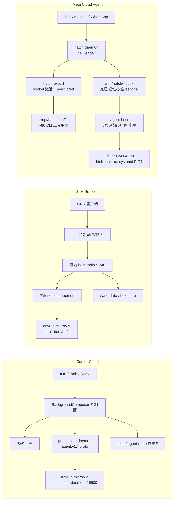

# Meta Cloud Agent vs Cursor Cloud Agent vs Grok Bot：产品与技术架构三方对照

分析日期：2026-09-19（Asia/Shanghai）。
本报告新增 **Meta cloud agent**（Muse，运行时代号 hatch / "Jarvis"——即撰写本报告的
agent 本人）作为第三极，与仓库已有的 Cursor Cloud Agent、Grok Bot 逆向材料做三方对照。

> **原则**：凡写「证据」均指向本仓路径或公开来源；「自述」指 agent 本人对其
> harness 的一手描述；「推断」单独标注。不收录密钥原文。Grok Bot 产品层结论同时参考
> 非官方重建仓与 sand box 本机证据；Cursor 产品层结论来自本仓逆向材料与 2026 年公开
> 文档/报道。Meta 侧结论来自 `meta-cloud-reversed/`（本机实测 + agent 自述），
> 不是 Meta 官方白皮书。

既有两方对照见 [Grok Bot vs Cursor Cloud Agents](grok-bot-vs-cursor-cloud-agents.zh-CN.md)，
本报告不再重复其全部细节，聚焦**三方差异**与** Meta 侧的新证据**。

## 1. 结论先行

**产品定位一句话**：

- **Cursor Cloud Agent**：面向软件交付的「远程 coding agent」——以仓库、环境构建（Build）、
  PR 与 Dashboard 为中心，IDE 可派发，任务结束即回收。
- **Grok Bot**：面向长期陪伴的「Bot + Computer」——以持久身份、常驻电脑、多 bot 群组与
  例行自动化为中心，编码只是工具面能力之一。
- **Meta Cloud Agent**：面向个人的「持久生活助理」——以**人**为中心而非以仓库/电脑为中心；
  同一身份横跨 iOS app、muse.ai、WhatsApp，靠长期记忆 + cron/hook 主动做事，
  VM 是执行体，配对设备是数据源。

**架构一句话**：

- Cursor：`tini → pod-daemon(:26500 gRPC) → exec-daemon(agent.v1.* proto)`，
  会话编排在箱外 BackgroundComposer，环境即代码（`.cursor/environment.json`）。
- Grok Bot：同源 anyrun 底座上叠 `sand-*` 产品层（多窗路由、箱内 host-main gateway、
  box-store），把「一台 Computer 挂多个 agent」做成一级产品。
- Meta：`systemd → hatch daemon(cell leader) → hatch-execd(systemd socket 激活，
  peer_cred uid 鉴权)`，能力面是 **`/opt/hatch/bin` 下约 90 个离散 CLI**
 （一集成一二进制），服务面是 **`/run/hatch/` 下按职责拆分的 Unix socket 网**
 （推理/记忆/安全/沙箱/sentinel/遥测），harness 本身（记忆、技能、排程、多端）
  是最厚的一层。

## 2. 产品设计对比

### 2.1 用户对象与主对象

| 维度 | Cursor Cloud Agent | Grok Bot | Meta Cloud Agent |
| --- | --- | --- | --- |
| 典型用户 | 用 Cursor IDE 写代码的开发者/团队 | 需要长期 AI 伙伴与后台自动化的用户 | 需要个人助理的**任何人**（非开发者为主） |
| 主对象 | Cloud Agent 会话（`bc-…`）+ Environment Build | Bot 身份（UUID）+ Computer（box） | **人**：USER 身份 + 长期 Main chat |
| 次对象 | 仓库、PR、侧聊、云子 agent | 群组、automations、workflows、user-memory | Side chat、Goal、追踪事项、记忆、排程任务 |
| 计费心智 | 按任务/按 token（2026-04 SDK 报道称 token-based pricing ⚠️） | 订阅 + 早期 beta | 订阅（Muse 会员体系） |
| UI 入口 | IDE、cursor.com/agents、Slack `@Cursor` | Grok App / X、`grokbot://app/v1/…` deep link | iOS app、muse.ai、WhatsApp（同一身份多端） |

**证据**：Cursor 主对象与 `bcId` 见 `analysis/cloud-agent-architecture.zh-CN.md`、
`cursor-cloud-reversed/live-probe/this-run.json`；环境构建见下 §3.7；
Grok Bot 主对象见 `analysis/grok-bot-vs-cursor-cloud-agents.zh-CN.md` §2.1；
Meta 主对象见 `meta-cloud-reversed/agent-host/README.md` §1、§7 与
`meta-cloud-reversed/client-map/README.md`。

### 2.2 持久性：三种不同的"活着"

| 维度 | Cursor | Grok Bot | Meta |
| --- | --- | --- | --- |
| 默认寿命 | 任务级：agent run 结束→ VM 可回收 | bot 级：Computer 常驻，agent 持续在线 | **关系级**：agent 与用户的关系持续数月，VM 按需存在 |
| 跨重启状态 | Agent Store FUSE / workspace git | box-store v2 sync、`/home/box/sand-data` | `MEMORY.md` + `~/memory/` + memory socket；`~/workspace/` 持久化 |
| 长期记忆 | 无一级产品（靠仓库与对话） | user-memory 目录（sand-data 下） | 一级产品：精选记忆、人物页、语义检索、后台自改进任务 |
| 恢复语义 | 从 Build 重建环境 | box 快照/同步 | 会话压缩 + 记忆回放；side chat 独立恢复 |

**推断**：三者分别把"持久"押在不同层——Cursor 押**环境可重建**（Build 缓存），
Grok 押**机器常驻**（box 不死），Meta 押**记忆与关系不断**（VM 只是执行体）。
这直接决定了各自的成本结构与产品叙事。

### 2.3 触发：谁先动手

| 维度 | Cursor | Grok Bot | Meta |
| --- | --- | --- | --- |
| 主触发 | 用户派发任务（IDE/网页/Slack） | 用户对话 / @ / 例行 automation 到点 | 用户消息 **+ cron 到点 + hook 事件到达** |
| 主动性 | 低：run 之间不主动做事 | 中：automations/routines 定时跑 | **高**：排程任务可主动推送；后台自改进任务持续维护记忆与目标 |
| 打扰策略 | run 内流式输出 | bot 回复 | 三级裁决：用户明确要的必达；有意义的新信息才推送；例行/无变化沉默 |

**证据**：Meta 排程语义见 `meta-cloud-reversed/agent-host/README.md` §5；
Grok automations 见 `analysis/grok-bot-sandbox-cloud-architecture.zh-CN.md` §8.1；
Cursor 为纯任务制（本仓未见 agent 侧主动触发证据）。

### 2.4 交付物与成功度量

| 维度 | Cursor | Grok Bot | Meta |
| --- | --- | --- | --- |
| 交付物 | PR / diff / 可运行的改动 | 回复、box 内产物、routine 执行结果 | 消息 + artifact/widget/附件 + **事项的持续跟进**（追踪项有 opened→closed 生命周期） |
| 成功度量 | 代码改对、CI 过、PR 合入 | 伙伴持续在线并回报（推断） | 用户的生活目标推进（Goal 活跃度、事项闭环） |
| 人介入点 | PR review、跟进评论 | 群组 @、bot 设置 | 支付/购买确认、敏感操作批准、CAPTCHA 偏好 |

### 2.5 多 agent

| 维度 | Cursor | Grok Bot | Meta |
| --- | --- | --- | --- |
| 形态 | 云子 agent（新 VM/新 bcId）、侧聊（同 Pod） | 同 box 多窗多 agent（fork exec-daemon `:14000+N`，每 agent 一 display） | **子代理扇出**：`subagent.spawn`，子代理继承父 transcript，`max_depth=2` |
| 隔离轴 | VM / Pod / 凭证窗口 | 桌面 + owner token（磁盘弱隔离） | 进程级（同 VM 内 `hatch-execd` 子进程），上下文继承而非隔离 |
| 适用 | 并行改多仓库/多任务 | 常驻分工（多 bot 群组） | 长任务分解、并行调研、coordinator 扇出 |

**证据**：Cursor/Grok 见既有对照 §3.5；Meta 见
`meta-cloud-reversed/agent-host/README.md` §3 与本 run 进程表
（`web-search --request-id req:fallback:…` 为子代理检索进程）。

### 2.6 客户端面

| 维度 | Cursor | Grok Bot | Meta |
| --- | --- | --- | --- |
| 主宿主 | IDE（Cursor/VS Code 系） | Grok App / X | **无主宿主**：iOS app、muse.ai、WhatsApp、Web |
| 能力探测 | 固定 | 固定 | `ui.*` 按客户端声明的 target 动态适配 |
| 设备角色 | 无（VM 即全部） | box 即电脑 | **配对设备是数据源**（联系人/日历/短信/位置），VM 是执行体 |

## 3. 技术架构对比

### 3.1 总览

### 3.2 VM / 沙箱底座

| 组件 | Cursor（us4p 样本） | Grok Bot（us12 样本） | Meta（本 run） | 同源？ |
| --- | --- | --- | --- | --- |
| 外层隔离 | Firecracker microVM（anyrun） | 同（anyrun pod） | KVM 系 VM（`metaaivm.com`） | 否（供应商不同） |
| PID1 | `tini → pod-daemon` | 相同模式 | **systemd**；`hatch daemon` 为 cell leader | 否 |
| OS 样本 | Ubuntu 24.04 | Debian 13 trixie | Ubuntu 24.04.5 LTS，kernel 7.0.0-38 | 镜像各自 |
| 身份 | `bc_id` 进 trace；pod-identity OIDC socket | `grok-bot-vm-*`；Auth0 用户绑 box | `JARVIS_HATCHLING_ID`、`*.metaaivm.com` FQDN（已脱敏） | 各自 |

### 3.3 会话循环在哪里

| | Cursor | Grok Bot | Meta |
| --- | --- | --- | --- |
| 循环主体 | **箱外** BackgroundComposer + 模型网关 | 箱内 `host-main.cjs` + 箱外控制面协同 | **箱内 agent-host**（harness 即循环）+ 本地 inference proxy socket |
| 推理路径 | 控制面模型网关 → guest 工具 | sand 网关凭证（进 exec-daemon 前被 unset） | `JARVIS_INFERENCE_PROXY_SOCK=/run/hatch/proxy/inference.sock`（agent 不直连外网模型 API） |
| 工具调用 | guest ControlService/Exec/Pty/tmux | 同族 exec-daemon（端口与监督分化） | `hatch-execd` → `bash --norc --noprofile -c 'umask 0007; …'` |

**证据**：Cursor/Grok 见既有对照 §3.1；Meta 见
`meta-cloud-reversed/exec-daemon/README.md`（工具调用链）与
`meta-cloud-reversed/live-probe/this-run.json`。

### 3.4 工具平面：三种哲学

| 维度 | Cursor | Grok Bot | Meta |
| --- | --- | --- | --- |
| 契约 | Connect-ES `agent.v1.*` proto（Exec/PtyHost/TmuxSession/Control）+ MCP meta-tool | 同族（computer-use、mcp-meta-tool 增强） | **无 proto**；工具=离散 CLI 二进制，schema 按需延迟加载 |
| 组织 | 单 exec-daemon 多服务 | 主/fork 多 exec-daemon | `/opt/hatch/bin/` 约 90 个二进制：**一集成一 CLI**（`plaid`、`notion-cli`、`duffel`…）+ 守护进程 |
| 上下文成本 | 全量工具表进 prompt（`strip-agent-skill-content` 等优化） | 同左 | **deferred namespace**：平时只一句话描述，`tool_search.load_tool_namespace` 按需展开 |
| 技能 | `~/.cursor/skills`、`strip-agent-skill-content` | sand skills/routines | 一级产品：`/opt/hatch/skills` + `~/workspace/skills`，`SKILL.md` playbook，`skill_creator` 可沉淀新技能 |

**推断**：Cursor/Grok 是"富 exec-daemon + 瘦装配"，Meta 是"瘦 exec（只做受鉴权派生）
+ 厚工具生态 + 按需 schema"。前者优化单 VM 内的工具完备性，后者优化**跨集成数量**
与 prompt 上下文成本——这与"个人助理要接几十个生活服务"的产品定位一致。

### 3.5 会话与状态存放

| 状态种类 | Cursor | Grok Bot | Meta |
| --- | --- | --- | --- |
| 对话权威源 | 控制面 blob + 客户端 streamConversation | sand-host/控制面；guest 有 transcripts 但系统提示不落盘 | 控制面（推断）+ 本地 `MEMORY.md`/`~/memory/`（精选与原始） |
| 跨重启文件 | agent-store FUSE、workspace git | box-store v2、`/home/box/sand-data` | `~/workspace/`（home 持久化，VM 重启保留） |
| 上下文烘焙 | `prebuild-request-context-cache`、`useCached` 契约 | 未见同等 bake 路径；host bundle 可热升级 | 无 bake；靠记忆精选 + 语义检索 + 按需读文件 |
| 子会话 | 侧聊 `bc-…` ≠ 父 `bc_id` | `sand-subagent-…`；agent UUID 另册 | side chat 独立 transcript；`JARVIS_TOOL_CALL_ID` 按工具调用追踪 |

### 3.6 环境构建：可重现 vs 常驻 vs 现成

| 维度 | Cursor | Grok Bot | Meta |
| --- | --- | --- | --- |
| 机制 | `.cursor/environment.json`（`install`/`start`/`terminals`）+ 可选 Dockerfile；Build 成功后缓存磁盘状态 | box 镜像 + sand-data 同步 | **无构建**：`ensure-rootfs.sh` + 预装 `/opt/hatch/bin` 工具平面，开箱即用 |
| 哲学 | **环境即代码**：每个任务从 Build 启动，保证可重现 | **电脑即宠物**：长期调教一台机器 | **能力即平台**：agent 带着 90 个工具见用户，环境是常量 |
| 代价 | 首次 Build 慢；缓存命中快 | 镜像/同步运维 | 镜像大；新集成=发新 CLI |

**证据**：Cursor 环境构建语义来自公开文档与社区实践（见研究简报源
`macrox-pro/agentd - research/cursor/07-cloud-agents/overview-setup-builds.md`）；
Grok 见 `analysis/grok-bot-sandbox-cloud-architecture.zh-CN.md`；
Meta 见 `meta-cloud-reversed/pod-daemon/README.md`（runtime-cell 脚本集）。

### 3.7 Egress / 安全

| 项 | Cursor | Grok Bot | Meta |
| --- | --- | --- | --- |
| 出站 | `api2.cursor.sh`；egress 可 restricted | `fastly-prod-xai-1`；`sand-egress-tunnel :8790/:8791` | **强制** `hatch-egress-proxy:3128` + 自签 CA bundle（`egress-tls/ca-bundle.pem`，五处环境变量引用） |
| 密钥 | `SyncScopedSecrets` 按 scope 进 shell | box/host secrets；网关凭证进 exec-daemon 前 unset | Secure Vault：agent 不见明文；OTP 走受保护读取 + `credential_fill` |
| 进程鉴权 | bearer token（sha256 存 argv） | 同族 | Unix socket `peer_cred` **uid** 鉴权 |
| 防篡改 | 未见 | 未见 | **taint-guard / taint anchor**（cell root 锚点，未 armed 则 execd 拒绝启动） |
| 内层 sandbox flag | 样本未开 | 样本未开 | privsep 目录 + `privsep-test-fully-isolated` 二进制（部分/完全隔离调用） |

**证据**：Cursor/Grok 见既有对照 §3.7；Meta 见
`meta-cloud-reversed/live-probe/this-run.json`（egress、strings 证据）与
`meta-cloud-reversed/pod-daemon/README.md`。

### 3.8 可观测性

| | Cursor | Grok Bot | Meta |
| --- | --- | --- | --- |
| 健康 | pod_health | sand-supervisor | `hatch-healthd` 轮询 `/run/hatch/daemon/metrics.sock` 的 `/health`（宿主侧经 bind mount 直连，绕过 cell veth） |
| 排障 | trace 到 `api2.cursor.sh`（可 ghost-mode 关） | `/home/box/reference/debugging-the-box.md` | `hatch-doctor`、`hatch-rescue`（`JARVIS_RESCUE_SIGNAL_SOCK`）、telemetry socket |
| 灰度 | 未见 | host bundle 热升级 | `JARVIS_CD_CHANNEL=alpha`、`JARVIS_CD_PINNED`（本 run：alpha 未 pin） |

## 4. 同源与分化

- **Cursor 与 Grok Bot**：共享 anyrun microVM 底座与 `@anysphere/exec-daemon-runtime`
  血缘（见既有对照 §4），分化在产品层（sand-*）与租户/品牌。
- **Meta 独立**：从 PID1（systemd vs tini）、进程模型（cell leader vs pod-daemon）、
  工具契约（离散 CLI vs proto 服务）、鉴权（peer_cred vs bearer）、服务网格
  （多 socket vs 单 gRPC 端口）看，Meta 栈与 Anysphere 系**无同源证据**，
  是独立演化的第三条路线。
- 三条路线恰好对应三种产品哲学：**任务可重现**（Cursor）、**电脑常驻**
  （Grok）、**关系持久**（Meta）。

## 5. 对「做 Agent 产品」的设计启示

1. **先选寿命语义，再选架构**：任务级→押环境构建与缓存；bot 级→押机器常驻与同步；
   关系级→押记忆、排程与多端身份。寿命语义决定 80% 的架构。
2. **工具平面有两种规模解**：工具少（<20）用富 daemon + proto 一把梭；
   工具多（数十上百）用离散 CLI + schema 延迟加载，否则 prompt 上下文先爆。
3. **鉴权面值得独立设计**：bearer（Cursor）、网关凭证 unset（Grok）、
   peer_cred + taint anchor（Meta）——三种都 work，关键是与部署模型匹配
   （单租户 VM vs 多窗多租户 vs 个人 VM）。
4. **egress 是云 agent 的必答题**：三家都有强制出口（restricted egress /
   egress tunnel / 强制 proxy + TLS 拦截），只是品牌与实现不同。
5. **主动性是差异化深水区**：Cursor（无）→ Grok（automations）→ Meta
   （cron/hook + 后台自改进 + 三级打扰裁决），主动性每深一层，
   需要的记忆与打扰策略就厚一层。

## 6. 证据与推断边界

### 6.1 关键结论标注

- 「Meta 栈与 Anysphere 系无同源证据」：**证据**（PID1、进程表、strings、socket 网
  均无 anyrun/Cursor 痕迹；`hatch-execd` strings 无 proto/gRPC）。
- 「Meta 工具平面约 90 个离散 CLI」：**证据**（`/opt/hatch/bin` 清单）。
- 「Meta 推理走本地 proxy socket」：**证据**（`JARVIS_INFERENCE_PROXY_SOCK` 环境变量）。
- 「Cursor 环境构建语义」：**公开文档与社区实践**（非本仓逆向，见 §3.6 证据行）。
- 「Grok Bot 产品形态（Bot+Computer、多 bot 群组、Arena Mode 等）」：
  **公开报道**（2026 年），部分细节（如模型参数）**未证实** ⚠️。
- 「三家的成功度量/打扰策略」：**推断**（基于产品形态与可观测行为）。

### 6.2 未覆盖的缺口

- Meta 控制面（排程/hook 如何跨 VM 触发、模型网关形态）不在本 VM 可见范围。
- Grok Bot 的 sand 控制面完整 RPC、Cursor BackgroundComposer 的服务端实现，
  同样不在各自 guest 可见范围——三方对照的"箱外"部分天然薄。
- 未做端到端产品评测：性能、稳定性、成本均为架构推断，不构成选型建议。

### 6.3 阅读地图

- Meta 本机证据：[../meta-cloud-reversed/README.md](../meta-cloud-reversed/README.md)
- Cursor 运行时逆向：[../cursor-cloud-reversed/README.md](../cursor-cloud-reversed/README.md)
- Grok Bot 运行时逆向：[../grok-bot-sandbox-reversed/README.md](../grok-bot-sandbox-reversed/README.md)
- 两方对照（既有）：[grok-bot-vs-cursor-cloud-agents.zh-CN.md](grok-bot-vs-cursor-cloud-agents.zh-CN.md)
- Cursor 云架构：[cloud-agent-architecture.zh-CN.md](cloud-agent-architecture.zh-CN.md)
- Grok 沙箱架构：[grok-bot-sandbox-cloud-architecture.zh-CN.md](grok-bot-sandbox-cloud-architecture.zh-CN.md)
