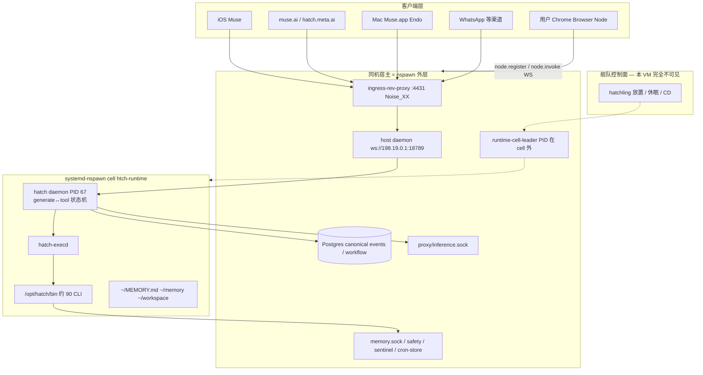

# Muse（Meta Hatch / Jarvis / Endo）实现方式：已确认与需推测

分析日期：2026-09-19。本报告把 **CVM 内运行时探针**、**宿主层补测**、**Mac 桌面 DMG 恢复** 合成一份实现说明书。目标是尽当前材料所能，画出 Muse 实际怎么跑；每一节区分【观察】【自述】【推断】。不是 Meta 官方白皮书，也不是可编译源码。

> **材料**：`meta-cloud-reversed/`（cell 自述 + 只读命令）、`meta-cloud-reversed/runtime-report-2026-09-19-hostlayer.zh-CN.md`、`muse-reversed/`（Muse 2.0 DMG，`com.meta.endo`）。密钥、token、用户 MEMORY 正文不收录。

## 1. 一句话

Muse 是 **以人为中心的持久个人助理**：token 循环在用户专属 CVM 的 nspawn cell 里由 `hatch daemon` 推进；同机宿主提供 Postgres、推理代理、记忆/安全 socket 和 Noise 入口；Mac/iOS/Web 只是终端。Mac 桌面把用户 Chrome 和本机电脑注册成 CVM 的 device 节点，**不在本机跑 planner**。

## 2. 证据范围

| 来源 | 能证明什么 | 不能证明什么 |
| --- | --- | --- |
| cell 内 `ps` / `ss` / systemd / `--help` / strings | 进程、socket 路径、SQL 表名、RPC 方法名、工具派生链 | 宿主进程表、inference 包体 |
| `run-daemon.sh` 等 runtime-cell 注释 | nspawn、nsenter、ptrace-drop、Sentinel egress | 舰队调度器 |
| agent 运行手册（自述） | 工具命名空间、记忆分层、cron/hook、subagent 语义 | 二进制是否一字不差实现手册 |
| `hotset.manifest` 键名、subagent jsonl 结构 | 材料索引形态、子代理 session 文件 | 用户文本、完整 prompt 装配代码 |
| Muse 2.0 DMG：Swift 类型名 + Chrome 扩展全文 + Hatch HTML marker | 桌面壳、Browser Node 协议、`hatch.metaaivm.com` / `/v1/noise`、CVM 恢复密钥、审批字段 | planner 源码、ComputerControl 线协议细节、53MB HTML 全量 RPC |
| 公开产品面 | iOS / muse.ai / WhatsApp 多端 | 计费实现、模型权重 |

## 3. 总架构（四层）

【观察】cell 默认路由 `198.19.0.2/30` via `198.19.0.1` dev `host0@if3`；`ls /proc/<leader>` 在 cell 内不存在；cell 的 `ps` 几乎只有 systemd、`hatch daemon`、`hatch-execd`。  
【观察】真客户端路径：Hatch Web `HATCH_SHARED_LB_HOST=hatch.metaaivm.com`，`NOISE_WS_PATH=/v1/noise`。  
【推断】舰队（谁创建/休眠哪台 hatchling）在 leader 之上，guest 与 DMG 都看不见实现。

### 3.1 产品对象

| 对象 | 含义 | 证据 |
| --- | --- | --- |
| 人 / USER | 长期关系，跨端同一身份 | 【自述】agent-host；【观察】Mac Reset 文案删除「你的」chat/files/tasks |
| Hatchling / CVM | 一台专属执行 VM | 【观察】`JARVIS_HATCHLING_ID`、`*.metaaivm.com` |
| Main chat / Side chat | 长期主会话 + 主题会话 | 【观察】`chat-send --channel` 默认 `main`；【自述】side chat 独立 transcript |
| Goal / cron / hook | 长期目标与主动触发 | 【观察】`~/workspace/cron.d/` Markdown；`scheduler.*` 表名 |
| Device 节点 | 用户 Chrome / 本机电脑 | 【观察】Browser Node `node.register`；Swift `ComputerControl` |

## 4. Agent loop：已确认的分裂实现

### 4.1 结论

**generate↔tool 的推进器在箱内 `hatch daemon`（PID 67）。** 宿主没有第二套 token 循环的进程证据。不是 Temporal。

【观察】`hatch` 二进制 strings 含 `runtime.workflow_runs` / `workflow_agent_calls` / `workflow_phase_runs`、`iteration_index`、`inference_request_id`、`lifetime_tool_call_count`。  
【观察】`temporal` / `cadence` / `grpc` / `connectrpc` 在 `hatch`/`hatch-execd` strings 中零命中。  
【观察】cell 内除 daemon/execd 外无 node/python/temporal worker。  
【观察】`run-daemon.sh` 明确 Drop PTRACE，因此 `/proc/67/fd` Permission denied **不能**用来否定 daemon 连接了 inference.sock。  
【观察】daemon RSS/CPU 随多轮 tool call 增长；无工具的单词 subagent 期间无此增长。  
【自述】每一轮：runtime 投递消息 → 模型输出文本或 tool call → harness 执行工具 → 拼回上下文 → 再调模型，直到停止调工具。

### 4.2 一轮时序（合成）

1. 客户端经 Noise `/v1/noise` 进 `ingress-rev-proxy :4431`。【观察】Hatch HTML + `ingress-rev-proxy --help` + `hatch-ws-client --noise`。
2. 宿主 daemon（`198.19.0.1:18789` 或 HTTP API）把 turn 交给 cell 内 PID 67。【观察】`chat-send` 默认 URL；【推断】ingress 与 PID 67 之间的具体转发代码在宿主，看不见。
3. PID 67 从 Postgres 读 canonical events、hotset、memory 服务，装配 prompt。【观察】表名 + hotset 键；【自述】MEMORY.md 每次注入、人物页按需读；**完整拼装顺序的代码不可见**。
4. 经 `inference.sock` 调模型。【观察】socket 在 net-ns 绑定且有 ESTAB；协议字段【不可见】。
5. 若 tool call：`hatch-execd` → `bash --norc --noprofile -c 'umask 0007; …'`，注入 `JARVIS_TOOL_CALL_ID` / `JARVIS_SESSION_ID`。【观察】`ps auxf`。
6. 集成 CLI 再连 authd / stefi / credit-watcher / sentinel 等宿主 socket，**不走单一 privsep**。【观察】CLI strings；sleep 子进程 fd 只有 0/1/2。
7. 结果写回 Postgres + 流式 `Delta*` 经 Noise `chat.subscribe` 回客户端。【观察】strings 事件名；【观察】`chat-send` 默认等终态，`--wait-reply` 才订阅流。

### 4.3 Tool LLM vs Expert Agent vs subagent

| 名称 | 是什么 | 证据 |
| --- | --- | --- |
| Tool LLM | 便宜快模型做工具路由 | 【观察】strings「Tool LLM fast search failed; automatically falling back to Expert Agent」 |
| Expert Agent | 难例回退，不是常驻进程 | 同上 |
| `subagent.spawn` | 同 daemon 扇出任务 | 【观察】无新 hatch 进程；新 `agents/agent-<uuid>/sessions/<uuid>.jsonl`；`seq` 全局连续；jsonl 只有 preamble+brief+回复，不是父 transcript 全量拷贝 |
| `browser.spawn_task` | 独占 live 浏览器会话 | 【自述】禁止用通用 subagent 做购买/登录；【观察】审批字段 `browser_task_id` |

【自述】手册写「子代理继承完整 transcript」；【观察】文件层是 seeding standing instructions，不是共享 fd。应理解为**继承推理上下文**。`max_depth=2` 为运行手册/runtime 字段。

## 5. 状态与「blob」等价物

| 机制 | 角色 | 等级 |
| --- | --- | --- |
| 宿主 Postgres `runtime.messages` / `tool_calls` / `tool_outputs` / `events` | 对话权威源，全局 `event_seq` | 【观察】strings 表名；行从未读取 |
| `runtime.text_blobs` + `text_blob_gc_queue` | 服务端大文本分块 + GC | 【观察】表名。**存储像 Cursor blob，分发不像**——客户端拿 `chat-history` 消息 |
| `hotset.manifest` | 779 条 `{path,offset,len,tier}` 材料预热索引 | 【观察】键名；值未读 |
| `~/MEMORY.md`、`~/memory/` | 精选长期记忆 + 按日原始日志 | 【观察】文件存在且跨 cell 重建仍在；【自述】语义检索 `memory_search` |
| `memory.entries` / `embeddings` | 记忆服务 | 【观察】表名；`memory.sock` 方法名【不可见】 |
| compaction `runtime.summaries` / `agent.compactions` | 丢中间轮原文，留摘要 | 【观察】表名 + `DeltaCompactionEvent` |
| `agent.runtime_restart_checkpoints` | daemon 重启后续未完成 tool call | 【观察】strings |
| `/run/hatch/resume/handoff-epoch` | cell 代际；重建后只认同代 resume | 【观察】文件类型；22:10 cell 重建后会话无缝继续 |
| Cursor 式 `offsetKey` | **无** | 最接近 `after_chat_event_seq` / `before_seq` |

【观察】`hatch-ws-client chat-history` 走 daemon HTTP API（`before_seq`、`transcript_mode`），客户端不直读 VM 内 transcript 文件。

下一轮拼模型上下文（【自述】为主，【观察】为辅）：

1. 身份文件 `USER.md` / `SOUL.md` / `MEMORY.md`
2. 当前 chat 的 Postgres 事件（可能已经过 compaction）
3. hotset 指向的文件切片
4. 按需 `memory_get` / 人物页
5. 本轮 developer handoff（cron / 子代理 / 设备事件）
6. 延迟加载的工具 schema（`tool_search.load_tool_namespace`）

精确字节级装配算法【不可见】。

## 6. 工具平面

【观察】`/opt/hatch/bin` 约 90–97 个二进制：daemon 类（hatch、hatch-execd、browser-broker、ingress-rev-proxy、spawnd…）+ 一集成一 CLI（notion-cli、plaid、duffel…）。  
【自述】工具按 namespace（`muse.*` / `browser.*` / `subagent.*` / `cron.*` / `credentials.*`…）组织，非常用 namespace 只暴露一句话，按需展开。  
【观察】`hatch-execd` 必须 socket 激活或 `--socket`；peer_cred uid；taint-guard。  
【观察】`bin-scopes.conf`：部分二进制刻意不进 cell。  
【观察】箱内 root 不被宿主信任（`pre-start.sh`：daemon 状态放在 root-owned `daemon-ctl`，因 cell-root-forgeable）。  
【自述】凭据走 Secure Vault，agent 不见明文；OTP 经 `credential_fill`。  
【推断】「一集成一 CLI」是为了接几十个生活服务而不把全量 JSON schema 塞进每一轮 prompt。

技能：【观察】`/opt/hatch/skills` 只读 + `~/workspace/skills`；Mac DMG 的 Hatch HTML 含 red-team mock `SKILL.md`（todoist/notion/plaid 等），**桌面没有 skill 扫描器**。

## 7. 客户端协议（对标 streamConversation）

| 通道 | 用途 | 证据 |
| --- | --- | --- |
| Noise `wss://<vm>.metaaivm.com/v1/noise` | 真用户流：`chat.subscribe`、`DeltaTextAppendEvent` / `DeltaThinkingAppendEvent` / `DeltaAgent*` / `DeltaCompactionEvent` | Hatch HTML + hatch-ws-client `--noise` |
| 宿主 WS `ws://198.19.0.1:18789/` | fleet 内 / 调试；`chat-send` 默认等最终回复 | `--help` |
| daemon HTTP API | `chat-history`、`activity` | `--help` |
| protobuf framing | daemon RPC 默认自动协商，`--use-json` 强制 JSON | `--help` |

【观察】`ChatSubscribeRequest` 有 `after_chat_event_seq`、`replay_limit`。  
【观察】CVM 凭证：32 字节 recovery secret → 不可导出 HKDF key，info `hatch:rv-luks:v1:<vmId>`；`delegation.*` notary token；attestation `off/staging/prod`。  
【观察】VM 类型 `standard` vs `confidential`；邀请/订阅 GK 仅 standard。

## 8. Mac 桌面（Endo）怎么接到 CVM

Muse 2.0 不是 Electron：原生 `com.meta.endo` + 内嵌 53MB Hatch Web + Chrome 扩展。

### 8.1 壳

Swift 类型显示：`HatchClient` / `HatchStreamProcessor` / `LiveHatchClientTransport*` 管传输；`ComputerControl` / `BackgroundComputerControl` / `ScreenCapture` 管本机键鼠截屏；`EndoEmail/Calendar/Contacts/Notes/Reminders/IMessageSyncSource` 管本机数据；`S2SHatchBridge` 管语音。`mcpSetup` 只是 ivar，无 MCP 配置文件。

【观察】Reset 对话框：永久删除 chat history、files、artifacts、active tasks——CVM 是 agent 身份的磁盘，Mac 不是权威库。

### 8.2 Browser Node

扩展将用户 Chrome 注册为 CVM 的可控节点：

- 配对仅允许 `hatch.meta.ai` / `agent.meta.ai`；gateway host 后缀 `*.metaaivm.com`、`*.customer.prod.willow606.com`、`node.hatch.one`
- 页面只转发 `gatewayUrl`，凭据由 Hatch prod 下发
- 协议：`node.register`（带完整 `COMMAND_SCHEMA`）→ `node.invoke.request` → `node.invoke.result`；heartbeat；at-least-once 去重 256 条
- CVM 内 agent 用 Rust **`devices` 工具**，`invokeParamsJson` 必须是 JSON **字符串**（`Option<String>`）
- 默认发现用 `page.snapshot`（AX 树 `@eN`）；多步用 `page.batch`（对应 jarvis `browser batch`）
- `.bundled` 标记：App 内置 Chromium 禁用 node WebSocket，命令走本地 CDP

这与 cell 内 `browser-broker` **租赁云浏览器** 是两条路：前者带用户登录态，后者是隔离购买/爬虫会话。

### 8.3 本机电脑节点

【推断】Swift `ComputerControl` 以类似 device 家族挂到同一套 `devices` / HatchNode 协议（DMG 无 Swift 源码，只有类型名）。【观察】审批 payload 含 `binary_path`、`cmdline_paths`、本机 HITL 字段。

## 9. 安全

| 机制 | 等级 |
| --- | --- |
| 强制 egress proxy + 自签 CA（工具子进程 Sentinel-routed） | 【观察】env 名 + `control-execd.sh` 注释 |
| inference 走宿主 socket，cell 不直连模型 HTTPS | 【观察】 |
| peer_cred / taint-guard / ptrace-drop | 【观察】 |
| nspawn PrivateUsers：cell root = 宿主 uid 131072 | 【观察】注释 |
| 特权 socket 故意不 bind-mount 进 cell | 【观察】`browser-broker --help` 原文 |
| prompt_injection_checker / classifier | 【观察】strings；每轮是否都跑【不可见】 |
| CVM attestation + LUKS 恢复密钥 | 【观察】Hatch HTML |
| Secure Vault / OTP credential_fill | 【自述】 |
| 外部内容视为数据、指令只接受用户与排程 | 【自述】 |

## 10. 排程与主动性

【观察】cron 定义是 `~/workspace/cron.d/<freq>/<id>__<freq>@<time>.md` 的 YAML frontmatter + 任务正文；箱内 systemd timer 只有 tmpfiles，**不是** cron 触发器。  
【观察】`cron-store/control.sock`、`scheduler.jobs` / `job_runs` / `scheduled_resume_state` / `delivery_outbox`。  
【推断】到点由宿主 scheduler worker 持有 lease；cell 已停则可唤醒/重建（22:10 重建是旁证，不是直接证明「每个 cron 都会开机」）。  
【自述】hook 为事件触发；打扰三级：用户明确要的必达、有意义才推、例行沉默。  
【自述】后台结果以 developer 消息 handoff 进下一轮。

## 11. 已确认 vs 必须标推测 vs 不可见

### 11.1 可当实现事实用

- 四层：客户端 / 同机宿主 / nspawn cell / 不可见舰队
- loop 在 PID 67，工具经 execd，不是 Temporal，不是 Cursor 式箱外 BackgroundComposer
- 对话权威在宿主 Postgres；hotset 是材料索引；无 offsetKey
- 真用户走 Noise；Browser Node 是 `devices` + `node.*` JSON WS
- 子代理同进程新 session 文件；浏览器任务专用通道
- Mac 是壳，Reset 抹的是 CVM

### 11.2 有理由但未闭合的推测

- 宿主 `198.19.0.1:18789` 上的 host daemon 是薄接入还是还做一部分 prompt 装配（箱内二进制已含装配字符串，倾向「装配在 PID 67」，宿主偏接入）
- PID 67 确实是 inference.sock 的 connect 者（ptrace-drop 阻止直接证明，但无其他候选进程）
- 停机 cron 一定唤醒 VM（有 lease + 重建能力，无一次「关机后到点拉起」的抓包）
- ComputerControl 与 Browser Node 共用同一套 node 协议
- 舰队用与 `self_improvement.fleet_*` 表相关的控制面放置 hatchling
- Tool LLM 每轮先跑再决定是否 Expert（strings 只证明存在回退路径）

### 11.3 当前材料下不可见

- inference / memory.sock 线协议与字段
- 模型网关、GPU、计费费率
- 舰队 API、放置算法、多租户是否一宿主机多 hatchling
- 53MB Hatch HTML 的完整 RPC 表
- Swift ComputerControl 的二进制协议
- Postgres 行内容与完整 schema（仅 strings 表名）

## 12. 阅读地图

- cell 第一份报告：[../meta-cloud-reversed/runtime-report-2026-09-19.zh-CN.md](../meta-cloud-reversed/runtime-report-2026-09-19.zh-CN.md)
- 宿主层补测：[../meta-cloud-reversed/runtime-report-2026-09-19-hostlayer.zh-CN.md](../meta-cloud-reversed/runtime-report-2026-09-19-hostlayer.zh-CN.md)
- Mac DMG：[../muse-reversed/README.md](../muse-reversed/README.md)
- 与 Cursor Cloud Agents 对照：[muse-vs-cursor-cloud-agents.zh-CN.md](muse-vs-cursor-cloud-agents.zh-CN.md)
- 三方（含 Grok）：[meta-cloud-vs-cursor-cloud-vs-grok-bot.zh-CN.md](meta-cloud-vs-cursor-cloud-vs-grok-bot.zh-CN.md)
