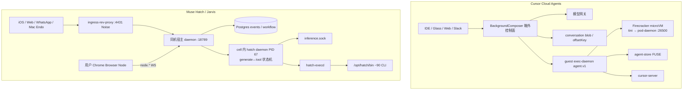

# Muse vs Cursor Cloud Agents：产品与架构详细对照

分析日期：2026-09-19。材料来自本仓 **CVM 探针**、**宿主层补测**、**Muse 2.0 Mac DMG** 与 **Cursor Cloud / 本地 Host 逆向**，不是 Meta 或 Anysphere 官方白皮书，也不是端到端产品评测。

> **原则**：凡写「证据」均指向本仓路径或公开文档；「自述」指 Muse agent 运行手册；「推断」单独标注。不收录密钥、token、MEMORY 正文。三方（含 Grok）见 [meta-cloud-vs-cursor-cloud-vs-grok-bot.zh-CN.md](meta-cloud-vs-cursor-cloud-vs-grok-bot.zh-CN.md)；本文只做 **Muse ↔ Cursor Cloud Agents** 双边深挖。

Muse 实现说明书：[muse-implementation-architecture.zh-CN.md](muse-implementation-architecture.zh-CN.md)。Cursor Cloud 本机证据：[cloud-agent-architecture.zh-CN.md](cloud-agent-architecture.zh-CN.md)；本地/云端职责拆分：[cursor-local-cloud-architecture.zh-CN.md](cursor-local-cloud-architecture.zh-CN.md)。

## 1. 结论先行

**产品一句话**：Cursor Cloud Agent 是面向软件交付的「远程 coding agent / Background Composer 会话」——主对象是一次可跟进的 `bc-…` run、仓库与 Environment Build；Muse 是面向个人的「持久生活助理」——主对象是**人**与长期 Main chat，CVM 是执行体，Mac/iOS/Chrome 是终端与设备节点。

**架构一句话**：Cursor 把 **generate↔tool 循环放在箱外**（BackgroundComposer + 模型网关），guest 只跑 `exec-daemon` 工具面；Muse 把 **循环放在 nspawn cell 内 `hatch daemon`（PID 67）**，同机宿主提供 Postgres、推理/记忆/安全 socket 和 Noise 入口，舰队放置层在 guest 完全不可见。二者 **无同源证据**（PID1、工具契约、鉴权、会话账本全部不同）。

**状态一句话**：Cursor 的对话权威是控制面 **blob 图 + `streamConversation` 事件 + `offsetKey`**，guest `AGENT_TRANSCRIPTS` 常空；Muse 的对话权威是宿主 **Postgres `runtime.events`（全局 `event_seq`）**，客户端用 `after_chat_event_seq` 订阅，**没有 offsetKey**；`runtime.text_blobs` 只做服务端大文本分块，「存储像 Cursor blob，分发不像」。

## 2. 产品设计对比

### 2.1 用户、主对象、入口

| 维度 | Cursor Cloud Agents | Muse（Hatch / Jarvis / Endo） |
| --- | --- | --- |
| 典型用户 | 已在 Cursor IDE / Glass / Web Agents 写代码的开发者 | 需要个人助理的任何人（非开发者为主） |
| 主对象 | Cloud Agent / Background Composer 会话（`bc-…`） | **人**（USER）+ 长期 Main chat |
| 次对象 | Project、侧聊、云子 agent、Environment Build、PR | Side chat、Goal、cron/hook、记忆、配对设备 |
| 机器角色 | 按 run 调度的隔离 microVM；文档有 hibernate / snapshot | 专属 CVM / hatchling；可重建，身份在磁盘与记忆 |
| UI 入口 | IDE、cursor.com/agents、侧聊 composer、Slack/GitHub `@cursor`、REST `/v0/agents` | iOS Muse、muse.ai / hatch.meta.ai、WhatsApp、Mac Muse.app |
| 成功默认叙事（推断） | 这次 run 是否把代码改对、能否跟进与交付 PR | 关系是否还在、事项是否跟进、助理是否在合适时机主动做事 |

**证据**：Cursor 主对象与 `bcId` 见 `analysis/cloud-agent-architecture.zh-CN.md` §1、§7；入口与本地 Host 见 `analysis/cursor-local-cloud-architecture.zh-CN.md` §1、§5。Muse 主对象见 `meta-cloud-reversed/agent-host/README.md`、`analysis/muse-implementation-architecture.zh-CN.md` §3.1；Mac 壳见 `muse-reversed/README.md`。

**推断**：二者都能写代码、都能开浏览器，但首页心智不同。把 Muse 当「另一个 Cloud Agent」会低估记忆/排程/多端；把 Cursor 当「缺记忆的 Muse」会低估 Environment Build、GitHub App 与 IDE 附加。

### 2.2 寿命语义：「活着」押在哪一层

| 维度 | Cursor Cloud | Muse |
| --- | --- | --- |
| 默认寿命 | **任务级**：agent run 结束 → VM 可回收 | **关系级**：人与助理的关系按月计；VM 按需存在 |
| 跨重启对话 | 控制面 blob / Agent Store；guest 上 transcript 常空 | 宿主 Postgres events；cell 重建后会话可无缝续（22:10 实测） |
| 跨重启文件 | Agent Store FUSE（`self` 绑父 bcId）+ `/workspace` git | `~/MEMORY.md`、`~/memory/`、`~/workspace/`；home 在 cell 重建后仍在 |
| 长期记忆 | 无一级产品（靠仓库、对话、skills） | 一级产品：精选记忆、人物页、语义检索、后台自改进 |
| 环境可重现 | Environment Build 把 install 结果做成可复用磁盘 | **无 Build**：预装 `/opt/hatch/bin`，能力是平台常量 |
| Reset 语义 | 新 agent / 新 VM / 新 clone | Mac Reset 文案删除「你的」chat/files/tasks——抹的是 **CVM**，不是 Mac 本地库 |

**证据**：Cursor 持久化与 FUSE 见 `cloud-agent-architecture.zh-CN.md` §5–§6；Build 见 `cursor-local-cloud-architecture.zh-CN.md` §7。Muse Reset 文案与 home 持久化见 `muse-implementation-architecture.zh-CN.md` §5、§8.1；cell 重建见 hostlayer 报告。

**推断**：Cursor 把「持久」押在 **环境可重建 + 会话 blob 可续**；Muse 把「持久」押在 **记忆与关系不断，CVM 只是执行体**。成本结构跟着走：Cursor 优化冷启动 Build 命中；Muse 优化一台 hatchling 的长期磁盘与 compaction。

### 2.3 谁先动手、人何时介入

| 场景 | Cursor Cloud | Muse |
| --- | --- | --- |
| 主触发 | 用户派发（IDE / Web / Slack / GitHub 评论 / 跟进队列） | 用户消息 **+ cron 到点 + hook 事件** |
| 主动性 | 低：run 之间不主动做事（本仓未见 agent 侧日历） | 高：排程 Markdown + 宿主 `scheduler.*`；打扰三级裁决 |
| 人看工作 | 远程 `cursor-server` / IDE attach；DesktopLease 仲裁桌面 | 无 IDE workbench；人在 iOS/Web/Mac 看流式 Delta；本机电脑走 ComputerControl |
| 人审批 | 本地 Agent 审批模式；云端 Secrets / Network 策略 | 支付/购买、敏感操作、CAPTCHA；审批 payload 含 `browser_task_id` / 本机 `binary_path` |
| 仓库协作 | GitHub App `cursor` installation，范围不扩大触发者可达集 | 本材料不是 Git-first 产品；凭证走 Secure Vault，agent 不见明文（自述） |

**证据**：Cursor GitHub / DesktopLease / 跟进见 `cloud-agent-architecture.zh-CN.md` §6 与 `cursor-local-cloud-architecture.zh-CN.md` §6.1（流 abort ≠ cancel agent）。Muse cron 文件形态与 `scheduler.jobs` 表名见 `muse-implementation-architecture.zh-CN.md` §10；箱内 systemd timer 只有 tmpfiles，**不是** cron 触发器。

**推断**：Cursor 的人介入更常发生在 diff/PR/远程 IDE；Muse 的人介入更常发生在生活动作批准与「该不该打扰」。停机 cron 是否一定唤醒 CVM：有 lease + 重建能力，**无一次「关机后到点拉起」抓包**。

### 2.4 多 agent 形态

| | Cursor Cloud | Muse |
| --- | --- | --- |
| 同机第二条对话 | **侧聊**：同 Pod、同 exec-daemon、同 `/workspace`、同 FUSE `self`；Dashboard `list-cloud-agents` **不列出**侧聊 | **Side chat**：独立 transcript；`chat-send --channel` 默认 `main` |
| 并行执行体 | Task `environment:"cloud"` → `StartBackgroundComposerFromSnapshot` → **新 bcId / 新 VM** | `subagent.spawn`：同 PID 67 扇出；新 `agents/agent-<uuid>/sessions/<uuid>.jsonl`；无新 hatch 进程 |
| 浏览器任务 | computer-use 共享桌面 + DesktopLease | `browser.spawn_task` 独占 live 浏览器；禁止用通用 subagent 做购买/登录（自述） |
| 深度 | 云子 agent 是另一台机器；侧聊不是子 VM | 运行手册 `max_depth=2`；jsonl 是 preamble+brief+回复，不是父 transcript 全量拷贝 |

**证据**：Cursor 侧聊 vs 云子 agent 表见 `cloud-agent-architecture.zh-CN.md` §6。Muse subagent 文件与 `seq` 全局连续见 hostlayer 任务 4 与 `live-probe/subagent-ps.txt`。手册写「子代理继承完整 transcript」与文件层 seeding **不完全同句**——应理解为继承推理上下文。

### 2.5 客户端是不是 planner

| | Cursor | Muse |
| --- | --- | --- |
| 桌面/IDE 是否跑 loop | **可以**：本地 Agent Host / `LocalLoopAgentClient` 与云端 BackgroundComposer 是可分开部署的职责 | **否**：Mac `com.meta.endo` 是 Hatch 终端 + 本机设备；planner 在 CVM |
| 远程 IDE | guest `cursor-server :26055` | 无对等物 |
| 本机电脑 | 本地 exec 扩展 `cursor-agent-exec`；云端则是 VM 内 VNC | Swift `ComputerControl` / `ScreenCapture` 把用户 Mac 注册成 device |
| 用户浏览器 | 云端 computer-use 用 VM 内 Chrome/桌面 | Chrome 扩展「Muse Browser Node」：`node.register` / `node.invoke`，带用户登录态 |
| MCP | `.cursor/mcp.json` + `GetDynamicTools` meta-tool | Swift 仅 `mcpSetup` ivar；无 `mcp_servers.json`（桌面缺口） |

**证据**：Cursor 六层职责见 `cursor-local-cloud-architecture.zh-CN.md` §3–§4。Muse Browser Node 协议见 `muse-reversed/recovered/computer/chrome__lib__protocol.js/` 与 `COMPARISON-CURSOR.md`。云端 browser-broker 租赁隔离浏览器 vs 用户 Chrome 是 **两条路**。

## 3. 架构总图对照

**证据**：Cursor 图与时序见 `cloud-agent-architecture.zh-CN.md` §2–§3。Muse 四层图见 `muse-implementation-architecture.zh-CN.md` §3。舰队放置（谁创建/休眠哪台 hatchling）在 leader 之上，guest 与 DMG 都看不见。

## 4. Agent loop：位置、引擎、一轮时序

### 4.1 循环在哪

| | Cursor Cloud | Muse |
| --- | --- | --- |
| generate↔tool 推进器 | **箱外** BackgroundComposer | **箱内** `hatch daemon` PID 67 |
| guest / cell 里有没有第二套 loop | 无完整 RPC 客户端；只有 exec-daemon | cell 内除 daemon/execd 外无 node/python/temporal worker |
| 工作流引擎 | 控制面未开源；guest 未见 Temporal worker | **不是 Temporal**：自研 `runtime.workflow_runs` / `workflow_agent_calls` / `workflow_phase_runs` |
| 模型调用者 | 控制面模型网关 | PID 67 经 `inference.sock`（ptrace-drop 阻止直接证明 fd，但无其他候选进程） |
| 本地对照 | 桌面可跑 `LocalLoopAgentClient`，推理仍可走托管 | Mac **不**跑 planner |

**证据**：Cursor 时序「CP→M 拼 RequestContext → tool call → ED ControlService」见 `cloud-agent-architecture.zh-CN.md` §3。Muse `hatch` strings 含 workflow 表名与 `iteration_index` / `lifetime_tool_call_count`；`temporal`/`cadence`/`grpc`/`connectrpc` 在 `hatch`/`hatch-execd` 零命中。`run-daemon.sh` 明确 Drop PTRACE，因此 `/proc/67/fd` Permission denied **不能**用来否定 inference 连接。

**推断（Muse）**：宿主 `198.19.0.1:18789` 偏薄接入；装配字符串在箱内二进制，倾向 prompt 装配在 PID 67。

### 4.2 一轮对话（并排）

| 步 | Cursor Cloud | Muse |
| --- | --- | --- |
| 1. 入口 | IDE/Web `create` / followup RPC → BackgroundComposer | 客户端 Noise `wss://<vm>.metaaivm.com/v1/noise` → `ingress-rev-proxy :4431` |
| 2. 交给执行面 | 控制面已持有会话；VM 可能已在跑或从 hibernate/Build 拉起 | 宿主 WS/HTTP 把 turn 交给 PID 67（ingress→daemon 转发代码在宿主，不可见） |
| 3. 拼上下文 | 控制面拼 `agent.v1.RequestContext`：系统提示 + skills + cloud rules + 历史 blob + 工具 schema；guest 可 bake `request-context-cache` | PID 67 从 Postgres events、hotset、`MEMORY.md`、按需 memory_get、developer handoff、deferred tool schema 装配；**精确字节序不可见** |
| 4. 调模型 | 控制面 → 模型网关 | `proxy/inference.sock`；协议字段不可见 |
| 5. 工具 | 控制面把 tool call 变成 `ControlService.Exec` / ReadTextFile / Pty / tmux | `hatch-execd` → `bash --norc --noprofile -c 'umask 0007; …'`，注入 `JARVIS_TOOL_CALL_ID` / `JARVIS_SESSION_ID` |
| 6. 写账本 | 事件进 `streamConversation`；内容进 conversation blob；客户端 `offsetKey` | 写回 Postgres；流式 `Delta*` 经 `chat.subscribe`；`chat-send` 默认等终态 |
| 7. 停止 | 模型不再调工具 / 用户 abort（abort 流 ≠ cancel agent） | 模型停止调工具；daemon 重启可走 `runtime_restart_checkpoints` |

**证据**：Cursor 上下文层表见 `cloud-agent-architecture.zh-CN.md` §5；客户端 `cloudAgentStream.js` 用 events + blob。Muse 时序见 `muse-implementation-architecture.zh-CN.md` §4.2；`ChatSubscribeRequest` 有 `after_chat_event_seq`、`replay_limit`。

### 4.3 Tool LLM / Expert 与 Cursor 模型路由

| | Cursor | Muse |
| --- | --- | --- |
| 快慢模型 | 产品层可选模型；控制面路由（guest 见 `cursor-grok-4.6-high-fast` 等 slug） | strings：「Tool LLM fast search failed; automatically falling back to Expert Agent」 |
| 是否每轮先跑快模型 | 不可见 | **未闭合**：只证明存在回退路径 |

## 5. 状态与「blob」等价物

这是两边最容易被 pen 成同一套的地方。它们解决同一问题（大对象、可续会话、压缩），实现不是同构。

| 机制 | Cursor Cloud | Muse | 是否对等 |
| --- | --- | --- | --- |
| 对话权威源 | 控制面 conversation blob 图 + 流事件 | 宿主 Postgres `runtime.messages` / `tool_calls` / `tool_outputs` / `events` | **问题对等，介质不同** |
| 客户端游标 | `offsetKey`（streamConversation） | `after_chat_event_seq` / `before_seq`；**无 offsetKey** | 游标语义相近 |
| 大文本 | blob 下发给客户端引用；Agent Host `getSessionBlobs` | `runtime.text_blobs` + `text_blob_gc_queue`；客户端拿 `chat-history` 消息 | 「存储像、分发不像」 |
| 工作区材料 | Agent Store FUSE `/cursor/stores/self`；git `/workspace` | `hotset.manifest` 779 条 `{path,offset,len,tier}`；`~/workspace` | 索引 vs 网盘 |
| 压缩 | 本地/云 Session 有 ConversationState；云端 compaction 细节 guest 不可见 | `runtime.summaries` / `agent.compactions` + `DeltaCompactionEvent` | Muse 表名可见 |
| 重启续跑 | createOrResumeSession；侧聊挂父 Pod | `agent.runtime_restart_checkpoints`；`/run/hatch/resume/handoff-epoch` 代际 | 都有「没跑完的 tool call」问题 |
| guest 落盘 transcript | `AGENT_TRANSCRIPTS` 常空 | 子代理 jsonl 在 cell 内；主对话权威不在这些文件 | 都不要把 guest 文件当 SoR |

**证据**：Cursor blob/events 关系见既有 Cloud 架构讨论与 `cursor-local-cloud-architecture.zh-CN.md` §4.4（本地也是 BlobStore + ConversationState，不是「聊天文本存成一个 md」）。Muse 表名见 `meta-cloud-reversed/live-probe/strings-sql.txt`（行从未读取）。hotset 不是事件日志。

**下一轮是否「读 KV 再 ping 模型」**：

- **Cursor（证据 + 推断）**：控制面内存持有本轮历史；blob 是持久化与多端/恢复投影，不是每一 token 都从 Redis 热读。AgentKV 不是对话 SoR。guest 不从 FUSE 读完整系统提示。
- **Muse（自述 + 观察）**：PID 67 从 Postgres + hotset + 记忆文件装配；没有 Cursor 式 offsetKey 客户端缓存协议。是否每轮全表扫描不可见。

## 6. 工具平面

| 维度 | Cursor Cloud | Muse |
| --- | --- | --- |
| 契约 | Connect-ES `agent.v1.*`：ControlService / Exec / Pty / Tmux / computer-use | **无 proto**；工具 = 离散 CLI |
| 派生 | 单 exec-daemon（侧聊共用）；云子 agent 新 daemon | `hatch-execd` socket 激活 + peer_cred uid |
| 组织 | 文件/壳/PTY/MCP/电脑 一把梭 | `/opt/hatch/bin` 约 90 个：**一集成一 CLI** |
| schema 进 prompt | 全量工具表；`strip-agent-skill-content`、MCP slim descriptors | **deferred namespace**：平时一句话，`tool_search.load_tool_namespace` 展开 |
| 技能 | `~/.cursor/skills` + plugin skills；ReloadAgentSkills 可热更新 | `/opt/hatch/skills` 只读 + `~/workspace/skills`；Mac Hatch HTML 有 red-team mock `SKILL.md`，桌面无扫描器 |
| MCP | 一等：meta-tool + `LoadMcpServers` | 桌面缺口 |
| tmux / 门户终端 | `--tmux-service-enabled` | 未见对等门户；工具就是 CLI |
| 集成哲学 | 优化「一台 coding VM 工具完备」 | 优化「几十个生活服务不撑爆 prompt」 |

**证据**：Cursor argv 与 capability 见 `cursor-cloud-reversed/exec-daemon/SERVE.md`。Muse `bin-scopes.conf` 部分二进制刻意不进 cell；箱内 root 不被宿主信任（`pre-start.sh` daemon-ctl root-owned）。

## 7. 隔离、底座、环境构建

| 组件 | Cursor（us4p 样本） | Muse（本材料） | 同源？ |
| --- | --- | --- | --- |
| 外层 | Firecracker microVM / anyrun | KVM 系 VM（`*.metaaivm.com`）+ **systemd-nspawn cell** | 否 |
| PID1 | `tini → pod-daemon :26500` | **systemd**；cell 外有 runtime-cell-leader | 否 |
| 网络 | guest 出站 `api2.cursor.sh` 等 | cell `198.19.0.2/30` via `198.19.0.1` `host0@if3` | 否 |
| 身份 | `bc_id`；pod-identity OIDC | `JARVIS_HATCHLING_ID`；CVM recovery HKDF `hatch:rv-luks:v1` | 否 |
| 环境 | `.cursor/environment.json` install/start/terminals + Build 磁盘缓存 | **无构建**；`ensure-rootfs.sh` + 预装工具平面 | 否 |
| 计算机桌面 | TigerVNC + xfce + noVNC `:26058` | 云浏览器走 browser-broker；用户桌面在 **用户 Mac/Chrome** | 产品层不同 |
| JIT vs 预热 | 本仓样本曾 `environment-info.build === null` 的 JIT 默认镜像 | CVM 类型 `standard` vs `confidential`；邀请/订阅 GK 仅 standard | — |

**证据**：Cursor 组件表 `cloud-agent-architecture.zh-CN.md` §4。Muse nspawn / PrivateUsers（cell root = 宿主 uid 131072）见 runtime-cell 注释。特权 socket 故意不 bind-mount 进 cell（`browser-broker --help` 原文）。

**哲学**：Cursor **环境即代码**（每个任务从 Build 或 JIT 来，保证可重现仓库环境）；Muse **能力即平台**（agent 带着 90 个 CLI 见用户，环境是常量）。Grok 的「电脑即宠物」是第三者，不在本文展开。

## 8. 安全与密钥

| 项 | Cursor Cloud | Muse |
| --- | --- | --- |
| 出站 | 可 restricted egress；样本父会话 `egress.restricted = false` | **强制** hatch-egress-proxy + 自签 CA；工具子进程 Sentinel-routed |
| 推理 | 控制面网关，guest 不持模型 HTTPS 主路径 | cell 不直连模型 HTTPS；走宿主 inference.sock |
| 仓库身份 | GitHub/GitLab App，永不扩大触发者可达集 | 非 Git-first；集成凭据 Secure Vault（自述） |
| 密钥注入 | `SyncScopedSecrets` 按 scope 进对应 shell，不进 daemon 全局 env | agent 不见明文；OTP `credential_fill`（自述） |
| 进程鉴权 | exec-daemon bearer（sha256 在 argv） | Unix socket **peer_cred uid**；taint-guard |
| 反调试 / fd | 未见对等 ptrace-drop | **ptrace-drop**：`/proc/PID/fd` Permission denied |
| 提示注入 | 产品层规则；guest 有 commit-msg secret 扫描 | `prompt_injection_checker` strings；每轮是否都跑不可见 |
| 证明启动 | pod-identity OIDC | CVM attestation `off/staging/prod` + LUKS 恢复密钥 |
| 内层 sandbox | `cursorsandbox` 样本未开 | privsep 二进制存在；集成 CLI 走多路 socket **不是**单一 privsep |

公开 Cursor 安全概述：[cursor.com/docs/cloud-agent/security](https://cursor.com/docs/cloud-agent/security)。

## 9. 协议对照（streamConversation vs Hatch）

| 角色 | Cursor | Muse |
| --- | --- | --- |
| 真用户实时流 | `streamConversation` 事件 | Noise `chat.subscribe`：`DeltaTextAppendEvent` / `DeltaThinkingAppendEvent` / `DeltaAgent*` / `DeltaCompactionEvent` |
| 内部/调试 | 控制面 RPC；guest Connect 工具口 | 宿主 `ws://198.19.0.1:18789/`；`chat-send` 默认等终态，`--wait-reply` 才订阅流 |
| 历史读取 | blob + 客户端 IndexedDB 缓存 | daemon HTTP `chat-history`（`before_seq`、`transcript_mode`） |
| 设备通道 | 无对等「把用户 Chrome 挂到云 loop」 | `node.register` → `node.invoke.request/result`；at-least-once 去重 256 条；`invokeParamsJson` 必须是 JSON **字符串** |
| 帧格式 | Connect-ES / protobuf 家族 | daemon RPC 默认自动协商，`--use-json` 强制 JSON |
| 凭证 | 账号 + GitHub App installation | 32 字节 recovery secret → 不可导出 HKDF；`delegation.*` notary |

**证据**：Muse Hatch HTML `HATCH_SHARED_LB_HOST=hatch.metaaivm.com`，`NOISE_WS_PATH=/v1/noise`。Cursor 客户端切片 `cursor-cloud-reversed/client-map/`。

## 10. 恢复、跟进、失败

| 场景 | Cursor | Muse |
| --- | --- | --- |
| 用户再发一条 | followup 队列；侧聊可挂同一 Pod | 同一 Main/Side chat 追加事件 |
| 刷新客户端 | `offsetKey` 续流；blob 补洞 | `after_chat_event_seq` + `replay_limit` |
| daemon 崩溃 | 控制面仍在；VM 可重启 exec-daemon | `runtime_restart_checkpoints` 续未完成 tool call |
| cell / VM 重建 | Build snapshot 或 JIT 再 clone；hibernate 文档 90 天 | `handoff-epoch`：重建后只认同代 resume；22:10 实测会话继续 |
| 取消 | 客户端 abort 流 ≠ 取消 agent | 未做对等 abort 语义的完整对照 |

## 11. 同源与分化

1. **无 Anysphere 血缘（证据）**：Muse 无 `tini`、`pod-daemon`、`@anysphere/exec-daemon-runtime`、`bc_id`、`agent.v1` proto、`api2.cursor.sh`。Cursor 无 `hatch daemon`、`hatch-execd`、Noise `/v1/noise`、nspawn cell。  
2. **同属「云上有一台执行机 + 箱外还有控制面」家族（推断，产品层）**：两边都把模型权重和舰队调度放在 guest 看不见的地方。差别是 **loop 是否下沉进执行机**。  
3. **Mac 对照不要串台**：`muse-reversed/COMPARISON-CURSOR.md` 比的是 **Cursor Projects 桌面 vs Muse 2.0 桌面**，不是本文的 Cloud Agent 控制面。Cursor 桌面 **可以**跑 loop；Muse 桌面 **不可以**。

## 12. 对「做 Agent 产品」的设计启示

面向工程师读者。这些是结构建议，不是本仓产品规格。

1. **先定主对象再抄组件**  
   主对象是「一次交付 run」→ 箱外 loop + blob + per-run VM + Environment Build 更接近 Cursor。主对象是「长期的人」→ 箱内 loop + 记忆 + cron + 多端终端 更接近 Muse。不要用 Cloud Agent Pod 模型假装覆盖个人助理，也不要用 CVM 记忆模型假装覆盖可重现 CI 环境。

2. **loop 放箱内还是箱外是成本/信任/延迟三角**  
   箱外（Cursor）：模型网关、计费、取消、多会话调度集中；guest 可更小、可 hibernate；代价是每一跳工具 RTT 过控制面。箱内（Muse）：工具与装配本地，宿主做入口与 DB；代价是执行机必须足够可信（attestation、ptrace-drop、cell root 不可伪造）。

3. **对话 SoR 不要放在 guest 文件**  
   Cursor blob 在控制面、Muse events 在宿主 Postgres，方向一致。guest jsonl / 空 `AGENT_TRANSCRIPTS` 都只是投影。新产品若把 markdown transcript 当权威源，重建 VM 时会对不齐。

4. **大对象存储与客户端协议可以拆开**  
   Muse `text_blobs` 证明：服务端可以有 blob 表，同时只给客户端消息流。Cursor 则把 blob 引用做成多端同步协议的一部分。按客户端是否需要断点续传、附件、多设备缓存来选，而不是先画「我们也要 blob」。

5. **工具一多就必须延迟加载 schema**  
   Coding agent 二十个工具可以全量进 prompt；生活助理九十个 CLI 不行。Cursor 用 strip-skill + MCP slim；Muse 用 deferred namespace。规模解不同，问题相同。

6. **子 agent 要公开隔离轴**  
   同 Pod 侧聊、新 VM 云子 agent、同进程 session 文件、独占浏览器任务，安全语义全不同。UI 应写清：是否同盘、是否同凭证、是否同桌面。

7. **用户设备是数据源还是执行沙箱**  
   Cursor Cloud 默认「工作发生在 VM」；Muse 把用户 Chrome/Mac 收编为 device。前者隔离强、登录态弱；后者登录态强、必须有配对与审批。两条不要混在一个默认路径里。

8. **主动性需要独立账本**  
   Muse cron 是 workspace Markdown + 宿主 scheduler 表，不是 systemd timer，也不是 Cursor followup 队列。日历、去重、漏跑、打扰分级都不是 BackgroundComposer 的附加字段能 internally 解决的。

## 13. 证据与推断边界

### 13.1 可当事实用

| 结论 | 性质 | 依据 |
| --- | --- | --- |
| Cursor loop 在箱外 BackgroundComposer；guest 是 exec-daemon | 证据（客户端 + 本机 argv + 时序）+ 推断（完整控制面未开源） | `cloud-agent-architecture.zh-CN.md` §2–§3 |
| Muse loop 在 PID 67；不是 Temporal | 观察 | hatch strings、进程表、hostlayer 裁决 |
| 两边无 PID1/工具契约/proto 同源 | 观察 | 两侧 live-probe 与二进制 strings |
| Cursor 对话权威在控制面 blob；guest transcript 常空 | 观察 | §5；`AGENT_TRANSCRIPTS` |
| Muse 对话权威在宿主 Postgres；hotset 是材料索引 | 观察（表名/键名）；行未读 | `strings-sql.txt`、`hotset-keys.txt` |
| Muse 无 offsetKey；有 `after_chat_event_seq` | 观察 | hatch-ws-client / Hatch HTML |
| Mac Muse.app 不跑 planner | 观察（Swift 类型 + Reset 文案 + Hatch 指向 CVM） | `muse-reversed/` |
| 侧聊与父会话同 Cursor Pod | 观察（2026-09-16 样本） | 不可推广为一切账号/区域 |
| Muse 子代理同进程新 jsonl | 观察 | `subagent-ps.txt` |

### 13.2 有理由但未闭合

- 宿主 `:18789` 是否还做一部分 prompt 装配（倾向否）。  
- PID 67 确为 inference.sock 的 connect 者（无其他候选 + ptrace-drop）。  
- 停机 cron 一定唤醒 hatchling。  
- ComputerControl 与 Browser Node 是否同一套 `devices` 协议（类型名支持，无 Swift 源码）。  
- 舰队是否用 `self_improvement.fleet_*` 表放置。  
- Tool LLM 是否每轮先跑。  
- Cursor 控制面是否 Temporal（guest 未见 worker，**不能**反证控制面没有）。  
- Cursor 每一轮是否从 blob 冷读进内存再请求模型（更像内存历史 + 异步落 blob）。

### 13.3 当前材料不可见

- 两边的模型网关字段、GPU 拓扑、计费费率。  
- Cursor 如何把模型 tool call 字节变成 `ControlService.Exec` 的桥。  
- Muse inference/memory.sock 线协议。  
- Muse 舰队 API、是否一宿主机多 hatchling。  
- 53MB Hatch HTML 完整 RPC 表。  
- Postgres 行内容与完整 schema。  
- 未做真实用户任务的成功率、成本、延迟对比。

### 13.4 阅读地图

| 材料 | 用途 |
| --- | --- |
| [muse-implementation-architecture.zh-CN.md](muse-implementation-architecture.zh-CN.md) | Muse 已确认 vs 需推测的实现说明书 |
| [cloud-agent-architecture.zh-CN.md](cloud-agent-architecture.zh-CN.md) | Cursor Cloud 本机 VM + 控制面切片 |
| [cursor-local-cloud-architecture.zh-CN.md](cursor-local-cloud-architecture.zh-CN.md) | 本地 Host/loop 与云端职责拆分 |
| [meta-cloud-vs-cursor-cloud-vs-grok-bot.zh-CN.md](meta-cloud-vs-cursor-cloud-vs-grok-bot.zh-CN.md) | 含 Grok 的三方对照 |
| [../meta-cloud-reversed/](../meta-cloud-reversed/) | CVM 自述、hostlayer、live-probe |
| [../muse-reversed/](../muse-reversed/) | Muse 2.0 Endo / Browser Node |
| [../muse-reversed/COMPARISON-CURSOR.md](../muse-reversed/COMPARISON-CURSOR.md) | **桌面** vs Cursor Projects，不是本文 |
| [../cursor-cloud-reversed/](../cursor-cloud-reversed/) | exec-daemon / pod-daemon / client-map |
| [../sources.json](../sources.json) | 快照与 bundled evidence 元数据 |

---

*本报告只综合 2026-09-19 已固化材料。若后续 hostlayer / DMG / Cloud live-probe 更新，应同步修订 §4 循环位置、§5 状态表与 §13 样本边界。*
