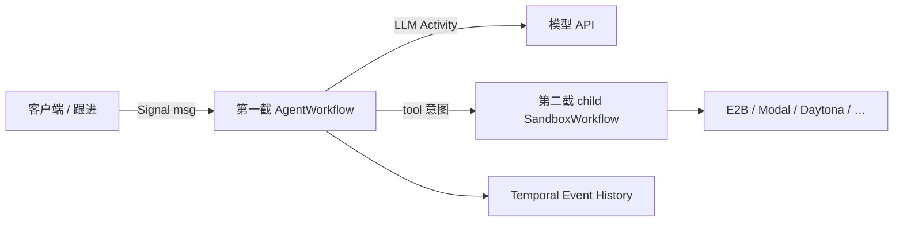

# 用 Temporal 拼一套「箱外 loop + 隔离沙箱」：开源前两截

分析日期：2026-09-20。本文把「想做类似 Cursor Cloud Agents 的云端 coding agent，循环放在执行机外面」的开源拼法写成可跟进的方案。不是 Temporal 或 Anysphere 官方白皮书，也不是可上线的产品规格。

> **原则**：仓库与官方文档标「证据」；与 Cursor / Muse 的对齐标「对照」或「推断」。Cursor 控制面是否真用 Temporal，本仓 **从未证实**（guest 无 Temporal worker）。Muse 已确认 **不是** Temporal。

对照材料：[cloud-agent-architecture.zh-CN.md](cloud-agent-architecture.zh-CN.md)、[muse-vs-cursor-cloud-agents.zh-CN.md](muse-vs-cursor-cloud-agents.zh-CN.md)。

## 1. 结论先行

**方案一句话**：用两个开源仓库分别覆盖 Cursor Cloud 的前两层——**箱外 generate↔tool 循环** 和 **隔离沙箱生命周期**；GitHub App、PR、会话协议、Environment Build、远程 IDE 要自己写。没有开源「完整 Cloud Agent」。

| 截 | 职责 | 仓库 | 对标 Cursor |
| --- | --- | --- | --- |
| **第一截** | 对话循环 + 工具循环（LLM → tool call → 再 LLM） | [temporal-community/durable-react-agent-gemini](https://github.com/temporal-community/durable-react-agent-gemini) | BackgroundComposer 里的 generate↔tool |
| **第二截** | 开 / 停 / 挂起 / 快照隔离环境，命令打进沙箱 | [temporal-community/sandbox-orchestration-harness](https://github.com/temporal-community/sandbox-orchestration-harness) | guest `exec-daemon` + anyrun 机器生命周期 |
| **第三截** | Git、PR、blob/offset、Build、IDE 附加、计费 | **无现成仓库** | GitHub App、`streamConversation`、Environment Build、`cursor-server` |

第一截若要审批 / HITL / Code Mode / 可组合子代理，同一层换成 [temporal-community/temporal-agent-harness](https://github.com/temporal-community/temporal-agent-harness)，仍不是第三截。

## 2. 为什么是这两截

Cursor Cloud 的可见结构是：循环在箱外，guest 只执行工具；机器可休眠，会话权威在控制面。见 `cloud-agent-architecture.zh-CN.md` §2–§3。

Temporal 2026-05 官方伪代码把同一结构写成 Workflow（[博文](https://temporal.io/blog/temporal-sandbox-orchestration-harness-the-missing-layer-for-running-agents)）：

```
CodingAgent(ctx):
    sbx := newSandbox(ctx, modal)
    defer sbx.Stop(ctx)
    inbox := SignalChannel("msg")
    for {                          // 对话循环
        msg := inbox.Receive()
        for {                      // 工具循环
            resp := callLLM(ctx, history)
            if no tool calls: break
            out := sbx.ExecuteCommand(ctx, call.Cmd)
        }
    }
```

开源仓库恰好按这条缝切开：Gemini 样本实现内层 `for`（以及如何把 LLM/tool 做成 Activity）；sandbox harness 实现 `newSandbox` / `ExecuteCommand` / idle suspend。拼在一起才接近「箱外 Composer + 箱内 exec」。

单独用第一截，工具跑在 worker 本机，没有 Cloud Agent 的隔离。单独用第二截，没有模型决策循环，只是远程 shell。

## 3. 第一截：durable ReAct loop

**仓库**：<https://github.com/temporal-community/durable-react-agent-gemini>

**证据（仓库自述）**：ReAct 循环的每一步——调 Gemini、调工具——都是 Temporal Activity。worker 崩溃后从 Event History 续跑，已完成的 LLM/工具调用不重放执行。教程里会关掉 SDK 自动 function calling 和内置重试，把重试交给 Temporal。

**实现要点**：

- `AgentWorkflow` 持有 `while`：调 LLM Activity → 若有 function call → `dynamic_tool_activity` → 把结果写回 contents → 再调模型。
- Workflow 代码必须确定性；非确定的 I/O 只能在 Activity。
- 对话历史活在 Workflow 状态 / Event History，不依赖 guest 磁盘上的 transcript。

**对照 Cursor**：这是 BackgroundComposer 的最小开源替代——循环、历史、重试在编排层。它 **不是** `streamConversation`、`offsetKey`、blob 图或侧聊同 Pod。

**对照 Muse**：Muse 的循环在 cell 内 PID 67，账本在宿主 Postgres，明确不是 Temporal。抄第一截不会得到 Muse。

**何时换同层更厚的仓库**：需要人审批、Signal 久等、Code Mode、多 agent 组合时，用 `temporal-agent-harness`（PyPI 同名，实验性）。需要 Codex 风格本机 CLI（`tcx`）时，见 [mfateev/temporal-agent-harness](https://github.com/mfateev/temporal-agent-harness)——沙箱是 Seatbelt / bubblewrap，不是云 VM。

## 4. 第二截：sandbox orchestration harness

**仓库**：<https://github.com/temporal-community/sandbox-orchestration-harness>

**证据（README / Temporal Code Exchange）**：Go 样本。Workflow 里 `NewSandbox` → `ExecuteCommand`；生命周期由 **长寿命 child workflow** 管。供应商：E2B、Daytona、Modal、Amazon Bedrock AgentCore Runtime、GKE Agent Sandbox。无原生 Suspend 的供应商（Modal、GKE）用 snapshot + stop + `StartFromSnapshot` 做挂起。

**实现要点**：

- 沙箱创建绑在 Workflow 首次需要时；Workflow 结束则销毁，避免孤儿箱。
- `WithIdleTimeout`：一段时间无命令则 suspend，下一条 `ExecuteCommand` 再 resume。
- 工具失败靠 Activity 重试；会话状态在 Workflow，沙箱没了可以再 provision。
- Code Exchange 页写明：社区捐赠样本，Temporal **不正式支持或背书**。

**对照 Cursor**：对应「开一台隔离机、把 Exec 打进去、空闲可休眠」。Cursor 的真实底座是 anyrun Firecracker + `tini → pod-daemon → exec-daemon`（`agent.v1` proto），不是 E2B SDK。第二截换的是 **隔离执行面**，不是二进制兼容。

**对照 Muse**：Muse 的执行面是同机 nspawn cell + `hatch-execd`，CVM 是人的长期磁盘，不是 per-run 临时箱。第二截的默认心智更接近 Cursor 任务级 VM，而不是 Muse 关系级 hatchling。

## 5. 怎么拼（方案，不是已实现代码）



建议顺序：

1. 先独立跑通第一截：一条 prompt、若干 tool、杀掉 worker 再续。确认「不重跑已完成 Activity」。
2. 再独立跑通第二截：对选定供应商 `ExecuteCommand("uname -a")`，测 idle suspend 与 snapshot。
3. 在第一截的 tool Activity 里改调第二截的 `sbx.ExecuteCommand`，而不是本机 shell。LLM Activity 仍留在编排 worker。
4. 用 Signal 做跟进消息（对应 Cursor followup），不要把「用户刷新页面」做成新 Workflow。
5. **然后**才写第三截：克隆仓库、凭证窗口、PR、流式协议。不要在 1–3 未稳时上 GitHub App。

**不要做的事**：把 LLM 调用写进 Workflow 函数本体（破坏确定性与 replay）；把沙箱句柄只存在 worker 内存（换机后续不上）；把 markdown transcript 当会话权威源（重建后对不齐）。

## 6. 第三截：必须自建、现成仓库没有

| 能力 | Cursor 现状（本仓证据） | 这两截给不给 |
| --- | --- | --- |
| 会话流 / 游标 | `streamConversation` + `offsetKey` + blob | 否。最多有 Workflow Query / 自建事件流 |
| 侧聊同机 | 同 Pod、同 exec-daemon、同 FUSE `self` | 否。要自己定义「同 sandbox id」 |
| 云子 agent | `StartBackgroundComposerFromSnapshot` 新 bcId | 否。可用 child Workflow，语义自己定 |
| GitHub 身份 | App installation，不扩大触发者可达集 | 否 |
| 环境构建 | `.cursor/environment.json` + Build 磁盘 | 否。供应商 snapshot ≠ Build 产品 |
| 远程 IDE | guest `cursor-server :26055` | 否 |
| MCP / skills | exec-daemon meta-tool、strip-skill | 否（第一截只有示例 tool） |
| 计费 / 模型路由 | 控制面不可见 | 否 |

官方 Temporal 还提供另一条「第一截更厚、第二截已接进 SDK」的路径：Python/TS 的 OpenAI Agents 插件 + `SandboxClientProvider`（Daytona / E2B / Docker / 本机 Unix），demo 在 `openai/openai-agents-python/examples/sandbox/extensions/temporal`。那是 **SDK 胶水**，仍不是第三截产品。说明见 [Temporal × OpenAI sandbox 博文](https://temporal.io/blog/introducing-temporal-and-agentic-sandboxes-openai-agents-sdk)。

## 7. 同构但不是 Temporal

[Restate + Modal durable coding agent](https://restate.dev/blog/durable-coding-agent-with-restate-and-modal)、demo [igalshilman/agent47](https://github.com/igalshilman/agent47)：循环和会话在 Restate，代码在 Modal。拆法和本文两截相同，引擎不同。若已选定 Temporal，不必混用。

## 8. 证据与推断边界

| 结论 | 性质 |
| --- | --- |
| 两仓库存在，职责分别是 ReAct Activity 循环与 sandbox child workflow | 证据（各自 README / Temporal 博文，2026-09-20 查阅） |
| 拼在一起在结构上对应 Cursor「箱外 loop + 箱内 exec」 | 对照 / 推断 |
| 拼完即得到 Cursor Cloud Agents | **否** |
| Cursor 控制面使用 Temporal | **未证实** |
| Muse 使用 Temporal | **否**（本仓 CVM strings / 进程表） |
| sandbox-orchestration-harness 可当生产平台 | **否**（Code Exchange：非正式支持） |
| 本文未跑通两仓库的联合集成 | 缺口：只读公开材料，未在本仓 clone 联调 |

## 9. 阅读地图

| 材料 | 用途 |
| --- | --- |
| <https://github.com/temporal-community/durable-react-agent-gemini> | 第一截 |
| <https://github.com/temporal-community/sandbox-orchestration-harness> | 第二截 |
| <https://github.com/temporal-community/temporal-agent-harness> | 第一截的厚替代 |
| <https://temporal.io/blog/temporal-sandbox-orchestration-harness-the-missing-layer-for-running-agents> | 官方伪代码与供应商表 |
| <https://temporal.io/code-exchange/temporal-sandbox-orchestration-harness> | 样本边界（非正式支持） |
| [cloud-agent-architecture.zh-CN.md](cloud-agent-architecture.zh-CN.md) | Cursor 箱外/箱内证据 |
| [muse-vs-cursor-cloud-agents.zh-CN.md](muse-vs-cursor-cloud-agents.zh-CN.md) | 为何 Muse 路线不要抄 Temporal |

---

*公开链接查阅于 2026-09-20。仓库默认分支若改名或样本降级，以 GitHub / Code Exchange 当时页面为准。*
