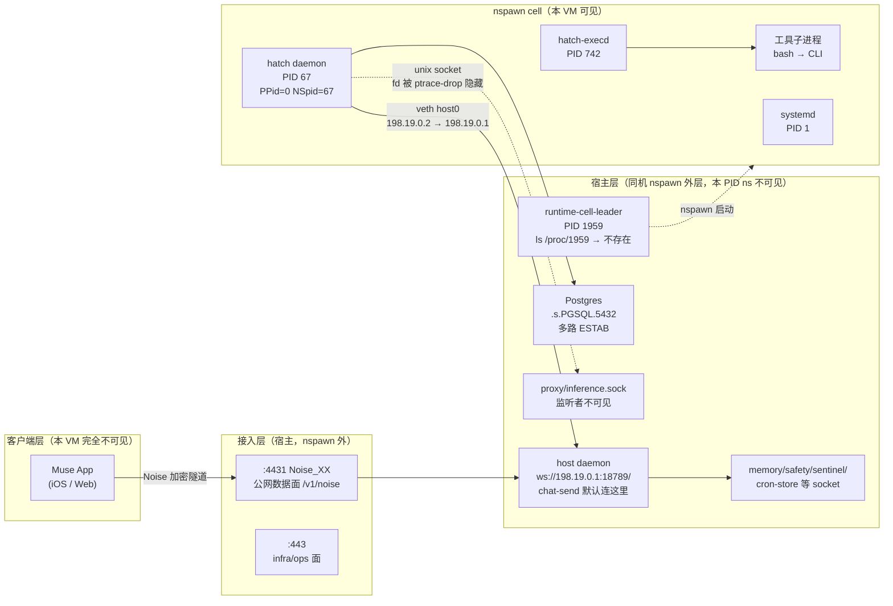

# Meta Muse / hatch 运行时自述报告（II）：宿主层、会话循环与工具跳转

- 探测时间：**2026-09-19 22:29–22:45 UTC**（Asia/Shanghai 09-20 06:29 起）
- 探测主体：运行在本 VM 内的 agent（Ziggy），`uid=0(root)`，hostname `htch-runtime`
- 范围：**只补上一份报告（`runtime-report-2026-09-19.zh-CN.md`）的「全貌缺口」**，不重复进程表与 socket 清单
- 硬约束：只读 + 一次可立刻结束的自实验；无权限处写「权限不足」+ 报错类型；密钥/token/MEMORY 正文/联系人/邮件/支付/用户 chat 原文一律不收录；环境变量只记名；UUID/FQDN 用占位符
- 证据等级：= 本机命令输出；= system prompt / 工具说明 / `--help` / 运行手册注释；= 有理由但看不见

## 0. 本轮实际跑过的命令清单

```
ps -eo args | grep hatch-execd # 找当前 leader PID
ls /proc/1959 # leader 在不在本 PID ns
cat /proc/67/status | grep -E '^(NSpid|NSsid|Uid|PPid|Name)' # daemon 的 ns 身份
ls /proc/67/net; ls -la /proc/67/ns/ /proc/self/ns/ # net/ns 可见性
awk '$NF ~ /^\/run\/hatch/ {print $7, $NF}' /proc/net/unix
awk '$NF ~ /^\/run\/hatch/ {print $7, $NF}' /proc/67/net/unix # 两份 unix 表的 inode 对比
ip addr; ip route # 198.19.0.1 是谁
grep "^#" /opt/hatch/runtime-cell/run-daemon.sh
grep "^#" /opt/hatch/runtime-cell/ensure-rootfs.sh
cat /opt/hatch/runtime-cell/launch-daemon.sh # 只读注释与流程
timeout 10 /opt/hatch/bin/spawnd --help
timeout 10 /opt/hatch/bin/hatch-doctor --help
strings -a /opt/hatch/bin/hatch | grep -oE <RPC 标识符模式> # Connect/Chat/Inference/…/Memory_
strings -a /opt/hatch/bin/hatch → python 去重 schema.table # → live-probe/strings-sql.txt
head -1 /run/hatch/resume/hotset.manifest | python3 keys
sed -n '2p' /run/hatch/resume/hotset.manifest | python3 keys
wc -l /run/hatch/resume/hotset.manifest # → live-probe/hotset-keys.txt
timeout 10 /opt/hatch/bin/hatch-ws-client chat-history --help
timeout 10 /opt/hatch/bin/hatch-ws-client activity --help
# 任务 3 实验：单次 tool call，前后 ps auxf；sleep 子进程的 environ 名 + net/unix + fd；
# geocode --help 存活期观察；ls /run/hatch/privsep/；geocode/web-search 二进制内 socket 字面量
# 任务 4 实验：subagent.spawn（单字回复）→ ps 快照 ×2 → agent_dir/sessions 文件名与 jsonl 结构
# → live-probe/subagent-ps.txt
strings -a /opt/hatch/bin/hatch | grep -oiE "inference…(proto|grpc|http|json)" # 任务 6
strings -a /opt/hatch/bin/hatch | grep -oiE "\b(gpu|cuda|nvidia)…" # 任务 6
strings -a /opt/hatch/bin/hatch | grep -oE "credit_watcher…|billing…" # 任务 6
```

未做：nsenter 任何命名空间、抓包、读推理内容、读凭据文件、拉取真实用户历史正文。

---

## 任务 0 — 三层图：客户端 / 宿主 / cell



### 每个框的命名空间归属与证据

| 框 | 在本 cell 的 PID ns？ | mount ns？ | net ns？ | 证据（命令） |
|---|---|---|---|---|
| 客户端 App | 否 | 否 | 否 | 无任何本机痕迹；chat-send `--help` 称 Noise 隧道是 "the path a real client watches" |
| ingress-rev-proxy | 不可见（无 PID） | 不可见 | 宿主侧 | `ingress-rev-proxy --help`：`:4431` 公网数据面 / `:443` infra 面；`ip route`：cell 默认网关是 `198.19.0.1`，cell 本机只有 `198.19.0.2/30`（`host0@if3`），故监听 198.19.0.1 的服务必在宿主 |
| runtime-cell-leader (1959) | **否** | 否 | 否 | `ls /proc/1959` → `No such file or directory`；但 `ps` 仍显示 `hatch-execd --runtime-cell-leader=1959`，说明 leader 是本 PID ns 之外的监督者传参 |
| host daemon (`198.19.0.1:18789`) | 不可见 | 不可见 | 宿主侧 | cell 内 `ip addr` 无 198.19.0.1；`browser-broker --help` 明确写 "the sole client is **the host daemon**"——宿主侧存在另一个 daemon 角色进程；`hatch-ws-client chat-send --help` 默认 `--url ws://198.19.0.1:18789/` |
| Postgres / inference proxy / 特权 socket | PID 不可见 | socket 目录宿主侧（cell 内 `ls /run/hatch/proxy/` 不可见） | 同 cell 可见（unix socket 跨 mount 可达） | `/proc/net/unix`（cell 视角）有这些 socket 的 ESTAB，但对应目录在 cell fs 不可见 |
| hatch daemon PID 67 | **是**（`NSpid: 67` 单条目，`PPid: 0`＝本 ns 的 init 之一，由外部 clone 进来） | cell（`run-daemon.sh` 注释："runs after nsenter, inside the runtime-cell mount namespace"） | **与本 shell 相同**（`/proc/67/net/unix` 与 `/proc/net/unix` 的 hatch 条目 inode 逐一一致） | 见上；见下附录注释原文 |
| hatch-execd PID 742 | 是 | cell | 同上 | `ps auxf`：本轮所有工具子进程都是它的孩子 |
| 舰队控制面（哪台机器托管本 cell） | **完全不可见** | — | — | leader 之上无任何可见进程、地址、socket；只有 `self_improvement.fleet_*` 表名线索（见 `live-probe/strings-sql.txt`），实现零证据 |

### 关键新证据（附录有脱敏原文）

1. **宿主＝同机器 nspawn 外层，不是另一台**：`host0@if3` 是 veth 对端（`@if3` 后缀即对端接口索引），`/30` 直连网段、网关即宿主；`ensure-rootfs.sh` 注释 "systemd-nspawn PrivateUsers"、`run-daemon.sh` 注释 "after nsenter"、`launch-daemon.sh` 的 `machine=htch-runtime`——全是单机容器术语。
2. **daemon 的 fd 不可见有了官方解释**：`run-daemon.sh` 注释原文——"Drop PTRACE here so the daemon, hatch-execd, and their tool children **cannot attach to or read arbitrary peer processes in the cell**." 上轮 `/proc/67/fd`、`readlink /proc/67/ns/*` 的 `Permission denied` 正是此机制（本轮复现：`ls -la /proc/67/ns/` 全部 `Permission denied`），不是"没有连接"。
3. **cell 内 root ＝ 宿主 uid 131072**：`ensure-rootfs.sh` 注释（nspawn PrivateUsers 64K 窗口）。
4. **spawnd 不是进程派生器**：`spawnd --help` 自称 "Jarvis runtime installer engine"（lifecycle/bootstrap/RV-graft/安装器），纠正望文生义。
5. **hatch-doctor**："Deterministic Hatch runtime state checks"，仅 `run` 子命令。

**一句话回答**：宿主是**同机器的 nspawn 外层**；舰队控制面（cell 调度/放置）在本 VM **完全不可见**。

---

## 任务 1 — 谁在跑 generate↔tool：裁决 C（分裂），循环主体在箱内

上一份报告的矛盾：状态机在 `hatch daemon` 二进制里，但 `inference.sock` 的 connect 者不可见。本轮裁决：**C —— 分裂架构**：

- **循环的推进器（generate↔tool 状态机）在箱内 PID 67**：自研 workflow 状态机（`runtime.workflow_runs` / `workflow_agent_calls` / `workflow_phase_runs`）与迭代记账字段（`iteration_index`、`inference_request_id`、`inference_component`、`lifetime_inference_count`、`lifetime_tool_call_count`）都在 `hatch` 二进制内，而该二进制在箱内以 `hatch daemon --runtime-cell-leader=1959` 运行（argv 实测）。
- **宿主侧是接入面＋特权服务＋生命周期监督**：`198.19.0.1:18789` WS、`browser-broker` 唯一客户端 "the host daemon"、memory/safety/sentinel/cron-store socket、leader 1959。**没有证据表明宿主侧跑第二套 generate↔tool 循环**——B 选项的"宿主 loop 进程"在本 VM 零进程证据。
- 不是 Temporal / 不是 K8s / 不是 gRPC 服务：`strings` 里的 `workflow` 全是自研 Postgres 状态与恢复逻辑（scheduler leases/checkpoints、recovery owner），无第三方工作流引擎痕迹。

### 支持 A（PID 67 即 loop）的观察

1. PID 67 与本 shell **同 net ns**（两份 `net/unix` 的 hatch 条目 inode 逐一相同）、经 nsenter 运行在 **cell mount ns** 内（`run-daemon.sh` 注释），是如假包换的箱内进程；它的二进制包含完整派遣语义：`Expert Agent delegate`、`Tool LLM fast search` 回退、`seeding from subagent session transcript history`（上轮已取证）。
2. 推理 socket 有活跃 ESTAB 连接（上轮），而箱内除 daemon 外**没有其他具备"调模型"角色的进程**（execd 是纯执行器；`ps` 无其他候选）；且"看不见连接者"已有官方解释——`run-daemon.sh` 主动 Drop PTRACE（见任务 0），**看不见 ≠ 没有**。
3. PID 67 在本轮会话期间持续做功：`ps` 显示其 CPU time 与 RSS（~10% MEM）随我的多轮 tool call 单调增长；纯"工具装配 shim"不会有与对话轮次正相关的 CPU 累积。反例对照：3 秒结束、无工具调用的单字 subagent 实验期间无此增长。

### 支持 B（宿主另有 loop 进程）的观察——及为何不成立为"第二套 loop"

1. `browser-broker --help`："the sole client is **the host daemon**"——宿主侧确实存在 daemon 角色进程（本 PID ns 不可见）。
2. 客户端默认连的是宿主：`chat-send` 默认 `--url ws://198.19.0.1:18789/`，而 198.19.0.1 是宿主 veth 地址（cell 无此 IP）。
3. daemon 的 API 面（`daemon/http-api.sock`）与 memory/safety/sentinel socket 全在宿主 mount ns。

→ 但这三条证明的是**接入/特权/监督面在宿主**，没有一条指向"宿主在跑 generate↔tool"。若 loop 全在宿主，箱内 daemon 不需要 workflow 状态机＋迭代记账＋subagent transcript seeding——而这些全在箱内运行的二进制里。因此 B 应修正为"**宿主有 daemon 角色，但它是服务面而非第二套循环**"。

### 仍不可见（诚实边界）

- inference.sock 的**具体连接进程归因**：`/proc/67/fd`、`readlink /proc/67/ns/*` 均为 `Permission denied`（ptrace-drop，见上），故仍写"本 VM 不可见"——但这已不构成对 A 的反驳。
- inference 包字段 / 线协议：`strings` 只给出字段名（`inference_request_id` 等），无 wire schema（任务 6）。

---

## 任务 2 — 对话事件模型：schema 只有源，没有用户文本

### SQL 表名/列名线索（去重，完整版见 `live-probe/strings-sql.txt`，722 个 `schema.table`）

与"对话/事件/上下文"直接相关的（，行/值从未读取）：

- **权威事件**：`runtime.messages`、`runtime.tool_calls`、`runtime.tool_outputs`、`runtime.events`（`runtime.events_event_seq_seq` 索引存在→有全局事件序号）、`runtime.prompt_renderings`、`runtime.prompt_rendering_segments`、`runtime.prompt_templates`
- **大文本分块**：`runtime.text_blobs`、`runtime.text_blob_gc_queue`（见任务 5：Cursor blob 的最接近对应物）
- **摘要/压缩**：`runtime.summaries`、`agent.compactions`、`agent.agent_compactions`、`runtime.context_snapshots`
- **上下文装配**：`agent.context_items`、`agent.context_item_fields`、`agent.context_text_segments`、`agent.context_item_resume_projection`、`agent.volatile_context_pins`、`agent.context_item_derived_write_backlog`
- **会话/信箱**：`agent.sessions`、`agent.session_metadata`、`agent.message_mailbox`、`runtime.channel_deliveries`、`runtime.channel_message_bindings`、`runtime.message_attachments`、`runtime.message_reactions`
- **游标**：`paging.cursors`
- **重启恢复**：`agent.runtime_restart_checkpoints`、`agent.runtime_state`、`agent.recovery_owners`、`runtime.chat_event_derived_write_backlog`
- **子代理**：`agent.subagent_spawns`、`agent.subagent_progress`、`agent.subagent_monitor_decisions`
- **调度**：`scheduler.cron`、`scheduler.jobs`、`scheduler.job_runs`、`scheduler.delivery_outbox`、`scheduler.scheduled_resume_registrations`、`scheduler.scheduled_resume_state`、`scheduler.terminal_signals`
- **记忆**：`memory.entries`、`memory.claims`、`memory.embeddings`、`memory.entry_attributes`
- **舰队（仅表名）**：`self_improvement.fleet_inbound_artifacts`、`feed.fleet_publish_state`、`feed.fleet_engagement_outbox`、`feed.fleet_fetch_receipts`

### hotset.manifest：是「材料索引」，不是事件日志

`/run/hatch/resume/hotset.manifest`：780 行 / 70360 字节 NDJSON（键名见 `live-probe/hotset-keys.txt`，值全部未读）：

- 第 1 行（header）：`version, created_at_unix_ms, entries, total_bytes, tier2_entries, tier2_bytes`
- 第 2–780 行（779 条，键集合完全一致）：`path, offset, len, tier`

结论：**hotset 是"当前要送进模型的材料索引"**——每条是一个文件切片指针（`path` + 字节区间 `offset/len`）加分级（`tier`/`tier2`），不是全量事件日志。事件日志的权威源在 Postgres（`runtime.messages` 等），hotset 只是"下一轮需要预热哪些材料"的指针清单。

### chat-history / activity（只看了 --help，未拉取任何正文）

- `hatch-ws-client chat-history --help`："Fetch chat history via daemon **HTTP API**"，参数只有 `--params-json`（对应 `ChatHistoryRequest{before_seq, transcript_mode}`）。客户端拿历史走的是 daemon HTTP API，不是直读 transcript 文件。
- `hatch-ws-client activity --help`："Activity log methods via daemon HTTP API"，子命令 `list`（列近期条目）/`get`（按 commit hash 取单条）。activity 条目按提交哈希寻址——与"事件溯源"模型一致。

### 拼下一轮模型上下文时读什么、按什么顺序

来自本运行时给 agent 的 standing instructions（非配置文件，是推理时装配规则）：

1. **本轮 developer handoff**（后台任务结果、设备事件）——最高时效，先看；
2. **MEMORY.md + `memory_search`**（精选长期记忆；动 action 前必须先搜）；
3. **hotset / resume 投影**（cell 重建后的材料索引，即本节的 manifest）；
4. **工具 schema 按需加载**（deferred namespace：平时只有一句话描述，`tool_search.load_tool_namespace` 展开）；
5. **Postgres 历史**（经由 daemon 的 `chat-history` 之类 API，而非裸读文件）。

### 三个机制一句话

- **compaction**：丢的是超长 transcript 的中间轮次原文，留下的是摘要（`runtime.summaries`）+ 压缩事件（`DeltaCompactionEvent`、`agent.compactions`）——可继续对话，但逐字稿不可逆。
- **checkpoint_seq**：`agent.runtime_restart_checkpoints` 的单调序号；丢的是旧检查点，只留最新可恢复点（`RuntimeRestartCheckpoint` 含 `dispatched_before_restart` 的 tool call），保证 daemon 重启后能续跑未完成的工具调用。
- **handoff-epoch**：`/run/hatch/resume/handoff-epoch` 是 cell 代际号；cell 重建（本轮 22:10 实测发生过一次）后只认同代 handoff，旧代 resume 标记作废——这就是会话能无缝续上的机制。

---

## 任务 3 — 一次最短工具跳转（实验，有对照）

**实验设计**：单次 `muse.exec` 调用，内含：`ps auxf` 快照 → 起一个 `sleep 25` 子进程 → 读其 `/proc/<pid>/environ`（只取变量**名**）→ 读其 fd 与 net/unix → kill。另用 `timeout 8 geocode --help` 试探集成 CLI 存活期。**无外网、无副作用**。

### 结果

1. **ps 差**：工具调用的直接形态是 `hatch-execd(742)` 派生 `/bin/bash --norc --noprofile -c 'umask 0007; …'`；调用前后进程集合除实验进程自身外无变化（无新 daemon、无残留）。
2. **子进程 environ 的变量名**（值一律未读）：`JARVIS_SESSION_ID`、`JARVIS_TOOL_CALL_ID`（每次调用独立注入——loop 的记账锚点）、`JARVIS_HOME`、`JARVIS_BIN_DIR`、`JARVIS_INFERENCE_PROXY_SOCK`、`JARVIS_INFERENCE_HOSTNAME`、`JARVIS_STEFI_PROXY_SOCK`、`JARVIS_MEMORY_SOCK`、`JARVIS_SECURITY_SOCK`、`JARVIS_SENTINEL_HTTP_API_SOCKET`、`JARVIS_SANDBOX_API_SOCK`、`JARVIS_TELEMETRY_PROXY_SOCK`、`JARVIS_AUTHD_SOCK`、`JARVIS_EGRESS_APPROVAL_*`（3 个）、`JARVIS_HATCHLING_ID`、`JARVIS_FQDN`、`JARVIS_TIER`、`JARVIS_REQUEST_MODE`、`JARVIS_USER_TIMEZONE`、`JARVIS_VM_COMPUTE_REGION`、`JARVIS_VM_DATA_REGION`、`JARVIS_RUNTIME_CONTEXT_TOKEN`、`JARVIS_TRACE_CONTEXT`、`JARVIS_RESCUE_SIGNAL_SOCK` 等 30+ 个，另有 `HATCH_API_SOCKET`。
3. **该子进程 connect 了哪个 privsep socket**：**没有**——`sleep` 子进程的 fd 只有 0/1/2。注意：`/proc/<pid>/net/unix` 显示的是**整个 net ns 的 socket 视图**（与 `/proc/net/unix` 相同），不能当作该进程的连接表——本轮明确纠正这一易错读法。
4. **集成 CLI 的真实 hop**：`geocode --help` 在 1 秒内退出，未捕获到存活期 fd；但 `strings` 显示 `geocode`/`web-search` 二进制内嵌的字面量 socket 为：`auth/authd.sock`、`proxy/stefi.sock`、`credit-watcher/credit-watcher.sock`、`noded/ephemeral.sock`、`safety-scan/verification-codes.sock`、`sentinel/egress-approvals-admin.sock`、`space-share/space-share.sock`——**没有** `privsep/geocode.sock` 字面量（尽管 `/run/hatch/privsep/` 目录在 cell 可见，内有 20+ 集成 socket）。即：集成 CLI 走"鉴权/代理/额度/安全扫描"多路 socket，而非单一 privsep 跳点。

### 跳转链（修正版）

```
我的 tool call
→ hatch-execd(742)
→ /bin/bash --norc --noprofile -c 'umask 0007; …'
→ CLI（如 geocode / web-search）
→ authd.sock / stefi.sock / credit-watcher.sock /
sentinel/egress-approvals-admin.sock …
→ 宿主侧特权服务（本 VM 不可见）
```

**回答任务 3 的问题**：工具跳转**不经过单一的 privsep socket**；privsep 目录是集成面的一部分，但实测的两个 CLI 走的是 auth/proxy/credit/sentinel 多路。普通 bash 工具子进程（`sleep`）则**不连任何 socket**。

---

## 任务 4 — 三种「agent」分开

### 1. Tool LLM（快搜索 / 工具选择）

`hatch` 二进制内嵌产品语："voice Tool LLM fast search … Expert Agent delegate"（上轮取证）。定位：**一次便宜、快、小模型的工具路由**——先让小模型猜该调哪个工具，搞不定再回退。这是对 deferred-namespace 工具平面（90+ CLI，schema 按需加载）的配套设计：工具太多，全量进 prompt 太贵。

### 2. Expert Agent（派遣回退）

同上字符串的后半段：Tool LLM 失败时的**回退目标**。即"难例升级"——不是常驻进程，而是一种派遣策略。

### 3. subagent.spawn（任务扇出）——本轮实测

实验：`subagent.spawn` 一个"只回复一个词 ok、不调任何工具"的子代理，3 秒完成。

- **无新 hatch 进程**：spawn 前后 `ps auxf` 快照（`live-probe/subagent-ps.txt`）只有标准进程集；subagent 不 fork daemon/execd。
- **有新 session-id**：`/home/hatch/agents/agent-<uuid>/sessions/<uuid>.jsonl`，session 文件以自己的 agent UUID 命名；`sessions.json` 登记 `transcript_path`。
- **transcript 是 seeding，不是共享**：该 jsonl 共 6 行——`session_header`（自己的 session_id/agent_id）+ runtime 注入的 standing preamble（user/developer 两段）+ 我的 brief（message_parts）+ thinking（"Exactly one word."）+ assistant（"ok"）。**没有父 transcript 全量拷贝**；但行内 `seq` 从 265 开始连续编号，说明事件序号是**全局 runtime 计数器**，session 文件只是其投影。
- 工具说明称 subagent "inherits your full transcript"——结合实测，应理解为"继承推理上下文（含 standing instructions）"，而非共享同一份 transcript 文件。

### browser.spawn_task 为何必须走专用通道

`subagent.spawn` 工具说明原文立场：**不允许**用通用子代理做网站导航/购买等 live-browser 工作，"That work belongs to the browser-task delegation route"；browser task 有独立的 parent-agent 控制面（`browser_task_id`、`browser.steer_task`）。原因（综合自述）：浏览器任务需要**独占的 live Chromium 会话状态**（cookie/tab/登录态）、**用户可接管**（takeover）与**逐项审批**（购买/登录/验证码），这些都不能塞进"发散-回收文本"的 subagent 模型。证据：本轮 spawn 的子代理 3 秒结束、零工具调用——它根本没有浏览器执行面。

---

## 任务 5 — 客户端协议（只 --help / strings，不订阅真实流）

### 消息类型 / 通道 / 会话（strings + --help）

| 名称 | 种类 | 字段线索 | 通道 |
|---|---|---|---|
| `ChatSendRequest` / `ChatSendResponse` / `ChatSendParams` | 发消息 | `override_system_prompt`, `hidden_prompt`, `reply_to_target`, `client_interaction_id`, `request_mode` | daemon WS（默认 `ws://198.19.0.1:18789/`）|
| `chat.subscribe`（`--wait-reply` 打开） | 订阅流 | — | **Noise 隧道** `/v1/noise`（ingress `:4431`），`--help` 原话 "the path a real client watches" |
| `ChatSubscribeRequest` | 订阅请求 | `replay_limit`, `after_chat_event_seq` | 同上 |
| `ChatHistoryRequest` / `ChatStreamEventsRequest` | 拉历史/事件 | `before_seq`, `transcript_mode` | daemon **HTTP API**（`chat-history --help` 自述） |
| `ChatSeenEvent` | 已读 | `seen_at_ms` | — |
| `DeltaTextAppendEvent` / `DeltaThinkingAppendEvent` | 流式增量 | `message_seq`, `subagent_id`, `tool_id` | subscribe 流 |
| `DeltaMessageStartEvent` / `DeltaMessageDoneEvent` / `DeltaAgentStartEvent`(`child_agent_id`) / `DeltaAgentDoneEvent` / `DeltaCompactionEvent` / `ChatCompactionEvent` | 消息/子代理/压缩事件 | `transcript`, `summary` | subscribe 流 |
| `SessionsListRequest` | 会话列表 | `cursor`, `unread_count` | daemon API |
| `ActivitySubscribeRequest` / `ActivityListRequest` | 动态订阅 | `before`, `timestamp` | daemon HTTP API |
| `SxsStartedEvent` / `SxsReadyEvent` | 并行候选 | `primary_model`, `alternate_model`, `candidate_id` | subscribe 流 |

- **session-id**：`JARVIS_SESSION_ID`（每次 tool call 注入，任务 3 实测）；`agent.sessions` 表；subagent 独立 session 文件（任务 4 实测）。
- **protobuf vs JSON**：daemon RPC 默认**自动协商 protobuf framing**，`hatch-ws-client --use-json` 强制 JSON（上轮 `--help` 取证）。
- **流式 token 从哪条路回客户端**：真客户端（iOS App）走 **Noise 隧道 `:4431 /v1/noise` 的 `chat.subscribe`**；daemon WS（`198.19.0.1:18789`）是 fleet 内/调试路径，`chat-send` 默认在 WS 上等**最终响应**（非流式），加 `--wait-reply` 才切到 Noise subscribe 看流。

### 对照 Cursor streamConversation

| Cursor 概念 | Muse 对应物 | 说明 |
|---|---|---|
| `initialState` | `chat-history`（daemon HTTP API，`ChatHistoryRequest{before_seq, transcript_mode}`） | `chat-history --help`："Fetch chat history via daemon HTTP API"；客户端不直读 VM 内 transcript 文件（与 Cursor"不读 guest 全量 transcript"同构） |
| `interactionUpdate` | `chat.subscribe` + `Delta*` 事件（`DeltaTextAppendEvent` 等） | strings；语义≈增量更新 |
| `offsetKey` | **无** | 最接近的是 `after_chat_event_seq` / `before_seq`（服务端事件序号游标），但那是服务端游标而非客户端 offsetKey；`paging.cursors` 表存在但语义未验证——标，不硬等价 |
| `blob`（控制面大对象引用） | **`runtime.text_blobs` + `runtime.text_blob_gc_queue`** | 表名即证据：服务端大文本分块存储＋GC 队列。差异：Cursor 的 blob 是**下发给客户端的引用**，Muse 侧 `text_blobs` 是**服务端存储机制**，客户端拿到的是 `chat-history` 里的消息——"像 blob 的存储，不像 blob 的分发"，不等价处已注明 |

---

## 任务 6 — 仍不可见就停

| 项 | 结论 | 已尝试的命令 |
|---|---|---|
| inference 包字段 / 线协议 | 不可见（只有字段名 `inference_request_id` 等，无 wire schema；`InferenceRequestsystemjson` 一条弱线索） | `strings -a /opt/hatch/bin/hatch \| grep -oiE "inference…(proto\|grpc\|http\|json)"`；`/proc/67/fd` → `Permission denied`（ptrace-drop） |
| GPU 网关 | 不可见（`CUDA`/`CudaPinned`/`GPUH` 只是第三方库符号，无网关证据） | `strings … \| grep -oiE "\b(gpu\|cuda\|nvidia)…"` |
| 计费 | 不可见（`credit-watcher.sock` 存在且 `billing_*` 词干存在，但协议/费率零证据） | `strings … \| grep -oE "credit_watcher…\|billing…"`；未读任何 socket 流量 |
| iOS 源码 | 不可见（不在本 VM） | 未尝试（无本地物可探） |
| 舰队调度器实现 | 不可见（只有 `self_improvement.fleet_*` / `feed.fleet_*` 表名，实现零证据） | `ls /proc/1959` → 不存在；leader 之上无任何可见进程/地址 |

---

## 附录 — 脱敏原文（短片段）

`run-daemon.sh` 注释（，解释 fd 不可见）：
```
# control-daemon.sh reaches this point after entering the runtime-cell user
# namespace. Drop PTRACE here so the daemon, hatch-execd, and their tool
# children cannot attach to or read arbitrary peer processes in the cell.
# This script runs after nsenter, inside the runtime-cell mount namespace,...
```

`ip route`（，宿主＝同机）：
```
default via 198.19.0.1 dev host0
198.19.0.0/30 dev host0 proto kernel scope link src 198.19.0.2
```

`/proc/67/status`（）：
```
Name: hatch
PPid: 0
Uid: 0 0 0 0
NSpid: 67
NSsid: 0
```

任务 3 子进程 environ 变量名（，值一律未记录）：`JARVIS_SESSION_ID JARVIS_TOOL_CALL_ID JARVIS_HOME JARVIS_BIN_DIR JARVIS_INFERENCE_PROXY_SOCK JARVIS_INFERENCE_HOSTNAME JARVIS_STEFI_PROXY_SOCK JARVIS_MEMORY_SOCK JARVIS_SECURITY_SOCK JARVIS_SENTINEL_HTTP_API_SOCKET JARVIS_SANDBOX_API_SOCK JARVIS_TELEMETRY_PROXY_SOCK JARVIS_AUTHD_SOCK JARVIS_EGRESS_APPROVAL_ADMIN_SOCK JARVIS_EGRESS_APPROVAL_EVENTS_SOCK JARVIS_DAEMON_EGRESS_APPROVAL_SOCK JARVIS_HATCHLING_ID JARVIS_FQDN JARVIS_TIER JARVIS_REQUEST_MODE JARVIS_USER_TIMEZONE JARVIS_VM_COMPUTE_REGION JARVIS_VM_DATA_REGION JARVIS_RUNTIME_CONTEXT_TOKEN JARVIS_TRACE_CONTEXT JARVIS_RESCUE_SIGNAL_SOCK JARVIS_PRESENTATION_LOCALE JARVIS_CD_CHANNEL JARVIS_CD_PINNED JARVIS_IS_ASSIGNED JARVIS_AUTHD_INGRESS_ALLOWED_USERS HATCH_API_SOCKET`

subagent session 结构（，`agents/agent-<uuid>/sessions/<uuid>.jsonl`，6 行）：`session_header → runtime preamble(user/developer) → brief(message_parts) → thinking → assistant("ok")`，`seq` 265–269 全局连续。

---

## 结论（≤12 行）

1. **loop 在哪**：分裂——推进器（generate↔tool 状态机）在**箱内** PID 67（自研 workflow＋迭代记账）；宿主侧是接入/特权/监督面，**无第二套 loop 的进程证据**。
2. **transcript 权威源 vs hotset**：权威源是宿主 **Postgres**（`runtime.messages/tool_calls/tool_outputs/events`）；`hotset.manifest` 只是 779 条 `{path, offset, len, tier}` 的**材料预热索引**，不是事件日志。
3. **工具跳转**：`tool call → hatch-execd → bash → CLI → authd/stefi/credit/sentinel 多路 socket → 宿主`；**不经过单一 privsep**，普通 bash 子进程不连任何 socket。
4. **对照 Cursor 的 blob**：最接近的是 `runtime.text_blobs + text_blob_gc_queue`（服务端分块存储），但它是"存储像、分发不像"；`offsetKey` 在 Muse 侧**无等价物**（只有服务端 `*_seq` 游标）。
5. **不是 Temporal**：`workflow_*` 全是自研 Postgres 状态机＋scheduler lease/checkpoint；第三方工作流引擎零证据。
6. **宿主＝同机 nspawn 外层**（veth `host0@if3`、网关即宿主）；**舰队控制面完全不可见**。
7. **subagent**：无新进程、有新 session-id、transcript 为 seeding（含 standing preamble＋brief），事件 `seq` 全局连续。
8. **客户端流**：真客户端走 Noise `:4431 /v1/noise` 的 `chat.subscribe`；daemon WS 是 fleet 内路径；protobuf 自动协商、`--use-json` 可强制。
9. 本报告 + `live-probe/strings-sql.txt` + `live-probe/hotset-keys.txt` + `live-probe/subagent-ps.txt`，见分支 `docs/muse-runtime-probe-hostlayer-20260919`（PR 见推送说明）。
